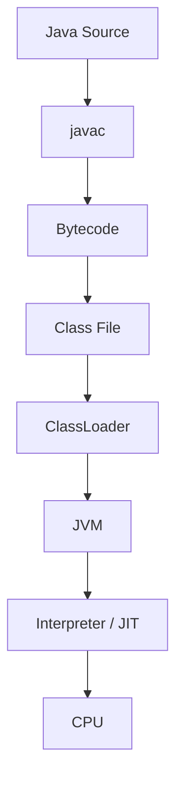
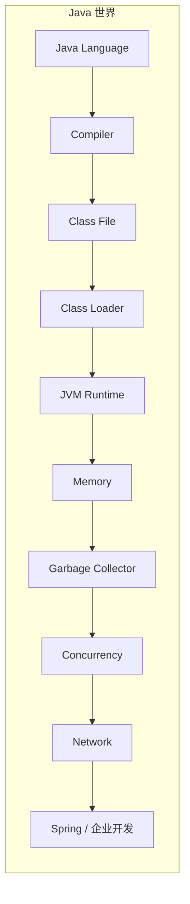

# 第一卷 Java 语言 —— 为什么 Java 会这样设计

> 第一卷回答"Java 为什么这样设计"——不教语法，而是沿着设计哲学 → 类型系统 → 面向对象 → 泛型 → 注解 → Lambda 的路线，逐层拆解 Java 语言的设计思想，为后续 Runtime 和框架原理打下基础。

---

## 1 Java 的设计哲学

本章目标：建立 Java 世界观，回答"Java 为什么存在，又为什么会设计成今天这样？"

- 为什么需要 JVM？
- 为什么跨平台？
- 为什么需要 GC？
- 为什么需要字节码？
- 为什么不是 C++？

### 1.1 软件世界为什么需要 Java

从计算机语言的发展切入，但不是讲历史，而是讲需求推动技术。围绕几个核心问题展开：

- 机器语言的问题是什么？
- C 为什么成功？
- C++ 为什么仍然没有解决软件复杂性？
- 为什么大型软件越来越难维护？
- Java 想解决哪些根本问题？

核心结论：Java 从来不是为了追求最快，而是为了追求可移植性、安全性、稳定性和开发效率。

### 1.2 Java 的核心设计目标

- Write Once, Run Anywhere（跨平台）
- 面向对象
- 自动内存管理
- 强类型系统
- 安全沙箱
- 丰富标准库
- 向后兼容

后续所有章节都围绕这些目标展开。

### 1.3 Java 是一门语言，还是一个平台？

很多人认为 Java 是一种编程语言，实际上这只是最表层。

Java 既是一门语言（Language），也是一套规范（Specification），一个编译器（Compiler），一个字节码格式（Class File），一个虚拟机（JVM），一套标准库（JDK），更是一个持续演进的软件生态（Platform）。

整本书，就是沿着这六个维度，一步一步拆解 Java。

### 1.4 一段 Java 代码是如何运行起来的

全书第一次建立全局视角——从源码到 CPU 的完整链路：



这里只建立流程认知，不展开解释。JVM 一卷会全部展开。

### 1.5 Java 世界的组成：语言、编译器、JVM 与生态

整本书的导航——后面每一卷都是在解释这里的一块：



### 1.6 Java 为什么能够演进二十多年

Java 二十多年没有淘汰的根本原因：

- JCP / JSR 标准化流程
- OpenJDK 开源驱动
- LTS 版本策略
- JVM 与语言解耦（Kotlin、Scala、Groovy 共享 JVM 生态）
- 严格的向后兼容

Java 不是一个静态语言，而是一个不断发展的平台。

### 1.7 本书的学习路线：从语言到架构

很多人的传统学习路径：集合 → IO → 线程 → Spring。问题是学完还是不会分析问题。

本书路线——自底向上：设计目标 → 语言 → Runtime → 并发 → 网络 → 企业开发 → 架构。

这一章不教任何具体语法，而是先帮助读者建立一张完整的"Java 地图"。后续每一章、每一卷，都是在逐步填充这张地图中的某一个区域。这样读者从一开始就知道每个知识点在整个 Java 体系中的位置，而不是学到最后才试图把零散的知识拼接起来。

## 2 类型系统（Type System）

这一章的核心是回答：**Java 到底如何表示一个对象？**

- 基本类型与引用类型
- 对象模型
- 包装类与自动装箱
- `equals` / `hashCode` / identity
- `String` 与不可变对象

类型系统这一章应该回答：

Java 如何通过类型系统描述现实世界，并在编译期和运行期保证程序正确性？

它应该成为后续很多内容的基础：

面向对象为什么存在；
泛型为什么出现；
自动装箱为什么设计；
equals/hashCode 为什么重要；
类型擦除为什么存在；
反射为什么复杂；
JVM 如何表示对象。

所以这一章应该围绕：

类型是什么 → Java 如何表示类型 → 类型如何约束程序 → 类型系统有什么边界

展开。

### 2.1 什么是类型（Type）？

这一节首先建立概念，不要马上讲 Java。

**先讲：类型到底是什么？**

```java
int age = 18;
```

这里：`18` 是数据，`int` 是类型。类型描述了三件事：

1. 数据占用多少空间
2. 可以进行什么操作
3. 如何解释这些比特

**核心观点：类型本质上是一组约束规则。**

```java
1 + 2       // ✅ 合法
"hello" - 1 // ❌ 非法
```

不是语法问题，而是类型系统拒绝这种组合。

### 2.2 静态类型 vs 动态类型

这一节确立 Java 在语言谱系中的位置。

| | 静态类型（Java） | 动态类型（Python） |
|---|---|---|
| 示例 | `String name;` | `name = "Tom"` |
| 类型确定时机 | 编译期 | 运行时 |
| 错误发现 | 编译期报错 | 运行时报错 |
| IDE 支持 | 强（自动补全、重构） | 弱 |

**静态类型的优势：** 编译期发现错误、IDE 智能提示、重构安全、运行效率更易优化。

**代价：** 灵活性降低、类型声明更繁琐。

**为什么 Java 坚持静态类型？** 因为 Java 的目标是**大规模企业软件的长期维护**。

### 2.3 Java 的类型体系总览

这一节建立 Java 类型地图：

```
          Type
            |
    ┌───────┴───────┐
    |               |
Primitive       Reference
    |               |
  int            Class
  boolean        Interface
  char           Array
  long           Enum
  double         Record
  ...            ...
```

Java 类型世界分两大类：

- **基本类型（Primitive）**：保存值，如 `int a = 10;`
- **引用类型（Reference）**：保存对象引用，如 `User user;`

### 2.4 基本类型：性能与抽象之间的取舍

这里不要只是介绍八种类型，重点讲：**为什么 Java 有基本类型？**

因为 Java 早期目标：**性能**。

如果所有东西都是对象：

```java
Integer i = new Integer(10);
```

会产生：

- 对象分配
- GC 压力
- 内存浪费

所以设计了 Primitive —— 直接存储值，包括 `int`、`long`、`double`、`boolean` 等。

然后引出：为什么 Java 现在又引入**自动装箱**和 **Value Class**（未来方向）？
### 2.5 引用类型：变量、引用与对象模型

这是本章的重要部分。

很多开发者误解：

```java
User user = new User();
```

认为"变量就是对象"。实际上：

```
栈（Stack）              堆（Heap）
┌─────────┐            ┌──────────────┐
│  user  ─┼───────────→│  User Object │
└─────────┘            └──────────────┘
```

应该解释清楚：引用是什么？对象是什么？变量保存什么？

例如：

```java
User a = new User();
User b = a;
b.name = "Tom";
```

为什么 `a` 看到了变化？因为两个引用指向**同一个对象**。

### 2.6 类型转换：编译期检查与运行期验证

核心问题：为什么 `int i = 10; long l = i;` 可以，但 `String s = 10;` 不行？

**基本类型转换：**

- 自动扩大：`byte → short → int → long → float → double`
- 缩小转换：需要显式强制转换

**引用类型转换：**

- 向上转型（安全）：`Animal a = new Dog();`
- 向下转型（需检查）：`Dog d = (Dog) a;`

编译期检查 + 运行期验证，对应 JVM 字节码中的 `checkcast` 指令，为后面的 JVM 章节做铺垫。

### 2.7 类型系统与编译器：错误如何被提前发现

这一节非常重要，解释 Java 编译器如何利用类型。

比如 `String s = 123;` 为什么编译失败？

```
源代码（Source Code）
       ↓
   解析器（Parser）
       ↓
   类型检查（Type Checking）  ← 编译器在此处拒绝非法组合
       ↓
   字节码（Bytecode）
```

编译器在字节码生成之前就阻止了错误。这里可以引出：类型检查、方法重载解析、泛型检查、自动类型转换。

### 2.8 类型系统与面向对象：抽象、继承与多态

这一节连接下一章。

解释：为什么**接口也是类型**？

```java
List<String> list;
```

这里 `List` 不是对象，而是一种**抽象类型**。类型系统支持多态、抽象、替换。

引出核心观点：**面向对象，本质上建立在类型系统之上。**

### 2.9 Java 类型系统的边界：泛型擦除、数组协变与 Null

高级内容。Java 类型系统并不完美：

**数组协变：**

```java
Object[] arr = new String[10];
```

为什么允许？为什么可能产生 `ArrayStoreException`？

**泛型擦除：**

```java
List<String>
```

运行时实际只存在 `List`，后面详细展开。

**Null——类型系统最大的漏洞：**

```java
String s = null;
```

为什么 `null` 可以赋给任何引用类型？为什么产生 NPE？为后面的 `Optional` 和 Nullability 打基础。

### 2.10 Java 类型系统的未来演进

最后看未来方向：

- **泛型增强**（类型推断改进）
- **Pattern Matching**（模式匹配，简化 `instanceof` 和 `switch`）
- **Sealed Class**（密封类，限制继承层次）
- **Record**（值类，简化不可变数据载体）
- **Valhalla Value Type**（值类型，消除基本类型与引用类型的鸿沟）

回答：Java 类型系统如何继续演进。

> 这一章放在第一卷非常关键——泛型是类型系统的扩展，反射是运行时绕过类型系统，JVM 字节码是类型系统的另一种表达，Spring 大量依赖类型信息，并发安全也依赖不可变类型设计。所以这一章不是"基础章节"，而是整个 Java 体系的地基。

## 3 面向对象

不是讲继承、封装、多态这些概念本身，而是追问：**为什么会出现这些东西？**

- 接口为什么存在？
- 抽象类为什么存在？
- 组合为什么优于继承？
- SOLID 与设计原则

本章目标：理解面向对象不是一种语法，而是一种**软件建模方法**。掌握：对象为什么存在、类与对象的关系、封装解决什么问题、继承为什么出现又被滥用、多态如何支撑扩展、接口为什么是 Java 设计的核心、面向对象设计如何影响大型系统演进。

本章承接上一章《类型系统》——上一章解决"Java 如何描述数据和约束"，这一章解决"Java 如何利用类型系统描述复杂的软件世界"。

### 3.1 为什么需要面向对象？

这一节不要直接进入 `class`，先回答：**软件为什么需要一种新的组织方式？** 从软件规模演进讲。

**过程式编程的问题：**

```c
processOrder(order);
calculatePrice(order);
sendEmail(order);
```

随着系统扩大，数据和行为分离，全局状态越来越多，修改一个功能影响大量代码。核心问题：**如何让软件结构更接近现实世界？**

**面向对象的核心思想：** 把数据和操作数据的方法组合成对象，让对象负责自己的状态和行为。

```
Order（订单）
├── 属性：id / status / items
└── 行为：pay() / cancel() / ship()
```

### 3.2 类与对象：Java 如何描述现实世界

这一节建立对象模型。

**类是什么？** 不要只解释"class 是模板"，太浅。应该解释：类是一种**类型定义（Type Definition）**——它描述对象拥有的数据结构和允许执行的行为。对应上一章的核心观点：Class 本质也是一种类型。

**对象是什么？** 对象是类型的一次具体实例：

```java
User user = new User();
// User 类型 → User 对象实例
```

**类、对象与 JVM（提前埋伏）：**

```
new → Heap → Object Header → Instance Data → Methods
```

后面 JVM 章节展开。

### 3.3 封装：控制状态与行为边界

这是面向对象最核心的思想之一。不要简单讲 `private + getter/setter`，应该回答：**为什么需要封装？**

**没有封装的问题：**

```java
account.balance = -100;  // 任何地方都可以直接修改状态
```

导致：数据不可信、规则散落、修改困难。

**封装真正的含义：** 不是隐藏变量，而是**控制对象状态变化的入口**。

```java
// ❌ 错误
account.balance -= 100;

// ✅ 正确
account.withdraw(100);
```

对象自己保证：余额不能小于 0、记录流水、触发事件。

### 3.4 继承：代码复用还是类型关系？

这是 Java 中最容易误解的地方。

**为什么出现继承？** 早期目标：代码复用。

```java
Animal animal;
// Dog extends Animal, Cat extends Animal
```

**继承真正表达什么？** 不是"拥有相同代码"，而是**子类是父类的一种特殊类型**——即 **is-a relationship**。

**继承的问题：** 为什么很多设计原则说"组合优于继承"？因为继承导致：强耦合、父类变化影响子类、层次结构僵化。

**Java 对继承的限制：** 单继承、`Object` 根类、`final` 禁止继承。为后面接口章节铺垫。

### 3.5 多态：面向对象扩展性的核心

这是面向对象最重要的一节。

**什么是多态？** 同一个接口，不同实现。

```java
Payment payment;
payment.pay();
// 可能是：Alipay.pay() / WechatPay.pay() / BankPay.pay()
```

**多态解决什么问题？** 核心：**消除条件分支。**

```java
// ❌ 没有多态
if (type == "wechat") { ... }
else if (type == "alipay") { ... }

// ✅ 有多态
payment.pay();
```

**Java 多态如何实现？** 这里连接 JVM：方法表、`invokevirtual`、动态绑定。后面 JVM 字节码章节展开。

### 3.6 抽象：隐藏复杂性与建立边界

**为什么需要抽象？** 用户支付时不需要知道 HTTP、加密、数据库、MQ，只需要调用 `pay()`。

抽象包括：抽象类、接口、API。

### 3.7 接口：Java 面向对象的核心契约

这一节非常重要。因为 Java 没有多继承，接口承担了：类型抽象、能力定义、解耦。

**接口是什么？** 不是"没有实现的方法集合"，而是一种**纯粹的能力契约**。例如：`Comparable`、`Runnable`、`Serializable`。

**接口为什么比继承更重要？**

- 继承回答：**你是什么**（is-a）
- 接口回答：**你能做什么**（can-do）

**Java 接口演进：**

| 版本 | 特性 |
|------|------|
| Java 8 | `default` method |
| Java 9 | `private` method |

### 3.8 面向对象设计原则：从代码组织到系统设计

这里进入工程实践。包括 **SOLID** 五大原则：

| 原则 | 含义 |
|------|------|
| **S**RP | 单一职责 |
| **O**CP | 开闭原则 |
| **L**SP | 里氏替换 |
| **I**SP | 接口隔离 |
| **D**IP | 依赖倒置 |

不要变成设计模式大全。重点：**这些原则为什么产生**。

### 3.9 Java 对象设计中的常见问题

高级章节。

**可变对象：** `Date`、`List` 为什么危险？

**equals/hashCode：** 对象相等性的定义，连接 `HashMap` 与集合。

**不可变对象：** 例如 `String`。为什么不可变对象天然线程安全？为什么适合缓存？

**继承滥用：** 典型问题——深层继承树。

### 3.10 Java 面向对象模型的现代演进

最后讲 Java 新特性，说明 Java 仍然在调整对象模型：

- **Enum**：有限值类型
- **Record**：不可变数据载体
- **Sealed Class**：限制继承层次
- **Pattern Matching**：简化类型判断与解构

> 这样设计以后，前三章形成一条非常自然的逻辑链：第 1 章设计哲学（为什么需要这种语言）→ 第 2 章类型系统（Java 如何描述世界）→ 第 3 章面向对象（Java 如何组织复杂世界）。后面的泛型（类型系统扩展）、注解（元编程能力）、Lambda（行为抽象）、JVM（对象如何运行）、Spring（如何利用对象模型构建框架）都会自然接上。第一卷“Java 语言”才真正成为一个完整体系，而不是语法合集。

## 4 泛型

建议单独成章——这是很多人第一次真正理解编译器。

泛型不是一个小语法特性，而是 Java 类型系统发展到一定阶段后，为解决**类型安全、代码复用、抽象能力**三个问题产生的一套机制。它承接第 2 章类型系统（Java 如何描述对象）和第 3 章面向对象（Java 如何利用类型组织现实世界），回答一个新问题：**Java 如何让类型本身也参与抽象？**

没有泛型时，`List list` 只是"一个存放 Object 的容器"；有了泛型，`List<String> list` 变成"一个只能存放 String 的容器"。所以本章的核心问题是：**Java 如何在保持静态类型安全的同时，实现更高层次的代码复用？**

本章目标：理解泛型产生的背景、设计思想和 JVM 实现机制。掌握：为什么需要泛型、泛型如何增强类型系统、泛型与继承/多态的关系、类型擦除为什么存在、编译器如何处理泛型、泛型在框架设计中的价值。

### 4.1 为什么需要泛型：从 Object 到类型安全

这一节讲历史背景——Java 5 之前的问题：

```java
// 早期集合——所有东西都是 Object
List list = new ArrayList();
list.add("hello");
list.add(123);        // 可以混入任何类型

// 读取时必须强制转型，编译器无法帮助检查
String s = (String) list.get(0);  // ✅
String s = (String) list.get(1);  // ❌ ClassCastException！
```

问题总结：强制类型转换、运行时错误、编译器无法帮助检查。

**泛型解决的问题：** 加入 `List<String>` 后，编译器知道这个集合只能保存 String，错误提前到编译期。

核心思想：**将类型约束从运行期提前到编译期。**

### 4.2 泛型的本质：类型参数化

这一节建立核心概念。很多人认为 `<T>` 只是占位符，实际上泛型是一种**参数化类型（Parameterized Type）**——类似方法参数 `void print(String s)` 参数化数据，泛型 `List<String>` 则是参数化类型。

**泛型类：** 一个类可以适配不同类型

```java
class Box<T> {
    private T value;
}
```

**泛型方法：** 类型也可以作为方法参数

```java
<T> T get() { ... }
```

**泛型接口：** 定义类型契约

```java
Comparable<T>
```

### 4.3 泛型与类型系统：为什么 `List<String>` 不是 `List<Object>`

这是很多开发者理解困难的地方。如果允许 `List<String>` 赋值给 `List<Object>`：

```java
List<String> list = new ArrayList<>();
List<Object> obj = list;   // 假设允许
obj.add(100);              // String 集合中混入 Integer！
```

所以 Java 泛型默认**不支持泛型类型之间的继承关系**。这引出了三个核心概念：

- **Invariant（不变性）**：`List<String>` 和 `List<Object>` 无关
- **Covariance（协变）**：`? extends` 实现
- **Contravariance（逆变）**：`? super` 实现

### 4.4 通配符：让泛型拥有表达能力

这是泛型真正进入工程的地方。

**无界通配符 `?`：** `List<?>` 表示未知类型，适合只读场景。

**上界通配符 `? extends`：** `List<? extends Number>` 表示某种 Number 子类，`List<Integer>` 和 `List<Double>` 都可以匹配。适合**读取**场景（Producer）。

**下界通配符 `? super`：** `List<? super Integer>` 可以接收 Integer 或其父类。适合**写入**场景（Consumer）。

### 4.5 PECS 原则：泛型的工程使用规则

**Producer Extends, Consumer Super.**

- **读取（Producer）**：用 `List<? extends Number>` —— 可以安全读取 Number
- **写入（Consumer）**：用 `List<? super Integer>` —— 可以安全写入 Integer

解释为什么，这一节连接真实开发场景。

### 4.6 泛型与继承、多态的关系

这一节连接上一章。讨论一个关键区别：

```java
// 对象继承链：String → Object（成立）
Object o = "hello";          // ✅

// 泛型参数：List<String> → List<Object>（不成立！）
List<Object> list = new ArrayList<String>();  // ❌ 编译错误
```

区别在于：对象继承是 is-a 关系，而泛型类型参数之间**不传递**这种关系。这是 Java 类型系统中的重要设计约束。

### 4.7 类型擦除：Java 泛型的核心设计

这是泛型章节最重要部分。回答：**为什么 Java 泛型运行时看不到类型？**

```java
// 编译前
List<String> list = new ArrayList<>();

// 编译后（擦除）
List list = new ArrayList();   // <String> 消失了
```

Java 选择**编译期泛型**而非**运行时泛型**，原因只有一个：**向后兼容**。Java 5 引入泛型时，必须兼容 Java 4 的字节码——JVM 不需要改变，原有的 JVM 可以直接运行新程序。

这也解释了后续章节中反射处理泛型的复杂性。

### 4.8 擦除之后：桥接方法、类型转换与字节码

这一节深入擦除后的真实世界。

**编译器自动插入类型转换：**

```java
// 源码
String s = list.get(0);
// 编译后实际为
String s = (String) list.get(0);  // 对应字节码 checkcast 指令
```

**桥接方法（Bridge Method）：** 泛型继承时编译器自动生成，保证多态正确性。

```java
class StringFoo implements Foo<String> {
    // 编译器生成 bridge method 来保证类型安全
}
```

**Signature 属性：** Class 文件中仍然保存了 `List<String>` 这样的泛型信息（用于反射），为后面 Class 文件章节铺垫。

### 4.9 泛型与 JVM：运行时类型信息的保存与丢失

这一节连接 Runtime。讨论两个看似矛盾的事实：

- `new ArrayList<String>()` 运行时不知道 `String`（擦除了）
- 但反射仍能看到 `List<String>` 的某些泛型信息

引出 Class 文件中的 `Signature Attribute` 和 `GenericSignature`——擦除删掉了类型参数，但签名信息保留在字节码元数据中，供反射和框架使用。

### 4.10 泛型在 Java 生态中的应用

最后回到工程，泛型在主流框架中无处不在：

| 框架 / 场景 | 泛型用法 |
|-------------|----------|
| 集合框架 | `List<T>`、`Map<K,V>` |
| Spring | `ApplicationContext.getBean(Class<T>)` |
| MyBatis | `Mapper<T>` |
| CompletableFuture | `CompletableFuture<T>` |
| JSON 序列化 | `TypeReference<T>`（如 Jackson） |

### 4.11 Java 泛型的限制与未来演进

讨论：为什么 Java 泛型一直被吐槽。

**当前限制：**

- 不能使用基本类型：`List<int>` ❌ → 只能用 `List<Integer>`（装箱开销）
- 不能 `new T()`（擦除后类型信息丢失）
- 运行期类型缺失（无法在运行时区分 `List<String>` 和 `List<Integer>`）

**未来方向（Project Valhalla）：**

- **Specialized Generics**：让泛型支持基本类型
- **Value Types**：消除装箱开销，统一基本类型与引用类型

> 这样设计以后，前四章形成一条清晰递进：类型系统（Java 如何描述类型）→ 面向对象（Java 如何利用类型组织现实世界）→ 泛型（Java 如何让类型本身参与抽象）。这也是为什么泛型应该放在面向对象之后，而不是简单放在"Java 基础语法"里面。

## 5 注解

不是讲 `@Retention` / `@Target` 的用法，而是理解注解的生命周期与编译期/运行期处理机制：

- SOURCE / CLASS / RUNTIME
- Annotation Processor（APT）
- Spring 如何利用注解

真正需要理解的是：**注解为什么会出现？它如何让 Java 从"静态代码"走向"元数据驱动"？** 为什么 Spring、MyBatis、JUnit 等框架大量依赖它？

本章承接前面四章——类型系统描述数据、面向对象组织对象、泛型让类型参与抽象，注解进一步解决：**Java 如何给代码附加额外的信息，让编译器、工具和框架理解代码的意图？**

本章目标：理解注解不是"特殊的接口"，而是一种**元数据（Metadata）机制**。掌握：注解产生的背景、注解如何存储、注解生命周期、编译器如何处理注解、运行时如何读取注解、注解如何驱动框架运行。

### 5.1 为什么需要注解：从配置驱动到元数据驱动

这一节先讲问题——早期 Java 开发大量依赖 XML 配置：

```xml
<bean>
    <property name="userDao" ref="userDao"/>
</bean>
```

而代码本身 `class UserService` 和配置 `UserService.xml` 分离，导致：修改困难、信息分散、IDE 无法感知。

**注解的思想：** 把描述信息放回代码附近。

```java
@Service
public class UserService {
}
```

代码本身携带"我是一个 Service"的语义。核心：**注解不是执行逻辑，而是描述代码的信息。**

### 5.2 什么是注解：Java 的元数据系统

这一节建立概念。

**注解的定义：** Annotation 是附加在程序元素（Class、Method、Field、Parameter）上的**结构化元数据**。

```java
@Override
public String toString() {
    return "...";
}
```

`@Override` 不改变方法行为，它只告诉编译器：**"请检查这里是否真的覆盖了父类方法"**。

### 5.3 注解与接口：Annotation Type 的本质

这是很多人困惑的地方。`@interface` 为什么叫 interface？

注解类型本质上是一种**特殊接口**——它不是普通业务接口，编译器会特殊处理：

```
@interface Test
      ↓
  Annotation Type（注解类型）
      ↓
  Class File Metadata（字节码元数据）
```

### 5.4 注解的组成：声明、元素与默认值

如何定义注解：

```java
// 注解声明
public @interface Author {
    String value();              // 注解元素（必需）
    String name() default "";    // 带默认值的元素（可选）
}
```

注解类型本身也是一种类型——连接上一章类型系统。

### 5.5 元注解：控制注解自身行为

这是注解核心。Java 提供五大元注解：

| 元注解 | 作用 |
|--------|------|
| `@Target` | 决定注解可以放在哪里（类、方法、字段等） |
| `@Retention` | 决定注解生命周期（最重要） |
| `@Documented` | 是否出现在 Javadoc 中 |
| `@Inherited` | 类注解是否被子类继承（方法注解不会继承） |
| `@Repeatable` | 同一位置是否能重复使用 |

**`@Target` 示例：**

```java
@Target(ElementType.METHOD)   // 只能修饰方法
public @interface Test { }
```

**`@Retention` 三阶段：**

```
SOURCE → CLASS → RUNTIME
```

### 5.6 注解生命周期：SOURCE、CLASS、RUNTIME

这一节非常重要，连接后面的 JVM。

完整流程：`.java → Compiler → .class → ClassLoader → Runtime Annotation`

| 阶段 | 说明 | 典型例子 |
|------|------|----------|
| **SOURCE** | 只存在源码中，编译后消失 | `@Override` |
| **CLASS** | 进入 class 文件，但 JVM 不加载 | 字节码工具使用 |
| **RUNTIME** | 保留到运行时，可通过反射读取 | `@Component`（Spring） |

### 5.7 注解如何存储：Class File 中的 Annotation Attribute

这一节连接 JVM。注解不是存储在普通字段里，而是作为 **Class File Attribute**：

- `RuntimeVisibleAnnotations` —— RUNTIME 注解
- `RuntimeInvisibleAnnotations` —— CLASS 注解

Class 文件结构：`Constant Pool → Field → Method → Attribute → Annotation Attribute`

为后面 Class 文件章节埋伏笔。

### 5.8 运行时如何读取注解：Reflection 与动态代理

这一节进入实现：

```java
clazz.getAnnotation(Component.class);
```

背后流程：

```
Class 对象 → 读取 Annotation 属性 → 创建 Annotation 代理对象 → 返回
```

关键点：JVM **并不是**提前把注解对象创建好放在堆里，而是在读取时根据 class 文件中的元数据**动态解析**。这里连接之前的反射章节。

### 5.9 编译期注解处理：从 Metadata 到 Code Generation

这是很多开发者不知道的部分。运行时注解（如 Spring）之外，大量代码生成**不是在运行时完成**的。

典型工具：Lombok、MapStruct、Dagger。

流程：

```
Java Source → Annotation Processor → Generate Code → Compile
```

核心 API：`javax.annotation.processing.Processor`、`RoundEnvironment`。

### 5.10 注解驱动框架：Spring 等框架如何利用注解

这一节回到工程。分析 `@Component`、`@Service`、`@Autowired`、`@Transactional` 的背后流程：

```
启动 Spring → 扫描 Class → 读取 Annotation → 创建 BeanDefinition → 实例化对象 → 依赖注入
```

关键理解：**注解只是入口，真正执行的是框架。**

### 5.11 注解设计边界：便利与隐式复杂性的权衡

高级讨论。注解不是万能的：

**隐藏行为问题：** `@Transactional` —— 代码看起来没有事务，运行时却有代理增强。隐式逻辑过多会导致调试困难。

**注解 vs 外部配置的取舍：**

- 代码注解：适合与代码强绑定的元数据（如 `@Service`）
- 外部配置：适合频繁变化的运维参数（如超时时间、地址）

### 5.12 Java 注解的发展方向

最后讲未来：

- **类型注解（TYPE_USE）**：`@NonNull String` 等类型级注解
- **模块化注解**：与 JPMS 模块系统的结合
- **编译期代码生成**：Lombok、MapStruct 等工具持续演进
- **框架元编程**：框架利用注解实现声明式编程

> 这样设计以后，前五章形成一条完整递进：设计哲学（为什么需要 Java）→ 类型系统（Java 如何描述数据）→ 面向对象（Java 如何组织复杂对象）→ 泛型（Java 如何抽象类型）→ 注解（Java 如何给代码附加语义）。到了这里，读者已经不只是"会写 Java"，而是开始理解 Java 语言本身提供的抽象能力。

## 6 Lambda 与函数式编程

这一章自然引出 JVM——`invokedynamic` 是语言演进与运行时协作的典型案例。

Lambda 与函数式编程应该放在第一卷 Java 语言的最后一章，因为它代表 Java 语言层面一次重要的**范式扩展**。

前面五章分别建立了：类型系统（如何描述数据）、面向对象（如何组织对象）、泛型（如何抽象类型）、注解（如何附加语义）。而 Lambda 解决的是：**Java 如何把行为（Behavior）也作为一种可以被抽象、传递和组合的东西？** 这是 Java 从纯面向对象语言向多范式语言演进的重要一步。

所以这一章不能设计成"Lambda 语法 → Stream API → Optional"这种 API 教学。真正应该讲的是：**为什么 Java 需要函数式编程？Lambda 背后的类型系统、编译器和 JVM 是如何支持这种能力的？**

本章目标：理解 Lambda 不是匿名内部类的简写，而是 Java 引入函数式编程思想后的语言级能力。掌握：函数式编程解决什么问题、Lambda 表达式的本质、函数式接口与类型系统的关系、方法引用、Stream 的设计思想、Optional 的价值与边界、Lambda 背后的 `invokedynamic` 机制。

### 6.1 为什么需要函数式编程：从对象到行为

这一节作为入口。

传统面向对象关注对象 + 状态 + 行为，如 `order.pay()`，行为属于对象。但很多场景下，**我们真正想传递的是一段逻辑**。

例如排序时，`Comparator` 本质就是"如何比较"这一行为。早期 Java 只能通过对象包装行为：

```java
Collections.sort(list, new Comparator<User>() {
    public int compare(User a, User b) {
        return a.getAge() - b.getAge();
    }
});
```

代码冗长，意图被淹没在模板代码中。

**函数式思想：让行为成为一等公民。**

```java
Collections.sort(list, (a, b) -> a.getAge() - b.getAge());
```

### 6.2 函数式编程的核心思想
这一节建立概念，不要急着讲 Java。

函数式编程核心特点：

- **函数是一等公民**：函数可以保存、传递、返回
- **不可变数据**：减少共享状态带来的并发问题
- **声明式编程**：关注"做什么"而非"怎么做"

对比：

```java
// ❌ 命令式——关注"怎么做"
for (User user : list) {
    if (user.getAge() > 18) {
        result.add(user);
    }
}

// ✅ 声明式——关注"做什么"
users.stream()
     .filter(user -> user.getAge() > 18)
     .collect(toList());
```

### 6.3 Java 为什么引入 Lambda
这一节解释设计背景。Java 8 之前，为了实现行为传递需要大量匿名内部类：

```java
Runnable r = new Runnable() {
    public void run() {
        System.out.println("hello");
    }
};
```

问题：代码冗余、可读性差、无法表达函数式思想。所以 Java 引入 Lambda。
### 6.4 Lambda 表达式：行为的类型化表达

基本形式：

```java
// 单参数单表达式
(parameters) -> expression

// 多参数
(a, b) -> a + b

// 代码块
() -> {
    System.out.println("hello");
}
```

但重点：**Lambda 不是一个对象，它需要目标类型。**

### 6.5 函数式接口：Lambda 的类型基础

核心问题：**Lambda 到底是什么类型？**

```java
Runnable r = () -> System.out.println("hello");
```

Lambda 本身没有类型，它依赖 `@FunctionalInterface` 定义的目标类型。连接前面的类型系统：**Lambda 本质是一个符合函数式接口契约的行为实现**。

常见函数式接口：

| 接口 | 签名 | 用途 |
|------|------|------|
| `Function<T,R>` | `R apply(T t)` | 转换 |
| `Consumer<T>` | `void accept(T t)` | 消费 |
| `Supplier<T>` | `T get()` | 提供 |
| `Predicate<T>` | `boolean test(T t)` | 判断 |
| `UnaryOperator<T>` | `T apply(T t)` | 一元运算 |
| `BinaryOperator<T>` | `T apply(T a, T b)` | 二元运算 |

### 6.6 Lambda 与匿名内部类的区别

这是很多开发者误解的地方。两者看似等价，实则底层完全不同：

| 维度 | 匿名内部类 | Lambda |
|------|-----------|--------|
| `this` 绑定 | 指向匿名类自身 | 指向外部类 |
| class 文件 | 生成独立 `.class` | 无独立文件（`invokedynamic`） |
| 变量捕获 | 隐式持有外部引用 | 更轻量的捕获 |
| 调用机制 | `invokevirtual` | `invokedynamic` → `LambdaMetafactory` |
### 6.7 Lambda 背后的编译机制：invokedynamic

这是高级章节，连接 JVM。

代码 `x -> x + 1` 编译后，不是简单生成 `Lambda$1.class`，而是：

```
源码：x -> x + 1
        ↓
  invokedynamic 指令
        ↓
  Bootstrap Method
        ↓
  LambdaMetafactory
        ↓
  运行时生成实现类
```

**为什么 Java 选择 `invokedynamic`？** 三个原因：延迟绑定（运行时才决定实现）、JVM 可以跨 Lambda 优化、保持语言演进空间（未来可以改变实现策略而不影响字节码兼容性）。

### 6.8 方法引用：行为复用与表达简化

方法引用是 Lambda 的进一步简化：

| 形式 | 语法 | 示例 |
|------|------|------|
| 静态方法引用 | `Class::staticMethod` | `Math::max` |
| 实例方法引用 | `object::method` | `System.out::println` |
| 类实例方法引用 | `Class::instanceMethod` | `String::length` |
| 构造方法引用 | `Class::new` | `ArrayList::new` |

### 6.9 Stream API：声明式数据处理模型

不要变成 API 罗列。重点讲：**为什么 Stream 存在？**

传统集合用 for 循环修改集合；Stream 则是：

```
数据源 → 中间操作（惰性）→ 终止操作（触发计算）
```

三个核心思想：

- **惰性计算**：`filter()` 不会立即执行，直到遇到终止操作
- **管道模型**：`Source → Pipeline（filter → map → sorted）→ Terminal（collect）`
- **内部迭代**：从"开发者控制循环"变成"框架控制执行"

### 6.10 Stream 背后的计算模型

深入一层：

- **外部迭代 vs 内部迭代**：`for` 循环由程序控制流程，Stream 由框架控制——这让并行优化成为可能
- **并行 Stream**：`parallelStream()` 为什么存在，又为什么很多场景不要使用（线程池共享、不适合 IO 密集任务）
- **Stream 与集合的区别**：集合**存数据**，Stream **描述计算**——集合是有状态的，Stream 是无状态的管道

### 6.11 Optional：用类型表达空值语义

这一节放这里比较自然，因为 Optional 是函数式风格的重要产物。它解决的是 `null` 带来的 NPE 问题——用类型系统表达"值可能不存在"：

```java
Optional<User> user = findById(id);   // 明确表达：结果可能为空
user.map(User::getName)
    .orElse("Unknown");
```

关键方法：`map`、`flatMap`、`orElse`、`orElseGet`。同时讲清楚：为什么 Optional 不能滥用（不适合做字段、不适合做方法参数）。

### 6.12 Lambda 在现代 Java 生态中的应用

回到工程：

- **CompletableFuture**：`thenApply()`、`thenCompose()` 等用 Lambda 描述异步流程
- **Spring**：`@Bean` 方法引用、函数式路由等
- **集合处理**：大量业务代码中的 Stream 链式调用
- **Reactor / 响应式编程**：Lambda 作为声明式组合的基础

### 6.13 Java 函数式编程的边界

最后讨论：Java 不是纯函数式语言。它仍然面向对象、有可变状态、有副作用。

正确理解：**Java 是以面向对象为核心，同时吸收函数式思想的多范式语言。** 函数式特性是增强而非替代——在适合的场景用 Stream 链式处理，在适合的场景用传统 OOP 封装，这才是 Java 之道。

> 这样第一卷《Java 语言》的逻辑就完整闭环。六章对应 Java 语言能力的六次抽象升级：类型 → 对象 → 类型参数（泛型）→ 元数据（注解）→ 行为抽象（Lambda）。到这里，读者已经不仅"会写 Java"，而是理解了 Java 语言本身提供的全部表达能力，为第二卷 JVM Runtime 打下坚实的基础。