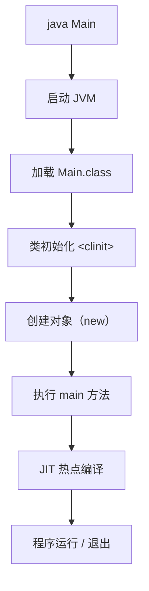
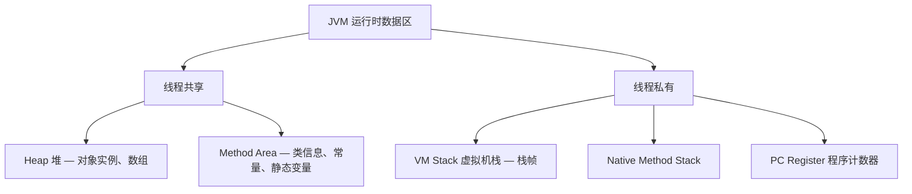

# 第二卷 JVM Runtime —— 一行 Java 代码是如何运行起来的

> 第一卷回答"Java 提供了哪些表达能力"，第二卷回答"这些 Java 代码到底是如何被 JVM 接收、加载、执行和管理的"。整卷遵循 **Java 程序从诞生到执行结束的生命周期** 来组织：源码 → 字节码 → 类加载 → 内存分配 → 对象创建 → 垃圾回收 → 即时编译 → 性能分析。各章依次递进，后续章节自然依赖前面内容——AQS 依赖对象头和 Monitor、synchronized 依赖 Mark Word；Spring 反射依赖 Class 元数据；Lambda 依赖 invokedynamic；泛型依赖 Signature；GC 调优依赖对象生命周期。

---

## 1 Java 程序的生命周期：从源码到机器执行

本章目标：作为第二卷的入口，建立 JVM 全局地图，让读者在进入细节前先看到整条链路。

### 1.1 Java 为什么需要 JVM

回答"为什么 Java 不直接编译成机器码"：

| | C | Java |
|---|---|---|
| 编译链路 | Source → Machine Code → CPU | Source → Bytecode → JVM → Machine Code |
| 跨平台 | 每平台重编译 | 一次编译，到处运行 |
| 安全 | 无运行时隔离 | 字节码验证 + 沙箱 |
| 优化时机 | 仅编译期 | 编译期 + 运行时（JIT） |

核心收获：字节码这一层抽象，让 JVM 可以在运行时观测、优化、管理代码，这是 Java 区别于 AOT 语言的根本。

### 1.2 Java 虚拟机到底是什么

JVM 不是"一个运行 Java 的软件"，而是一套**执行 Java 字节码的规范**。

- **JVM Specification**：定义字节码语义、类文件格式、运行时行为
- **HotSpot**：Oracle/OpenJDK 的主流实现（也是本卷的讨论对象）
- **OpenJ9**：IBM 的低内存开销实现
- 任何语言只要能编译为合法字节码，就能跑在 JVM 上（Kotlin、Scala、Groovy）

### 1.3 一次 Java 启动发生了什么

以 `java Main` 为例，建立后续章节路线：



整卷后续各章，就是对这条链路中每一环的深入展开。

---

## 2 Class 文件：Java 跨平台的核心契约

本章目标：理解源码编译后生成的 Class 文件到底是什么，它为 JVM 提供了什么信息。这是类加载、字节码增强、JIT 编译的基础。

### 2.1 为什么需要字节码

Java 不直接输出机器码，而输出字节码。三个核心原因：

- **平台无关**：同一份 `.class` 可以在任何平台的 JVM 上运行
- **运行时优化**：JVM 可以根据实际运行情况做 JIT 优化（AOT 做不到）
- **语言生态统一**：Kotlin、Scala 等语言都编译到同一套字节码，共享 JVM 生态

### 2.2 Class 文件总体结构

```
ClassFile {
    u4             magic;              // CAFEBABE
    u2             minor_version;
    u2             major_version;
    u2             constant_pool_count;
    cp_info        constant_pool[...]; // 常量池
    u2             access_flags;
    u2             this_class;
    u2             super_class;
    u2             interfaces_count;
    u2             interfaces[...];
    u2             fields_count;
    field_info     fields[...];
    u2             methods_count;
    method_info    methods[...];
    u2             attributes_count;
    attribute_info attributes[...];
}
```

重点不是记偏移量，而是理解：常量池是 Class 文件的"信息仓库"，字段和方法都依赖它；属性表是可扩展的元数据容器。

### 2.3 常量池：Class 文件的信息仓库

| 常量类型 | 存储内容 | 示例 |
|---------|---------|------|
| CONSTANT_Utf8 | 字符串字面量 | 类名、方法名、描述符 |
| CONSTANT_Class | 类或接口的符号引用 | `java/lang/Object` |
| CONSTANT_Methodref | 方法的符号引用 | `println:(Ljava/lang/String;)V` |
| CONSTANT_Fieldref | 字段的符号引用 | `System.out` |

核心问题：为什么 JVM 不在各处直接保存字符串，而是统一用常量池索引？——避免重复存储，统一引用，减小文件体积。

### 2.4 字节码指令概览

不要求背全部指令，建立分类认知即可：

- **加载与存储**：`aload`、`iload`、`astore`、`istore`
- **算术运算**：`iadd`、`lsub`、`imul`
- **对象操作**：`new`、`getfield`、`putfield`
- **方法调用**：`invokevirtual`、`invokestatic`、`invokeinterface`、`invokespecial`、`invokedynamic`
- **控制转移**：`ifeq`、`goto`、`tableswitch`、`lookupswitch`

关键在于让读者看到：`a + b` 在字节码层面是 `iload` → `iload` → `iadd` → `istore`，真正理解"Java 代码最终变成了什么"。

### 2.5 字节码与语言特性的映射

对应第一卷各章，形成纵向连接：

| 语言特性 | 字节码层面的体现 |
|---------|---------------|
| 泛型 | Signature 属性（擦除后保留签名信息） |
| Lambda | `invokedynamic` + `LambdaMetafactory` |
| 注解 | RuntimeVisibleAnnotations 属性 |
| 内部类 | `EnclosingMethod` 属性 + `$` 命名 |

---

## 3 类加载机制：代码如何进入 JVM

本章目标：理解 `.class` 文件如何被加载、验证、连接和初始化。双亲委派模型是理解 Spring Boot、Tomcat、OSGi 类隔离机制的前提。

### 3.1 ClassLoader 为什么存在

回答一个根本问题：为什么 JVM 不一次性加载所有代码？

- 按需加载：只加载真正用到的类，节省内存和启动时间
- 隔离性：不同 ClassLoader 可以加载同名类的不同版本
- 动态性：支持运行期生成和加载类（动态代理、热部署）

### 3.2 类加载的完整生命周期

```
加载 → 验证 → 准备 → 解析 → 初始化 → 使用 → 卸载
```

其中 Linking（连接）阶段包含验证、准备、解析三步：

| 阶段 | 做了什么 | 为什么要在这步做 |
|------|---------|----------------|
| 加载 | 通过全限定名获取字节流，生成 `Class` 对象 | 将外部字节码转为 JVM 可操作的形式 |
| 验证 | 文件格式、元数据、字节码、符号引用验证 | 保证安全性，防止恶意字节码破坏 JVM |
| 准备 | 为静态变量分配内存并赋零值 | 保证字段在未显式赋值前有默认值 |
| 解析 | 符号引用 → 直接引用 | 将符号转为内存中的实际地址 |
| 初始化 | 执行 `<clinit>`，真正赋值静态变量 | 保证静态代码块在类首次主动使用时执行 |

### 3.3 双亲委派模型

为什么需要 Parent Delegation？

- **安全**：`java.lang.String` 不可被用户自定义的同名类替换
- **避免重复加载**：同一个类只被加载一次
- **层次化信任**：核心库 → 扩展库 → 应用类，逐级向上委托

```
Bootstrap ClassLoader（rt.jar，C++ 实现）
        ↑
Platform ClassLoader（JDK 9+，替代 Extension ClassLoader）
        ↑
Application ClassLoader（classpath）
        ↑
自定义 ClassLoader
```

### 3.4 打破双亲委派

并非所有场景都适合向上委托，三大典型案例：

| 场景 | 为什么打破 | 如何打破 |
|------|----------|---------|
| **SPI（如 JDBC Driver）** | 核心库需要调用应用层实现 | 线程上下文类加载器（Thread Context ClassLoader） |
| **Tomcat** | 隔离不同 Web App，各自加载各自的类 | 每个 Web App 使用独立的 WebAppClassLoader |
| **OSGi** | 模块化 + 版本共存 | 网状 ClassLoader，每个 Bundle 独立 |

### 3.5 自定义 ClassLoader

动手实现，理解三个关键方法：

- `loadClass(String name)`：双亲委派入口，覆盖可打破委派
- `findClass(String name)`：留给子类实现查找逻辑，只覆盖此方法则不打破委派
- `defineClass(byte[] b, int off, int len)`：将字节数组转为 `Class` 对象

应用场景：从网络/数据库加载类、加密 Class 文件解密、热部署/热替换。

---

## 4 JVM 运行时数据区：程序运行在哪里

本章目标：建立完整的内存世界观。理解堆、栈、方法区的分工与协作，这是一切内存调优和 GC 理解的大前提。

### 4.1 JVM 内存全景图



### 4.2 方法调用与栈帧

一次方法调用在栈上压入一个栈帧，栈帧包含：

| 组件 | 作用 | 示例 |
|------|------|------|
| 局部变量表 | 存放方法参数和局部变量 | `int a`, `String b` |
| 操作数栈 | JVM 基于栈的运算中转站 | `iload_a` → 操作数栈顶端 |
| 动态链接 | 指向运行时常量池中该方法的符号引用 | 延迟解析/缓存 |
| 返回地址 | 方法调用后的下一条指令地址 | 正常返回 / 异常返回 |

### 4.3 堆内存：对象的家园

对象实例和数组存放于此。分代划分：

```
┌── Eden ──────────┐  ← 新对象
│  S0 │  S1        │  ← Survivor 区
├──────────────────┤
│   老年代          │  ← 长期存活对象
└──────────────────┘
```

### 4.4 方法区与 Metaspace 演进

JDK 7 → 8 的重大变化：

| | JDK 7 及以前 | JDK 8+ |
|---|---|---|
| 实现 | 永久代（PermGen，堆的一部分） | Metaspace（本地内存） |
| 大小限制 | `-XX:MaxPermSize` 固定 | 默认不设上限 |
| 回收难点 | 类卸载复杂 | 由 GC 按需回收 |
| 常见问题 | PermGen OOM | Metaspace OOM（大量动态生成类） |

### 4.5 StringTable 与字符串驻留

对应第一卷 String 章：

- `intern()` 将字符串放入 StringTable
- JDK 7 后 StringTable 从永久代移到堆，GC 管理
- 适度使用 `intern()` 节省内存，过度使用会导致 StringTable 膨胀

---

## 5 对象模型：Java 对象究竟是什么

本章目标：很多 JVM 书弱化这一部分，但它极其重要。从 `new` 到对象消亡，覆盖对象的创建、内存布局、Mark Word 以及 TLAB 和逃逸分析，连接后续的 GC、JIT 和并发章节。

### 5.1 new 一个对象发生了什么

```
new 指令
  ↓
检查类是否已加载 → 未加载则先加载
  ↓
分配内存（指针碰撞 / 空闲列表，CAS + TLAB）
  ↓
初始化零值（保证字段可以不赋初值就使用）
  ↓
设置对象头（Mark Word + Klass Pointer）
  ↓
执行 <init> 构造方法
```

### 5.2 对象内存布局

HotSpot 中一个 Java 对象在堆中的结构：

```
┌──────────────┐
│  对象头       │ ← Mark Word（8B）+ Klass Pointer（4B/8B）
├──────────────┤
│  实例数据     │ ← 父类字段在前，子类字段在后，按宽度对齐
├──────────────┤
│  对齐填充     │ ← 保证 8 字节对齐
└──────────────┘
```

### 5.3 Mark Word：对象头的核心

32 位 JVM 下，Mark Word 不同锁状态的结构变化：

| 锁状态 | 23bit | 2bit | 4bit | 1bit(偏向) | 2bit(锁标志) |
|--------|-------|------|------|-----------|------------|
| 无锁 | hashCode | 分代年龄 | 0 | 0 | 01 |
| 偏向锁 | ThreadID + Epoch | 分代年龄 | 0 | 1 | 01 |
| 轻量锁 | 指向栈中锁记录的指针 | | | | 00 |
| 重量锁 | 指向 Monitor 的指针 | | | | 10 |
| GC 标记 | 空 | | | | 11 |

这部分直接连接第三卷 `synchronized` 与锁升级。

### 5.4 TLAB（线程本地分配缓冲）

为什么 Java 多线程创建对象这么快？

- 每个线程在 Eden 区有一块私有缓冲区（TLAB）
- TLAB 内分配只需指针移动，无需 CAS
- TLAB 用完才需要同步申请新缓冲区
- `-XX:+UseTLAB`（默认开启）

### 5.5 逃逸分析

连接 JIT 编译（第 7 章）：

- 对象仅在方法内使用 → **未逃逸**
- 未逃逸的三种优化：
  - **栈上分配**：对象在栈帧中创建，随方法结束自动销毁
  - **标量替换**：将对象字段拆散为基本类型标量
  - **锁消除**：确定对象不暴露给其他线程，去掉同步

---

## 6 垃圾回收：自动内存管理的实现

本章目标：理解 GC 的完整理论体系和 HotSpot 演进路线。从"什么样的对象该回收"讲起，到"怎么回收"，再到各代收集器的设计取舍。

### 6.1 为什么需要 GC

- C/C++ 手动管理（`malloc` / `free`）：内存泄漏、野指针、Use-After-Free
- Java 自动管理：JVM 自动识别和回收不再使用的对象
- 代价：STW（Stop-The-World），即 GC 发生时应用线程暂停

### 6.2 如何判定对象存活

**引用计数法**：每个对象记录被引用次数，为 0 则回收。问题——无法解决循环引用。

**可达性分析**（Java 采用）：

```
GC Roots ──→ Object A ──→ Object B ──→ Object C（存活）
                    │
                    └──→ Object D ──→ Object E（存活）

GC Roots ──→ Object F ──→ Object G（存活）

         Object H ──→ Object I（垃圾，不可达）
```

GC Roots 包括：虚拟机栈引用、静态字段、常量、JNI 引用、被 `synchronized` 持有的对象。

### 6.3 Java 的四种引用类型

| 引用类型 | 回收时机 | 典型用途 |
|---------|---------|---------|
| 强引用 Strong | 永不回收（除非不可达） | 普通 `new` |
| 软引用 Soft | 内存不足时回收 | 缓存（如图片缓存） |
| 弱引用 Weak | 下次 GC 必定回收 | `WeakHashMap`、`ThreadLocal` |
| 虚引用 Phantom | 无法通过它获取对象 | 对象回收跟踪、NIO Cleaner |

### 6.4 垃圾回收算法

| 算法 | 思路 | 优点 | 缺点 |
|------|------|------|------|
| 标记-清除 Mark-Sweep | 标记存活 → 统一清除 | 简单 | 内存碎片 |
| 标记-复制 Copying | 存活对象复制到新空间 | 无碎片 | 浪费一半空间 |
| 标记-整理 Mark-Compact | 存活对象向一端移动 | 无碎片 | 耗时 |

### 6.5 分代收集思想

基于一个经验假设：**绝大多数对象朝生夕灭**。

- **新生代**（Eden + S0/S1）：存放新对象，使用复制算法，Minor GC 频繁但快速
- **老年代**：存放长期存活对象，使用标记-清除/整理算法，Major GC 较少但耗时长

### 6.6 HotSpot 收集器演进

按时间线，每一代解决了什么问题：

| 收集器 | 代 | 目标 | 核心特点 |
|--------|---|------|---------|
| Serial | 新生代 | 简单高效 | 单线程，Client 模式默认 |
| Parallel | 新生代 | 高吞吐 | 多线程并行，`-XX:+UseParallelGC` |
| CMS | 老年代 | 低延迟 | 并发标记清除，三次 STW + 并发清除 |
| G1 | 整堆 | 可预测停顿 | Region 化整为零，JDK 9 默认 |
| ZGC | 整堆 | 亚毫秒 STW | 染色指针 + 读屏障，TB 级堆 |
| Shenandoah | 整堆 | 低延迟 | Brooks 指针 + 读写屏障 |

CMS 的三个致命缺陷：CPU 敏感、浮动垃圾、碎片化导致退化 Serial Old。

G1 的核心创新：将堆分为大小相等的 Region，RSet 解决跨 Region 引用问题，`-XX:MaxGCPauseMillis` 控制停顿时间。

ZGC 核心技术：染色指针在 64 位指针中嵌入 GC 元数据，读屏障在访问时自动转发对象。

---

## 7 JIT 编译器：Java 为什么越跑越快

本章目标：回答"为什么 Java 不是一直解释执行，而是越来越快"。理解解释器、C1、C2 的分工协作，以及 JIT 背后的激进优化技术。

### 7.1 为什么需要 JIT

| 模式 | 启动速度 | 峰值性能 | 适用场景 |
|------|---------|---------|---------|
| 解释执行 | 快 | 差 | 小程序、脚本 |
| 提前编译（AOT） | 快 | 一般 | 启动敏感场景 |
| 即时编译（JIT） | 慢（需要预热） | 最优 | 长期运行的服务端 |

Java 的答案是**混合模式**：先用解释器快速启动，热点代码交给 JIT 编译优化。

### 7.2 HotSpot 编译体系

```
解释执行（Interpreter）
      ↓ 热点探测
C1 编译（Client Compiler）— 快速编译，保守优化
      ↓ 更热
C2 编译（Server Compiler）— 深度编译，激进优化
```

**分层编译（Tiered Compilation，JDK 8+ 默认）**：

| Level | 编译方式 | 特点 |
|-------|---------|------|
| 0 | 解释执行 | 启动阶段 |
| 1 | C1 无 profiling | 简单方法快速编译 |
| 2 | C1 + 简单 profiling | 收集调用次数 |
| 3 | C1 + 完整 profiling | 收集分支、类型等详细数据 |
| 4 | C2 | 基于 profiling 数据深度优化 |

### 7.3 方法内联

最重要的 JIT 优化，没有之一：

- 消除方法调用开销（栈帧创建与销毁）
- 为后续优化打开空间（逃逸分析、常量折叠等）
- `-XX:MaxInlineSize` 控制内联阈值

### 7.4 逃逸分析与相关优化

连接第 5 章对象模型：

- **栈上分配**：未逃逸对象在栈帧上创建，随方法结束自动销毁
- **标量替换**：将对象打散为基本类型标量，完全消除对象分配
- **锁消除**：对象不出方法，同步代码块无意义，直接去掉

### 7.5 去优化（Deoptimization）

为什么 JVM 有时会"倒退"回解释执行？

- 编译时做了激进假设（如"这个接口只有一个实现"）
- 运行时假设失效（新类被加载）
- JVM 主动回退到解释执行，必要时用新的 profiling 数据重新编译

---

## 8 JVM 性能分析与线上问题排查

本章目标：将前七章理论落地为实战能力。建立"发现问题 → 定位问题 → 解决问题"的系统思路。

### 8.1 JVM 常见故障速查

| 现象 | 首选诊断方向 |
|------|-------------|
| CPU 100% | `top -Hp` → 线程 dump → 定位热点代码 |
| 频繁 Full GC | GC 日志 → 内存 dump → MAT 分析大对象 |
| OOM | `-XX:+HeapDumpOnOutOfMemoryError` → MAT |
| StackOverflow | 检查无限递归 / 过深调用栈 |
| Metaspace OOM | 检查动态代理/反射/脚本引擎是否生成大量类 |

### 8.2 Heap Dump 分析

- 获取方式：`-XX:+HeapDumpOnOutOfMemoryError`、`jmap -dump`、Arthas `heapdump`
- MAT（Memory Analyzer Tool）四大核心功能：
  - **Leak Suspects Report**：自动识别可疑内存泄漏
  - **Histogram**：按类统计对象数量和占用空间
  - **Dominator Tree**：找到阻止 GC 的最大对象
  - **Path to GC Roots**：追溯对象为何不被回收

### 8.3 Thread Dump 分析

- 获取方式：`jstack <pid>`、`kill -3 <pid>`、Arthas `thread`
- 关键线程状态：RUNNABLE、BLOCKED、WAITING、TIMED_WAITING
- 死锁自动检测：jstack 输出末尾的 `Found one Java-level deadlock`

### 8.4 JVM 常用参数

建立参数认知体系，而非死记：

| 类别 | 参数示例 | 说明 |
|------|---------|------|
| 堆内存 | `-Xms4g -Xmx4g` | 初始/最大堆大小，线上建议设为一致 |
| GC | `-XX:+UseG1GC`、`-XX:MaxGCPauseMillis=200` | 选择收集器与目标停顿 |
| 日志 | `-Xlog:gc*=info:file=gc.log` | GC 日志（JDK 9+ 统一格式） |
| OOM | `-XX:+HeapDumpOnOutOfMemoryError` | OOM 时自动 dump |
| Metaspace | `-XX:MaxMetaspaceSize=256m` | 防止 Metaspace 无限膨胀 |

### 8.5 JVM 诊断工具箱

| 工具 | 核心用途 | 无需重启 |
|------|---------|---------|
| `jps` | 查看 Java 进程 PID | — |
| `jstack` | 线程 dump | ✅ |
| `jmap` | 内存 dump | ✅ |
| `jcmd` | 统一诊断命令 | ✅ |
| JFR + JMC | 低开销事件采集与可视化分析 | ✅ |
| **Arthas** | 线上实时诊断（trace/watch/jad/ognl） | ✅ |

Arthas 重点命令：

| 命令 | 用途 |
|------|------|
| `dashboard` | 实时看板（线程、内存、GC） |
| `thread` | 线程分析、CPU 热点、死锁 |
| `trace` | 方法调用链路耗时 |
| `jad` | 反编译确认线上代码 |
| `heapdump` | 生成 dump 文件 |
| `watch` | 方法入参/返回值/异常监控 |

---

> 第二卷到此结束。从 Class 文件 → 类加载 → 运行时数据区 → 对象 → GC → JIT → 诊断，读者已经建立起 Java 代码从源码到机器执行的完整心智模型。
>
> **与全书其他卷的纵横联系：**
>
> | 后续卷 / 框架 | 依赖本卷的哪部分 |
> |-------------|----------------|
> | 第三卷 并发 | AQS 依赖对象头和 Monitor；synchronized 依赖 Mark Word 锁升级 |
> | Spring / 动态代理 | 反射依赖 Class 元数据；CGLIB/ASM 依赖字节码操作 |
> | Lambda & Stream | `invokedynamic` + `LambdaMetafactory` 的基础在 Class 文件与类加载 |
> | GC 调优 | 依赖对象生命周期和分代模型的理解 |
> | 网络编程 | DirectByteBuffer 依赖直接内存模型 |
>
> 第二卷和第一卷形成自然递进：**Java 如何表达世界 → JVM 如何运行这些表达 → 多线程如何共同运行**。