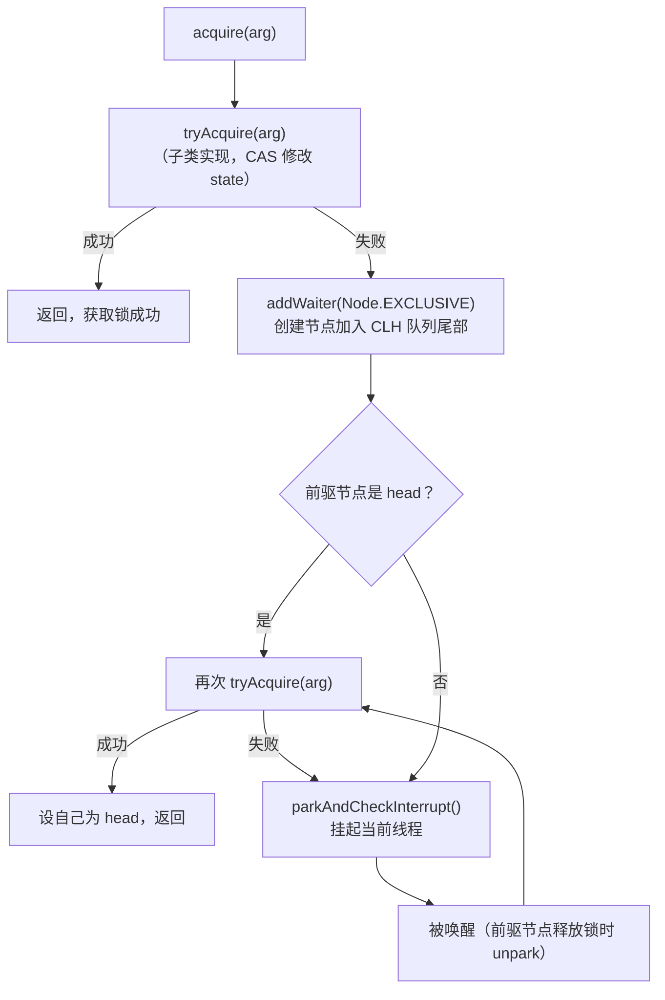
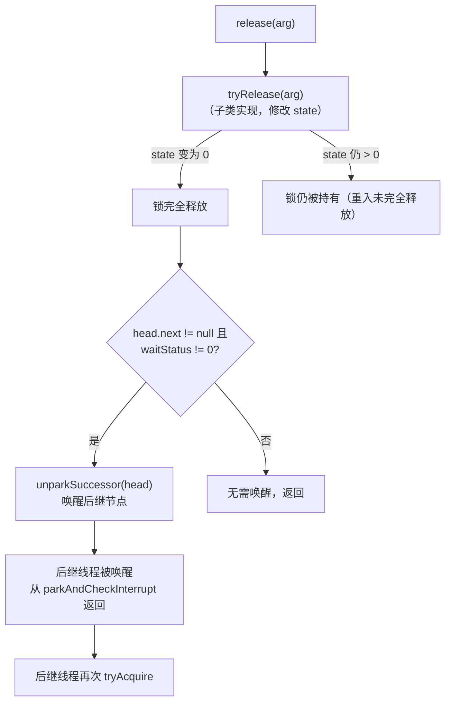

# 第6章 Lock 与 AQS：Java 并发工具的核心框架

> synchronized 能解决大部分互斥问题，但当需求变成"我只想等 3 秒""我被中断时需要立刻退出""读多写少时读线程不该互斥"时，你会发现 synchronized 的天花板很低。Lock 接口和 AQS（AbstractQueuedSynchronizer）正是为了突破这个天花板而生——它们不仅提供了更灵活的锁机制，更构建了整个 `java.util.concurrent` 包的骨架。理解 AQS，就拿到了打开 JUC 工具箱的万能钥匙。

---

## 6.1 为什么需要 Lock

### 6.1.1 synchronized 的功能限制

在早期的 Java 并发编程中，`synchronized` 是唯一的内置互斥手段。它用起来简单，JVM 也对其做了大量优化（偏向锁→轻量级锁→重量级锁），但在实际工程中，开发者很快遇到了它的硬性限制：

**不可中断获取**。一个线程在 `synchronized` 块外等待锁时，无法被 `interrupt()` 打断——它只能傻等，即使你已经不想要这个锁了。

**无超时获取**。你无法说"我最多等 3 秒，拿不到就算了"。`synchronized` 没有 `tryLock(timeout)` 这样的语义。

**无公平锁**。当多个线程争抢锁时，`synchronized` 不保证先到先得。某些线程可能反复"插队"，导致其他线程饥饿。

**只有一个隐式条件队列**。`wait()/notify()` 只能关联一个等待队列。如果你需要区分"队列满"和"队列空"两种等待条件，只能用一个 `notifyAll()` 全部唤醒，然后每个线程自己检查条件——浪费且低效。

**必须是块结构**。`synchronized` 的获取和释放必须在同一个方法的 `{}` 内完成，无法在一个方法中加锁、另一个方法中解锁。

### 6.1.2 Lock 接口的增强

`java.util.concurrent.locks.Lock` 接口正是为了解决上述所有问题而设计的。它把锁的操作从语言关键字提升为 API 层面的接口，带来了本质性的能力扩展：

| 能力维度 | synchronized | Lock / ReentrantLock |
|---|---|---|
| 获取方式 | 隐式（进入同步块） | 显式调用 `lock()` |
| 释放方式 | 隐式（退出同步块/异常） | 显式调用 `unlock()`（必须 finally） |
| 可中断获取 | ❌ 不支持 | ✅ `lockInterruptibly()` |
| 超时获取 | ❌ 不支持 | ✅ `tryLock(time, unit)` |
| 非阻塞尝试 | ❌ 不支持 | ✅ `tryLock()` 立即返回 true/false |
| 公平锁 | ❌ 不支持 | ✅ 构造时 `new ReentrantLock(true)` |
| 条件队列数量 | 1 个隐式 | 多个（`newCondition()`） |
| 锁的作用域 | 块结构（同一方法） | 可跨方法（手动 lock/unlock） |
| 性能（无竞争） | 极高（偏向锁优化） | 高（CAS 操作） |
| 性能（高竞争） | 中等 | 非公平模式下略优 |

注意最后一行：在高竞争场景下，`ReentrantLock` 的非公平模式因为允许"插队"（新到的线程直接尝试 CAS 抢锁，不用排队），吞吐量往往优于 `synchronized`。但公平模式下，由于维护 FIFO 的额外开销，性能会有所下降。

---

## 6.2 Lock 接口与 ReentrantLock

### 6.2.1 Lock 接口的六个方法

```java
public interface Lock {
    void lock();                          // 阻塞获取，不可中断
    void lockInterruptibly() throws InterruptedException; // 可中断获取
    boolean tryLock();                    // 非阻塞尝试，立即返回
    boolean tryLock(long time, TimeUnit unit) throws InterruptedException; // 超时尝试
    void unlock();                        // 释放锁
    Condition newCondition();             // 创建条件变量
}
```

六个方法，每一个都对应 `synchronized` 做不到的事情。其中 `lock()` 是最基本的阻塞获取；`lockInterruptibly()` 让等待中的线程可以响应中断；`tryLock()` 两个重载分别实现了非阻塞尝试和超时等待；`newCondition()` 则开辟了多个条件队列的能力。

### 6.2.2 ReentrantLock 的基本使用

`ReentrantLock` 是 `Lock` 接口最常用的实现。"Reentrant"意味着同一线程可以多次获取这把锁（重入），每次获取会将 state 加 1，释放时减 1，减到 0 才真正释放。

```java
ReentrantLock lock = new ReentrantLock();

try {
    lock.lock();
    // 临界区代码
    // 同一线程可以再次 lock()，state 变为 2
    lock.lock();
    // ...
    lock.unlock(); // state 变为 1，锁仍然持有
} finally {
    lock.unlock(); // state 变为 0，锁释放
}
```

一个关键原则：**`unlock()` 必须放在 `finally` 块中**。与 `synchronized` 的隐式释放不同，`Lock` 需要手动释放。如果在 `lock()` 之后、`unlock()` 之前发生了异常而没有 `finally`，锁就永远不会释放，其他线程将永久阻塞。这是 `Lock` 相比 `synchronized` 最大的使用风险。

### 6.2.3 公平锁 vs 非公平锁

```java
// 非公平锁（默认）
ReentrantLock unfairLock = new ReentrantLock();        // 等价于 new ReentrantLock(false)

// 公平锁
ReentrantLock fairLock = new ReentrantLock(true);
```

**非公平锁**允许"插队"：当锁被释放的瞬间，恰好来的新线程可以直接 CAS 抢锁，而不需要检查队列中是否有等待者。这听起来不公平，但实际好处是：如果新线程抢到了锁，它直接执行，省去了唤醒队列中线程的开销（唤醒涉及 unpark 系统调用，代价不低）。在高并发场景下，非公平锁的吞吐量通常比公平锁高 5～10 倍。

**公平锁**严格保证 FIFO：任何线程在尝试获取锁时，都会检查队列中是否有前驱节点在等待。如果有，老老实实排队。这避免了饥饿，但每次获取都需要检查队列，增加了开销。

```
非公平锁的"插队"过程：

线程 A（持有锁）   线程 B（队列中等待）   线程 C（刚到）
    |                    |                    |
    |--- 释放锁 -------->|                    |
    |                    |  被唤醒，准备获取   |
    |                    |                    |-- CAS 抢锁！
    |                    |                    |  （成功，直接执行）
    |                    |-- CAS 尝试（失败）  |
    |                    |  回到队列继续等     |
```

在大多数场景下，推荐使用非公平锁（默认）。只有当业务明确要求"先到先得"、不允许某些线程长期饿死时，才使用公平锁。

---

## 6.3 AQS 设计思想

### 6.3.1 JUC 的骨架

`AbstractQueuedSynchronizer`（AQS）是整个 `java.util.concurrent.locks` 包的核心框架。如果你翻开 `ReentrantLock`、`Semaphore`、`CountDownLatch`、`ReentrantReadWriteLock` 的源码，会发现它们内部都持有一个 `Sync` 对象——而这个 `Sync` 继承自 AQS。

AQS 的设计目标是：**用一个统一的框架，抽象出所有同步器的共性**。不管你是互斥锁、信号量、还是倒计时门栓，本质上都是在做同一件事：管理一个同步状态（state），以及在获取失败时排队等待。

### 6.3.2 核心三元素

AQS 的内部结构由三个核心元素构成：

```
┌─────────────────────────────────────────────────┐
│               AbstractQueuedSynchronizer         │
│                                                  │
│  ┌───────────────────────────────────┐           │
│  │  state (volatile int)             │           │
│  │  同步状态，含义由子类定义          │           │
│  └───────────────────────────────────┘           │
│                                                  │
│  ┌───────────────────────────────────┐           │
│  │  CLH Queue (FIFO 等待队列)        │           │
│  │                                   │           │
│  │  head ──→ Node ──→ Node ──→ tail  │           │
│  │  (虚)    (线程A)  (线程B)         │           │
│  └───────────────────────────────────┘           │
└─────────────────────────────────────────────────┘
```

**state**：一个 `volatile int` 变量，是 AQS 的核心。子类通过 `getState()`、`setState()`、`compareAndSetState()` 三个方法来操作它。在 `ReentrantLock` 中，state=0 表示未锁定，state=n 表示被同一线程重入了 n 次。在 `Semaphore` 中，state 表示剩余许可数。

**CLH 队列**：一个变体的 CLH（Craig, Landin, Hagersten）双向链表队列，FIFO 顺序。获取锁失败的线程会被封装成 Node 节点，通过 CAS 操作加入队列尾部。

**Node**：队列中的每个节点，封装了一个等待线程以及该线程的等待状态。Node 的关键字段：

```java
static final class Node {
    volatile int waitStatus;   // 等待状态
    volatile Node prev;        // 前驱节点
    volatile Node next;        // 后继节点
    volatile Thread thread;    // 等待的线程
    Node nextWaiter;           // 条件队列用
}
```

`waitStatus` 的几种状态：

| 值 | 含义 | 说明 |
|---|---|---|
| 0 | 初始状态 | 新建节点的默认值 |
| SIGNAL (-1) | 后继节点需要唤醒 | 当前节点释放时，必须 unpark 后继 |
| CANCELLED (1) | 已取消 | 线程超时或被中断，节点作废 |
| CONDITION (-2) | 条件等待 | 在 Condition 队列中等待 |
| PROPAGATE (-3) | 共享模式传播 | 用于共享锁的连续传播唤醒 |

---

## 6.4 AQS 获取锁流程（独占模式）

独占模式是最常见的模式——同一时刻只有一个线程能持有锁。`ReentrantLock` 就是独占模式的典型实现。

### 6.4.1 整体流程

AQS 的 `acquire(int arg)` 方法是独占模式获取的入口。它的流程可以用一句话概括：**先尝试直接获取，失败了就入队排队，排队时如果发现自己是队首就再试一次，还不行就挂起**。



### 6.4.2 源码级解析

让我们沿着源码走一遍 `acquire` 的核心逻辑：

```java
// AQS 的入口方法
public final void acquire(int arg) {
    if (!tryAcquire(arg) &&              // 第一步：尝试获取
        acquireQueued(addWaiter(Node.EXCLUSIVE), arg))  // 第二步：入队并等待
        selfInterrupt();
}
```

**第一步：`tryAcquire(arg)`**

这是模板方法，由子类实现。对于 `ReentrantLock` 的非公平模式：

```java
// NonfairSync.tryAcquire
protected boolean tryAcquire(int acquires) {
    return nonfairTryAcquire(acquires);
}

final boolean nonfairTryAcquire(int acquires) {
    final Thread current = Thread.currentThread();
    int c = getState();
    if (c == 0) {                        // 锁空闲
        if (compareAndSetState(0, acquires)) {  // CAS 抢锁
            setExclusiveOwnerThread(current);
            return true;
        }
    } else if (current == getExclusiveOwnerThread()) {  // 自己持有，重入
        int nextc = c + acquires;
        setState(nextc);
        return true;
    }
    return false;                        // 获取失败
}
```

注意非公平模式：即使队列中有线程在等待，新来的线程也会先 CAS 试一次。这就是"插队"。

公平模式则多了一行检查：

```java
// FairSync.tryAcquire
protected boolean tryAcquire(int acquires) {
    final Thread current = Thread.currentThread();
    int c = getState();
    if (c == 0) {
        if (!hasQueuedPredecessors() &&   // 关键：检查队列中是否有前驱
            compareAndSetState(0, acquires)) {
            setExclusiveOwnerThread(current);
            return true;
        }
    } else if (current == getExclusiveOwnerThread()) {
        int nextc = c + acquires;
        setState(nextc);
        return true;
    }
    return false;
}
```

**第二步：`addWaiter(Node.EXCLUSIVE)`**

`tryAcquire` 失败后，线程需要被封装成 Node 加入 CLH 队列尾部：

```java
private Node addWaiter(Node mode) {
    Node node = new Node(Thread.currentThread(), mode);
    Node pred = tail;
    if (pred != null) {
        node.prev = pred;
        if (compareAndSetTail(pred, node)) {  // CAS 加入尾部
            pred.next = node;
            return node;
        }
    }
    enq(node);  // 队列为空或 CAS 失败时，走完整入队流程
    return node;
}

// 完整入队：自旋 + CAS 确保成功
private Node enq(final Node node) {
    for (;;) {
        Node t = tail;
        if (t == null) {
            if (compareAndSetHead(new Node()))  // 初始化哨兵节点
                tail = head;
        } else {
            node.prev = t;
            if (compareAndSetTail(t, node)) {
                t.next = node;
                return t;
            }
        }
    }
}
```

**第三步：`acquireQueued`**

入队后，线程进入自旋检查：

```java
final boolean acquireQueued(final Node node, int arg) {
    boolean failed = true;
    try {
        boolean interrupted = false;
        for (;;) {
            final Node p = node.predecessor();
            if (p == head && tryAcquire(arg)) {  // 前驱是 head，再试一次
                setHead(node);                    // 成功了，设自己为 head
                p.next = null;
                failed = false;
                return interrupted;
            }
            if (shouldParkAfterFailedAcquire(p, node))  // 确认前驱状态为 SIGNAL
                interrupted = parkAndCheckInterrupt();   // 挂起
        }
    } finally {
        if (failed)
            cancelAcquire(node);
    }
}
```

这里有一个精妙的设计：线程在被 park 之前，会把前驱节点的 `waitStatus` 设为 `SIGNAL(-1)`。这样当前驱释放锁时，就知道自己有责任唤醒后继。

`parkAndCheckInterrupt()` 内部调用 `LockSupport.park(this)`，线程在此处挂起，直到被前驱节点 `unpark` 或者被 `interrupt()`。

---

## 6.5 AQS 释放锁流程（独占模式）

释放锁的流程比获取简单得多——核心就是把 state 减到 0，然后唤醒队列中的下一个等待者。

### 6.5.1 流程概览



### 6.5.2 源码解析

```java
// AQS 的释放入口
public final boolean release(int arg) {
    if (tryRelease(arg)) {       // 子类实现
        Node h = head;
        if (h != null && h.waitStatus != 0)
            unparkSuccessor(h);  // 唤醒后继
        return true;
    }
    return false;
}
```

`tryRelease` 由子类实现：

```java
// ReentrantLock.Sync.tryRelease
protected boolean tryRelease(int releases) {
    int c = getState() - releases;
    if (Thread.currentThread() != getExclusiveOwnerThread())
        throw new IllegalMonitorStateException();
    boolean free = (c == 0);
    if (free)
        setExclusiveOwnerThread(null);
    setState(c);       // 即使 free=false 也要 setState
    return free;       // 只有 state 归零才返回 true
}
```

关键细节：**只有 `tryRelease` 返回 true（state 归零）时，才会唤醒后继节点**。如果一个线程重入了 3 次，前两次 `unlock()` 只是把 state 从 3 减到 2 再减到 1，不会唤醒任何人。只有第三次 `unlock()` 把 state 减到 0，才会触发唤醒。

`unparkSuccessor` 的核心逻辑：

```java
private void unparkSuccessor(Node node) {
    int ws = node.waitStatus;
    if (ws < 0)
        compareAndSetWaitStatus(node, ws, 0);  // 清除 SIGNAL 状态

    Node s = node.next;
    if (s == null || s.waitStatus > 0) {       // 后继已取消
        s = tail;
        while (s != null && s != node) {       // 从尾部往前找
            if (s.waitStatus <= 0)
                break;
            s = s.prev;
        }
    }
    if (s != null)
        LockSupport.unpark(s.thread);          // 唤醒！
}
```

这里有一个容易困惑的地方：为什么后继节点已取消时，要从尾部往前遍历找有效节点？因为在 AQS 中，节点的 `next` 指针不总是最新的（入队时先设置 `prev`，再 CAS 设置 `tail`，最后才设置前驱的 `next`）。从尾部往前走，沿着 `prev` 链遍历，一定能找到最近的有效节点。

---

## 6.6 共享模式与条件变量

### 6.6.1 共享模式

独占模式保证同一时刻只有一个线程持有锁。共享模式则允许多个线程同时获取同步状态——典型的代表是 `Semaphore`（信号量）和 `CountDownLatch`（倒计时门栓）。

共享模式的入口是 `acquireShared(int arg)`：

```java
public final void acquireShared(int arg) {
    if (tryAcquireShared(arg) < 0)     // 子类实现，返回值 >= 0 表示获取成功
        doAcquireShared(arg);          // 失败则入队等待
}
```

`tryAcquireShared` 返回一个 `int`：
- **正数**：获取成功，且后续的共享获取也可能成功
- **0**：获取成功，但后续的共享获取可能失败
- **负数**：获取失败

共享模式的唤醒机制与独占模式不同。当一个共享锁被释放时，它不仅唤醒下一个节点，还会**传播**——如果被唤醒的节点也是共享模式，它会继续唤醒它的后继，形成连锁反应。这就是 `waitStatus = PROPAGATE(-3)` 的作用。

```java
// 共享模式的释放
public final boolean releaseShared(int arg) {
    if (tryReleaseShared(arg)) {
        doReleaseShared();  // 唤醒后继并传播
        return true;
    }
    return false;
}
```

`doReleaseShared` 中的传播逻辑（简化）：

```java
private void doReleaseShared() {
    for (;;) {
        Node h = head;
        if (h != null && h != tail) {
            int ws = h.waitStatus;
            if (ws == Node.SIGNAL) {
                if (!compareAndSetWaitStatus(h, Node.SIGNAL, 0))
                    continue;
                unparkSuccessor(h);       // 唤醒后继
            } else if (ws == 0 &&
                       !compareAndSetWaitStatus(h, 0, Node.PROPAGATE))
                continue;                 // 设为 PROPAGATE，让传播继续
        }
        if (h == head)                    // head 没变，说明传播结束
            break;
    }
}
```

### 6.6.2 Condition 条件变量

`Condition` 是 `Lock` 对 `wait()/notify()` 的替代品，但功能更强大。

```java
ReentrantLock lock = new ReentrantLock();
Condition notFull = lock.newCondition();   // 条件：队列未满
Condition notEmpty = lock.newCondition();  // 条件：队列非空

// 生产者线程
lock.lock();
try {
    while (queue.isFull()) {
        notFull.await();     // 在 notFull 条件上等待
    }
    queue.add(item);
    notEmpty.signal();       // 唤醒一个在 notEmpty 上等待的消费者
} finally {
    lock.unlock();
}

// 消费者线程
lock.lock();
try {
    while (queue.isEmpty()) {
        notEmpty.await();    // 在 notEmpty 条件上等待
    }
    Item item = queue.remove();
    notFull.signal();        // 唤醒一个在 notFull 上等待的生产者
} finally {
    lock.unlock();
}
```

`Condition` 的内部维护了自己独立的等待队列（条件队列），与 AQS 的 CLH 队列（同步队列）是两回事：

```
                    同步队列（CLH Queue）
            ┌──────┐     ┌──────┐     ┌──────┐
    head ──→│ Node │────→│ Node │────→│ Node │←── tail
            └──────┘     └──────┘     └──────┘
            (持有锁)     (等待锁)     (等待锁)

    Condition 条件队列（每个 Condition 一个）
            ┌──────┐     ┌──────┐
  firstWaiter──→│ Node │────→│ Node │←── lastWaiter
            └──────┘     └──────┘
            (调用了 await)  (调用了 await)
```

当线程调用 `condition.await()` 时：
1. 从同步队列中移除（释放锁）
2. 加入条件队列尾部
3. `park` 挂起

当线程调用 `condition.signal()` 时：
1. 从条件队列中取出第一个节点
2. 转移到同步队列尾部
3. 该节点重新参与锁的竞争

与 `synchronized` 的 `wait()/notify()` 对比：

| 维度 | wait/notify | Condition await/signal |
|---|---|---|
| 条件队列数量 | 1 个（所有 wait 共享） | 多个（每个 newCondition 一个） |
| 唤醒精确度 | notifyAll 唤醒所有 | signal 只唤醒指定条件的线程 |
| 可中断等待 | wait() 可中断 | await() 可中断，还有 awaitUninterruptibly() |
| 超时等待 | wait(timeout) | await(time, unit)，还有 awaitUntil(deadline) |
| 与锁的关系 | 必须在 synchronized 块内 | 必须在 lock 块内，通过 Lock 创建 |

多个条件队列的能力是 `Condition` 最大的优势。在经典的生产者-消费者模式中，生产者和消费者等待的条件不同，用两个 `Condition` 可以精确唤醒，避免 `notifyAll` 的"惊群"效应。

---

## 6.7 基于 AQS 的工具一览

AQS 之所以被称为 JUC 的骨架，是因为几乎所有核心同步工具都是基于它构建的。子类只需要实现 `tryAcquire/tryRelease`（独占模式）或 `tryAcquireShared/tryReleaseShared`（共享模式），AQS 负责排队、唤醒、中断处理等所有复杂的队列管理。

| 工具类 | 同步模式 | state 含义 | 典型场景 |
|---|---|---|---|
| `ReentrantLock` | 独占 | 0=未锁定，n=重入次数 | 互斥访问临界区 |
| `Semaphore` | 共享 | 剩余许可数 | 限流、资源池 |
| `CountDownLatch` | 共享 | 还需 countDown 的次数 | 等待多个任务完成 |
| `ReentrantReadWriteLock` | 共享+独占 | 高16位=读锁持有数，低16位=写锁重入数 | 读多写少场景 |
| `StampedLock` | 独占+共享 | 状态+版本号 | 高性能读写锁（JDK 8+） |

### ReentrantLock 的 state 使用

```java
// state = 0：锁空闲
// state = 1：被某线程锁定
// state = n：被同一线程重入 n 次
```

### Semaphore 的 state 使用

```java
Semaphore sem = new Semaphore(3);  // 3 个许可
// state 初始值 = 3
// 每次 acquire：state 减 1（CAS）
// 每次 release：state 加 1（CAS）
// state = 0 时，后续 acquire 的线程排队等待
```

### CountDownLatch 的 state 使用

```java
CountDownLatch latch = new CountDownLatch(3);
// state 初始值 = 3
// 每次 countDown：state 减 1
// await 的线程在 state 归零前阻塞
// state 归零时，所有等待的线程被唤醒（共享模式的传播）
```

### ReentrantReadWriteLock 的 state 设计

这是最巧妙的一个——用一个 `int` 同时管理读锁和写锁：

```
state (32 位 int)
┌────────────────────┬────────────────────┐
│   高 16 位          │   低 16 位          │
│   读锁持有数        │   写锁重入次数      │
│   (共享模式)        │   (独占模式)        │
└────────────────────┴────────────────────┘
```

这意味着读锁最多支持 65535 个线程同时持有，写锁最多重入 65535 次。在实际应用中，这个上限几乎不可能达到。

读锁的获取需要检查写锁是否被持有（低 16 位是否为 0），写锁的获取需要检查读锁和写锁是否都为空。这种位分割的设计让读写锁可以用一个 CAS 操作同时管理两种状态。

---

### StampedLock 的乐观读：读写锁的终极形态

`ReentrantReadWriteLock` 有一个隐蔽的问题：**写线程饥饿**。当读操作非常频繁时，读锁一直被持有（因为读锁共享，可以无数线程同时持有），写线程永远等不到所有读锁释放——写操作被饿死了。

`StampedLock`（JDK 8 引入）用一种巧妙的方式解决了这个问题：**乐观读**。

### 三种模式

```java
StampedLock lock = new StampedLock();

// 模式一：写锁（独占，和 ReentrantReadWriteLock 一样）
long stamp = lock.writeLock();
try { /* 写操作 */ } finally { lock.unlockWrite(stamp); }

// 模式二：悲观读锁（共享，和 ReentrantReadWriteLock 一样）
long stamp = lock.readLock();
try { /* 读操作 */ } finally { lock.unlockRead(stamp); }

// 模式三：乐观读（不加锁！）
long stamp = lock.tryOptimisticRead();  // 只记录一个版本号
// 直接读数据，不加锁
int x = point.getX();
int y = point.getY();
// 读完后校验：stamp 期间有没有写操作发生？
if (!lock.validate(stamp)) {
    // stamp 失效了（期间有写操作），数据可能不一致
    // 降级为悲观读锁，重新读
    stamp = lock.readLock();
    try {
        x = point.getX();
        y = point.getY();
    } finally { lock.unlockRead(stamp); }
}
// stamp 有效，数据一致，直接使用
```

### 乐观读为什么快

乐观读**完全不加锁**，只在读取后校验版本号。如果期间没有写操作发生，读到的数据就是一致的。这避免了读锁的 CAS 操作和内存屏障，性能接近无同步代码。

适用场景：**读远多于写，且读操作很短**。比如缓存的读取、配置的读取、坐标的读取。

### 不可重入的限制

`StampedLock` 不可重入——同一线程再次获取锁会死锁。也不支持 `Condition`。它是一个纯粹的高性能读写锁，不适合替代 `ReentrantLock`。

**选择建议**：

| 场景 | 选择 |
|------|------|
| 通用互斥 | `ReentrantLock` 或 `synchronized` |
| 读多写少，无饥饿问题 | `ReentrantReadWriteLock` |
| 读多写少，有饥饿问题 | `StampedLock` |
| 读操作极短，可接受重试 | `StampedLock` 乐观读 |

---

## 6.8 AQS 的设计哲学

### 6.8.1 模板方法模式

AQS 是模板方法模式的经典范例。它将同步器的工作划分为两层：

**AQS 负责的（不变部分）**：
- 管理 CLH 等待队列（入队、出队、节点状态维护）
- 线程的 park/unpark（挂起与唤醒）
- 中断处理
- 超时处理
- 公平性控制

**子类负责的（变化部分）**：
- `tryAcquire(int arg)` —— 如何获取同步状态
- `tryRelease(int arg)` —— 如何释放同步状态
- `tryAcquireShared(int arg)` —— 共享模式获取
- `tryReleaseShared(int arg)` —— 共享模式释放
- `isHeldExclusively()` —— 当前线程是否持有锁

这种分离意味着：**你只需要关心"如何获取"这个业务逻辑，而不需要关心"获取失败后怎么办"这个通用机制**。这正是模板方法的精髓。

### 6.8.2 用一个 state + 一个队列统一万物

Doug Lea（AQS 的设计者）的核心洞察是：所有的同步器，无论表面上多么不同，本质上都可以归结为：

1. **一个同步状态**（state）—— 用一个 `volatile int` 表示
2. **一个等待队列**（CLH Queue）—— 获取失败的线程排队
3. **一套获取/释放规则**（子类定义）—— 什么条件下可以修改 state

```
┌─────────────────────────────────────────────────────────┐
│                    AQS 统一框架                          │
│                                                         │
│    state ──→ 含义由子类定义                              │
│    queue ──→ 管理等待线程（AQS 负责）                    │
│    tryAcquire/tryRelease ──→ 子类实现具体逻辑            │
│                                                         │
│  ┌──────────┬──────────┬──────────┬──────────┐          │
│  │Reentrant │Semaphore │CountDown │ReadWrite │          │
│  │  Lock    │          │  Latch   │  Lock    │          │
│  │          │          │          │          │          │
│  │state=重入│state=许可│state=计数│state=分割│          │
│  └──────────┴──────────┴──────────┴──────────┘          │
└─────────────────────────────────────────────────────────┘
```

### 6.8.3 分离"如何获取"和"获取失败后怎么办"

这是 AQS 最优雅的设计决策。考虑一个没有 AQS 的世界：每个同步器都需要自己实现线程排队、唤醒、中断处理。这些代码量巨大且容易出错。

AQS 把这个问题一分为二：

- **"如何获取"**：子类通过 `tryAcquire` 定义——这是简短的、纯内存操作的代码，通常就是几行 CAS
- **"获取失败后怎么办"**：AQS 统一处理——入队、park、中断响应、超时、唤醒，这些复杂的并发控制逻辑全部封装在 AQS 内部

这种分离带来的好处是：
1. **子类代码极简**：`ReentrantLock` 的 `Sync` 内部类只有几十行
2. **正确性有保障**：队列管理、线程调度由 AQS 专家代码保证
3. **性能有保障**：AQS 经过多年优化，CAS 操作、park/unpark 的使用都是最优的
4. **可扩展性好**：想造新的同步器？只需要实现那几个 try 方法

---

## 本章小结

本章从 `synchronized` 的不足出发，引出了 `Lock` 接口和 `ReentrantLock`。然后深入 AQS 的内部设计——理解了 state、CLH 队列和 Node 三个核心元素，以及独占模式和共享模式下的获取-释放流程。最后，我们看到 AQS 如何通过模板方法模式，用一个统一的框架支撑起整个 JUC 同步工具家族。

核心要点回顾：
- `Lock` 相比 `synchronized` 提供了可中断、可超时、公平锁、多条件队列等能力
- AQS 用一个 `volatile int` state + 一个 CLH 双向队列 + 模板方法模式，统一了所有同步器
- 独占模式：`tryAcquire` → 入队 → park → 被唤醒 → 再试
- 共享模式：`tryAcquireShared` → 入队 → park → 被唤醒 → 传播唤醒后继
- `Condition` 提供了独立的条件队列，比 `wait/notify` 更精确、更灵活

---

> **纵横联系**
>
> - 与第 5 章（synchronized 与 Monitor）的联系：本章的 Lock/AQS 是 synchronized 的"升级版"。理解了 Monitor 的互斥和条件变量，再看 AQS 的 state + Condition，会发现思想一脉相承，只是实现方式从 JVM 内部提升到了 Java API 层面。
> - 与第 7 章（并发容器）的联系：`ConcurrentHashMap` 的分段锁、`LinkedBlockingQueue` 的 put/take 阻塞，底层都依赖本章介绍的锁和条件变量机制。
> - 与第 8 章（线程池）的联系：`ThreadPoolExecutor` 中的 `mainLock`（ReentrantLock）和 `termination`（Condition）直接使用了本章的知识。线程池的 worker 管理、任务排队，本质上也是 AQS 思想的延伸。
> - 与第二卷《JVM Runtime》的联系：AQS 中的 `volatile` 变量和 CAS 操作，其底层依赖 JVM 的内存模型保证（happens-before 关系）和 CPU 指令级的原子操作（cmpxchg）。理解 JVM 内存模型，才能真正理解 AQS 为什么正确。
