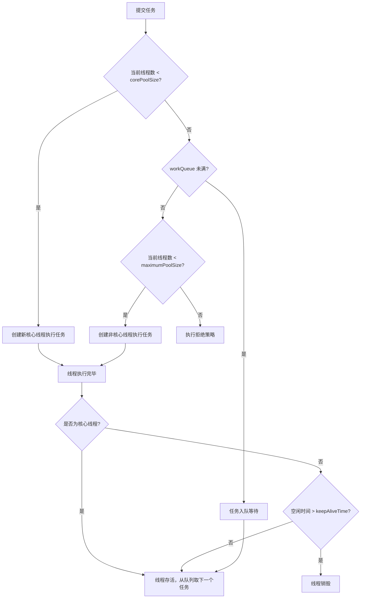

# 第9章 线程池：并发任务管理

> 为什么每个线上 Java 应用都必须使用线程池？线程池的 7 个核心参数如何影响任务的执行行为？当队列满了、线程也满了，任务何去何从？`Executors` 提供的便捷方法哪些是定时炸弹？本章从原理到工程实践，系统讲解线程池的设计、调优与避坑。

---

## 9.1 为什么需要线程池

### 9.1.1 无限创建线程的代价

很多初学者会写出这样的代码：

```java
// ❌ 每来一个请求就创建一个线程
new Thread(() -> handleRequest(request)).start();
```

这在低并发下可以工作，但在生产环境中是灾难。让我们算一笔账：

| 开销项 | 具体数值 | 说明 |
|--------|----------|------|
| 栈内存 | 每线程约 1MB（默认 `-Xss1m`） | 1000 线程 = 1GB 仅栈空间 |
| 创建耗时 | 约 0.1-0.5ms | 需要系统调用 `pthread_create` |
| 上下文切换 | 约 1-10μs/次 | 线程数 > CPU 核数时急剧增加 |
| 调度开销 | 随线程数线性增长 | OS 调度器负担加重 |
| 销毁耗时 | 需要回收栈空间和内核资源 | 频繁创建销毁 = 大量 GC 压力 |

**上下文切换的恶性循环**：

```
线程数增加 → CPU 时间片变短 → 频繁切换 → 有效计算时间减少
    ↑                                              │
    └──────── 响应变慢 → 超时重试 → 更多线程 ←──────┘
```

### 9.1.2 线程池的三大核心价值

1. **线程复用**：线程创建一次，执行多个任务，避免反复创建销毁
2. **并发控制**：限制最大并发数，保护系统资源不被耗尽
3. **任务管理**：排队、拒绝、监控，让任务的生命周期可控

```java
// ✅ 使用线程池
ExecutorService pool = Executors.newFixedThreadPool(10);
pool.submit(() -> handleRequest(request));
```

一行代码背后，线程池帮你完成了：复用已有线程 → 任务排队 → 并发限制 → 统一管理。

---

## 9.2 ThreadPoolExecutor 核心参数

`ThreadPoolExecutor` 是 Java 线程池的核心实现，它的构造函数有 7 个参数，每个参数都至关重要：

```java
public ThreadPoolExecutor(
    int corePoolSize,            // 核心线程数
    int maximumPoolSize,         // 最大线程数
    long keepAliveTime,          // 非核心线程空闲存活时间
    TimeUnit unit,               // 时间单位
    BlockingQueue<Runnable> workQueue,  // 任务等待队列
    ThreadFactory threadFactory,         // 线程创建工厂
    RejectedExecutionHandler handler     // 拒绝策略
)
```

### 9.2.1 参数详解

| 参数 | 含义 | 类比 |
|------|------|------|
| `corePoolSize` | 核心线程数，即使空闲也不会被回收（除非设置 `allowCoreThreadTimeOut`） | 餐厅的正式员工，即使没客人也不下班 |
| `maximumPoolSize` | 线程池允许的最大线程数 | 餐厅的最大员工容量 |
| `keepAliveTime` | 非核心线程空闲多久后被回收 | 临时工没活干多久后离开 |
| `unit` | keepAliveTime 的时间单位 | — |
| `workQueue` | 当核心线程都在忙时，新任务在此排队等候 | 餐厅门口的等位区 |
| `threadFactory` | 自定义线程的创建方式（名称、优先级、是否守护线程等） | 员工的工牌和制服 |
| `handler` | 队列满且线程数达上限时的处理策略 | 客人满了怎么处理——拒绝、排队、自己动手 |

### 9.2.2 参数之间的关系

```
任务提交
  │
  ▼
当前线程数 < corePoolSize ? ──是──▶ 创建核心线程执行
  │否
  ▼
workQueue 未满 ? ──是──▶ 入队等待
  │否
  ▼
当前线程数 < maximumPoolSize ? ──是──▶ 创建非核心线程执行
  │否
  ▼
执行拒绝策略
```

三个关键数值的关系：**corePoolSize ≤ maximumPoolSize**，workQueue 的容量决定了什么时候会创建非核心线程。

---

## 9.3 任务执行流程

### 9.3.1 完整流程图



### 9.3.2 execute() 源码分析

```java
public void execute(Runnable command) {
    int c = ctl.get();

    // 步骤1：线程数 < corePoolSize，创建核心线程
    if (workerCountOf(c) < corePoolSize) {
        if (addWorker(command, true))  // true 表示核心线程
            return;
        c = ctl.get();  // 创建失败，重新获取状态
    }

    // 步骤2：核心线程满了，尝试入队
    if (isRunning(c) && workQueue.offer(command)) {
        int recheck = ctl.get();
        // 入队后再次检查，防止状态变化
        if (!isRunning(recheck) && remove(command))
            reject(command);  // 线程池已停止，拒绝
        else if (workerCountOf(recheck) == 0)
            addWorker(null, false);  // 至少保持一个线程
    }

    // 步骤3：队列满了，创建非核心线程
    else if (!addWorker(command, false))  // false 表示非核心线程
        reject(command);  // 步骤4：创建失败，拒绝
}
```

**注意一个容易被忽略的细节**：`addWorker(null, false)` 的调用。当线程数为 0 时（所有线程都意外退出了），即使入队成功，也会创建一个空闲线程来处理队列中的任务。这保证了线程池不会"假死"。

### 9.3.3 代码示例：自定义 ThreadPoolExecutor

```java
// 工程推荐：手动创建线程池，而非使用 Executors 工厂方法
ThreadPoolExecutor executor = new ThreadPoolExecutor(
    5,                              // 核心线程数
    10,                             // 最大线程数
    60, TimeUnit.SECONDS,           // 非核心线程空闲 60 秒后回收
    new ArrayBlockingQueue<>(200),  // 有界队列，容量 200
    new ThreadFactory() {
        private final AtomicInteger counter = new AtomicInteger(1);
        @Override
        public Thread newThread(Runnable r) {
            Thread t = new Thread(r, "pool-order-service-" + counter.getAndIncrement());
            t.setDaemon(false);
            return t;
        }
    },
    new ThreadPoolExecutor.CallerRunsPolicy()  // 拒绝策略
);

// 提交任务
executor.submit(() -> {
    // 业务逻辑
    processOrder(order);
});

// 优雅关闭
executor.shutdown();  // 不再接受新任务，等待已提交任务完成
if (!executor.awaitTermination(30, TimeUnit.SECONDS)) {
    executor.shutdownNow();  // 超时后强制关闭
}
```

---

## 9.4 拒绝策略

当线程池无法接受新任务时（队列满 + 线程数达上限），会执行拒绝策略。JDK 提供了 4 种内置策略：

### 9.4.1 四种内置策略

```java
// 1. AbortPolicy（默认）—— 抛异常
public void rejectedExecution(Runnable r, ThreadPoolExecutor e) {
    throw new RejectedExecutionException("Task " + r.toString() +
                                         " rejected from " + e.toString());
}

// 2. CallerRunsPolicy —— 调用者自己执行
public void rejectedExecution(Runnable r, ThreadPoolExecutor e) {
    if (!e.isShutdown()) {
        r.run();  // 注意：是 run()，不是 start()！在当前线程执行
    }
}

// 3. DiscardPolicy —— 静默丢弃
public void rejectedExecution(Runnable r, ThreadPoolExecutor e) {
    // 什么都不做，任务被丢弃
}

// 4. DiscardOldestPolicy —— 丢弃队首，重试
public void rejectedExecution(Runnable r, ThreadPoolExecutor e) {
    if (!e.isShutdown()) {
        e.getQueue().poll();   // 丢弃队列最前面的任务
        e.execute(r);          // 重新提交当前任务
    }
}
```

### 9.4.2 策略对比

| 策略 | 行为 | 优点 | 缺点 | 适用场景 |
|------|------|------|------|----------|
| AbortPolicy | 抛 RejectedExecutionException | 快速失败，问题暴露充分 | 调用方必须处理异常 | 默认策略，通用场景 |
| CallerRunsPolicy | 提交任务的线程自己执行 | 天然限流，不丢任务 | 阻塞调用线程，降低提交速度 | 不允许丢任务的场景 |
| DiscardPolicy | 静默丢弃 | 不影响系统运行 | 任务丢失无感知 | 可容忍丢失（如日志采集） |
| DiscardOldestPolicy | 丢弃队首，重试提交 | 保留最新任务 | 可能丢失重要任务 | 新数据比旧数据重要的场景 |

### 9.4.3 CallerRunsPolicy 的限流效果

`CallerRunsPolicy` 的精妙之处在于它**自动降低了任务提交速度**：

```
提交线程（如 Tomcat 线程）
  │
  ▼
execute() → 线程池拒绝 → CallerRunsPolicy → 当前线程执行任务
  │
  ▼
Tomcat 线程被阻塞，无法处理新请求
  │
  ▼
新请求排队在 Tomcat 层面（而非线程池层面）
  │
  ▼
自动形成背压（Backpressure），保护下游系统
```

这是一种**优雅降级**——与其让任务丢弃或报错，不如让上游自动减速。

---

## 9.5 Executors 工厂方法

`Executors` 类提供了便捷的工厂方法来创建线程池。它们方便，但**部分方法存在严重隐患**。

### 9.5.1 各工厂方法对比

| 方法 | 核心线程 | 最大线程 | 队列 | 问题 |
|------|----------|----------|------|------|
| `newFixedThreadPool(n)` | n | n | LinkedBlockingQueue（无界） | ⚠️ 队列无界，可能 OOM |
| `newCachedThreadPool()` | 0 | Integer.MAX_VALUE | SynchronousQueue | ⚠️ 线程数无上限，可能创建过多线程 |
| `newSingleThreadExecutor()` | 1 | 1 | LinkedBlockingQueue（无界） | ⚠️ 队列无界，可能 OOM |
| `newScheduledThreadPool(n)` | n | Integer.MAX_VALUE | DelayedWorkQueue | ⚠️ 线程数无上限 |

### 9.5.2 OOM 风险详解

**newFixedThreadPool 的陷阱**：

```java
ExecutorService pool = Executors.newFixedThreadPool(10);
// 内部实现
new ThreadPoolExecutor(10, 10, 0L, TimeUnit.MILLISECONDS,
                       new LinkedBlockingQueue<Runnable>());
// LinkedBlockingQueue 默认容量 = Integer.MAX_VALUE
// 如果任务提交速度 > 处理速度，队列会无限增长 → OOM
```

**newCachedThreadPool 的陷阱**：

```java
ExecutorService pool = Executors.newCachedThreadPool();
// 内部实现
new ThreadPoolExecutor(0, Integer.MAX_VALUE, 60L, TimeUnit.SECONDS,
                       new SynchronousQueue<Runnable>());
// 瞬时高并发时，每个任务都创建一个新线程
// 10000 个并发请求 = 10000 个线程 ≈ 10GB 栈内存 → OOM
```

### 9.5.3 工程建议

```java
// ❌ 阿里巴巴编码规范禁止使用 Executors 创建线程池
ExecutorService pool = Executors.newFixedThreadPool(10);

// ✅ 手动创建，参数可控
ThreadPoolExecutor pool = new ThreadPoolExecutor(
    10, 20, 60, TimeUnit.SECONDS,
    new ArrayBlockingQueue<>(500),  // 有界队列！
    new NamedThreadFactory("order-service"),
    new ThreadPoolExecutor.CallerRunsPolicy()
);
```

**核心原则**：有界队列 + 明确拒绝策略。无界队列是 OOM 的温床。

---

## 9.6 线程池工程实践

### 9.6.1 线程命名：排查问题的生命线

线上出问题时，线程栈是最重要的诊断信息。如果线程名是 `pool-1-thread-1`、`pool-2-thread-3`，你根本分不清是哪个业务的线程。

```java
// ❌ 默认命名，无法区分业务
ThreadFactory defaultFactory = Executors.defaultThreadFactory();
// 产出: pool-1-thread-1, pool-1-thread-2, ...

// ✅ 自定义命名，一目了然
public class NamedThreadFactory implements ThreadFactory {
    private final String poolName;
    private final AtomicInteger counter = new AtomicInteger(1);

    public NamedThreadFactory(String poolName) {
        this.poolName = poolName;
    }

    @Override
    public Thread newThread(Runnable r) {
        Thread t = new Thread(r, poolName + "-" + counter.getAndIncrement());
        t.setDaemon(false);
        // 可选：设置 UncaughtExceptionHandler
        t.setUncaughtExceptionHandler((thread, ex) -> {
            log.error("Thread {} threw exception", thread.getName(), ex);
        });
        return t;
    }
}

// 产出: order-service-1, order-service-2, payment-service-1, ...
```

### 9.6.2 参数设置：没有银弹，只有调优

**CPU 密集型任务**（如计算、加密、压缩）：

```
corePoolSize ≈ CPU 核数 + 1
```

为什么 +1？当某个线程因为偶尔的页缺失或其他原因暂停时，额外的线程可以利用空闲的 CPU 周期。

**IO 密集型任务**（如数据库查询、HTTP 调用、文件读写）：

```
corePoolSize ≈ CPU 核数 × 2
```

为什么 ×2？IO 等待期间线程被阻塞，不占用 CPU。假设平均 50% 时间在等待 IO，那么需要 2 倍的线程来充分利用 CPU。

**但这只是起点**，真实的最优值取决于：

```java
// 最佳实践：通过压测确定最优线程数
// 公式参考（Little's Law）:
// 线程数 = CPU 核数 × (1 + IO 等待时间 / CPU 计算时间)
//
// 例如：8 核 CPU，任务平均 60% 时间在等待 IO
// 线程数 = 8 × (1 + 0.6/0.4) = 8 × 2.5 = 20
```

| 任务类型 | 推荐公式 | 8 核示例 | 说明 |
|----------|----------|----------|------|
| CPU 密集 | N + 1 | 9 | 计算为主，线程多了反而增加切换 |
| IO 密集（一般） | 2N | 16 | 一半时间在等待 |
| IO 密集（大量等待） | N × (1 + W/C) | 按比例计算 | 通过压测确定 |

### 9.6.3 监控：看不见就管不了

线程池提供了丰富的监控指标，接入监控系统是必须的：

```java
public class ThreadPoolMonitor {
    private final ThreadPoolExecutor executor;
    private final String poolName;

    public void report() {
        log.info("[{}] Pool: {}/{}, Active: {}, Queue: {}/{}, Completed: {}, Task: {}",
            poolName,
            executor.getPoolSize(),           // 当前线程数
            executor.getMaximumPoolSize(),     // 最大线程数
            executor.getActiveCount(),         // 正在执行任务的线程数
            executor.getQueue().size(),        // 队列中等待的任务数
            ((ArrayBlockingQueue<?>) executor.getQueue()).remainingCapacity(),
            executor.getCompletedTaskCount(),  // 已完成任务数
            executor.getTaskCount()            // 总任务数（已完成 + 执行中 + 排队）
        );
    }
}
```

**关键监控指标**：

| 指标 | 获取方法 | 告警阈值建议 |
|------|----------|-------------|
| 活跃线程数 | `getActiveCount()` | 持续 ≥ maximumPoolSize 的 80% |
| 队列积压 | `getQueue().size()` | 持续 > 队列容量的 70% |
| 完成任务数 | `getCompletedTaskCount()` | 关注增长趋势 |
| 拒绝任务数 | 自定义 RejectedExecutionHandler 计数 | > 0 即告警 |
| 线程创建数 | 自定义 ThreadFactory 计数 | 异常增长告警 |

### 9.6.4 线程隔离：不同业务不同池

**反模式**：所有业务共享一个线程池。

```java
// ❌ 所有业务共用一个池
ExecutorService sharedPool = new ThreadPoolExecutor(50, 50, ...);
sharedPool.submit(() -> orderService.process());   // 订单服务
sharedPool.submit(() -> paymentService.process()); // 支付服务
sharedPool.submit(() -> emailService.send());      // 邮件服务
```

如果邮件发送变慢，队列被邮件任务填满，订单和支付的请求也会被拒绝。一个服务的问题拖垮了所有服务。

```java
// ✅ 线程池隔离，互不影响
ExecutorService orderPool = new ThreadPoolExecutor(20, 20, ...);    // 订单
ExecutorService paymentPool = new ThreadPoolExecutor(15, 15, ...);  // 支付
ExecutorService emailPool = new ThreadPoolExecutor(10, 10, ...);    // 邮件
```

这就是微服务架构中**线程池隔离**的思想，Hystrix、Resilience4j 等框架的隔离策略正是基于此。

### 9.6.5 优雅关闭：shutdown() vs shutdownNow()

```java
// 方式1：shutdown() —— 温和关闭
executor.shutdown();
// - 不再接受新任务（抛 RejectedExecutionException）
// - 已提交的任务会继续执行完毕
// - 线程池状态变为 SHUTDOWN

// 方式2：shutdownNow() —— 强制关闭
List<Runnable> pendingTasks = executor.shutdownNow();
// - 不再接受新任务
// - 中断正在执行的任务（发送 Thread.interrupt()）
// - 返回队列中未执行的任务
// - 线程池状态变为 STOP

// 方式3：推荐的优雅关闭流程
executor.shutdown();  // 先温和关闭
try {
    if (!executor.awaitTermination(30, TimeUnit.SECONDS)) {
        // 超时后强制关闭
        executor.shutdownNow();
        // 再等待一下，给任务响应中断的机会
        if (!executor.awaitTermination(10, TimeUnit.SECONDS)) {
            log.error("线程池未能完全关闭");
        }
    }
} catch (InterruptedException e) {
    executor.shutdownNow();
    Thread.currentThread().interrupt();
}
```

**Spring Boot 中的实践**：

```java
@Configuration
public class ThreadPoolConfig {

    @Bean("orderPool")
    public ThreadPoolExecutor orderPool() {
        return new ThreadPoolExecutor(10, 20, 60, TimeUnit.SECONDS,
            new ArrayBlockingQueue<>(500),
            new NamedThreadFactory("order-service"),
            new ThreadPoolExecutor.CallerRunsPolicy());
    }
}

// 在 Spring 容器关闭时，自动执行优雅关闭
@PreDestroy
public void destroy() {
    orderPool.shutdown();
    // ... awaitTermination 逻辑
}
```

---

## 9.7 线程池的常见误区

### 误区一：线程池越大越好

线程数过多 → 上下文切换频繁 → CPU 利用率下降 → 吞吐量反而降低。最佳线程数需要通过压测确定，而非拍脑袋。

### 误区二：corePoolSize 和 maximumPoolSize 设成一样的就没用了

设成一样只是意味着没有非核心线程，队列满了就直接拒绝。这在很多场景下是合理的——固定大小的线程池比弹性伸缩的更可预测。

### 误区三：shutdown() 之后任务就立刻停了

`shutdown()` 只是拒绝新任务，已提交的任务（包括队列中等待的）会继续执行。如果需要立即停止，用 `shutdownNow()` 并处理中断。

### 误区四：submit() 和 execute() 没区别

```java
// execute: 提交 Runnable，异常会被 UncaughtExceptionHandler 处理
executor.execute(() -> doWork());

// submit: 提交 Runnable/Callable，返回 Future，异常被封装在 Future 中
Future<?> future = executor.submit(() -> doWork());
try {
    future.get();  // 这里才会抛出异常
} catch (ExecutionException e) {
    // 处理任务中抛出的异常
}
```

**坑**：如果用 `submit()` 提交任务但不调用 `future.get()`，任务中的异常会被**静默吞掉**。

---

## 9.8 小结

线程池是 Java 并发编程中最核心的基础设施。掌握它，需要理解三个层次：

1. **原理层**：7 个参数的含义、任务执行流程、Worker 线程的生命周期
2. **策略层**：拒绝策略的选择、队列类型的影响、核心线程数的计算
3. **工程层**：线程命名、监控指标、线程隔离、优雅关闭

```
线程池 = 资源管理器

    有限的线程资源 ← 管理 → 无限的任务请求
         │                        │
    核心参数配置              任务队列缓冲
         │                        │
    监控与调优              拒绝与降级
```

记住两个核心原则：
- **有界优于无界**：队列必须有界，否则 OOM 只是时间问题
- **可观测优于黑盒**：线程池必须监控，出了问题才知道发生了什么

---

> **纵横联系**
>
> - 线程池的核心组件 `workQueue` 就是第8章讲的 `BlockingQueue`——`ArrayBlockingQueue`、`LinkedBlockingQueue`、`SynchronousQueue` 在这里找到了最重要的应用场景
> - 线程池的 `Worker` 继承自 `AbstractQueuedSynchronizer`（AQS），它的锁机制在第6章《并发工具类》中有详细分析
> - `Future` 和 `CompletableFuture` 是线程池返回结果的载体，异步编程模型将在后续章节展开
> - 在第一卷《Java 基础》中，我们讲了 `Thread` 的创建与生命周期；本章的线程池是对线程生命周期的高级管理
> - Spring 的 `@Async` 注解、Dubbo 的线程池策略、Netty 的 EventLoopGroup——这些框架层面的并发模型，本质上都是 `ThreadPoolExecutor` 的封装与定制
