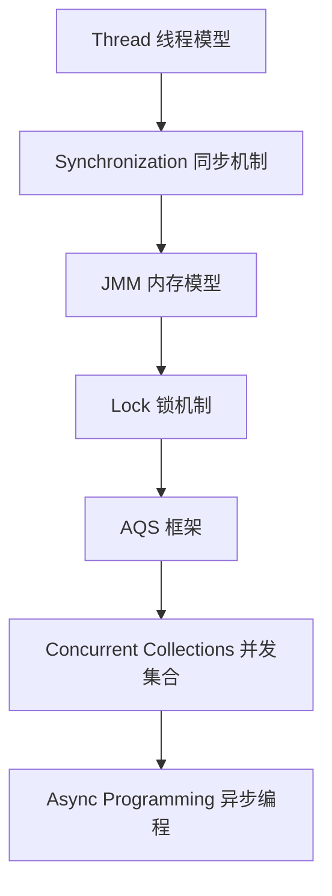
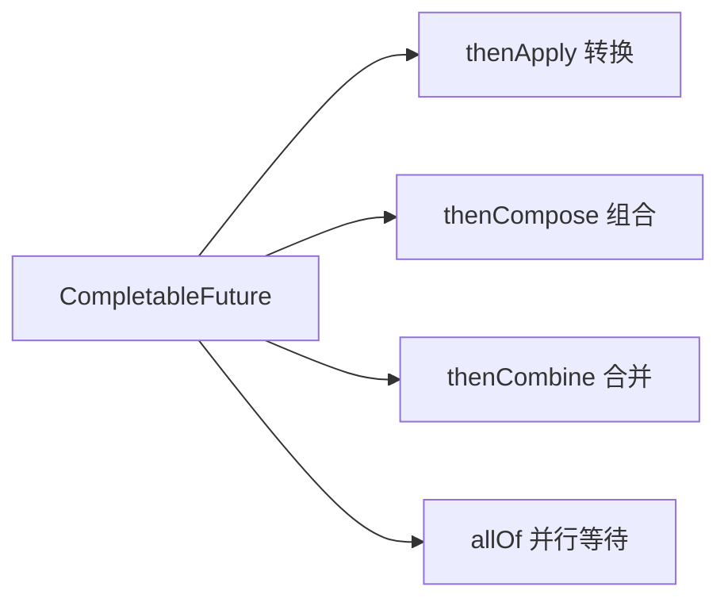

# 第三卷 Java 并发 —— 多线程如何正确、高效地共享资源

> 第一卷回答"Java 提供了哪些表达能力"，第二卷回答"程序如何被 JVM 执行"，第三卷回答"多个执行流同时访问共享资源时，Java 如何保证正确性与效率"。整卷按"问题产生 → 理论抽象 → 底层实现 → 工程实践"的顺序组织，不是线程 API 教程，而是理解 Java 如何在多核计算机上正确、高效地运行。本卷强依赖第二卷的 JVM 内存模型、对象布局、Monitor 和 JIT 知识。

---

## 1 为什么需要并发：从单线程到多核时代

本章目标：建立并发世界观。从历史驱动力出发，讲清楚并发为什么存在、解决什么问题、又带来什么新问题。

### 1.1 程序为什么要同时执行多个任务

从单核到多核的演进不是技术炫耀，而是物理极限的必然：

- **早期**：单 CPU、单程序、顺序执行——简单但慢
- **现在**：多核 CPU、海量任务、必须并行——快但复杂
- **三大驱动力**：提升吞吐量、降低响应时间、充分利用硬件资源

### 1.2 并发与并行的区别

| | 并发（Concurrency） | 并行（Parallelism） |
|---|---|---|
| 定义 | 多个任务在时间上交替推进 | 多个任务在同一时刻同时执行 |
| 核心 | 任务调度与切换 | 硬件并行计算 |
| 单核可行 | ✅ | ❌（需多核） |

### 1.3 并发带来的核心问题

单线程下 `count++` 毫无问题，多线程下：

```
Thread A: 读取 count(0) → +1 → 写入 count(1)
Thread B:       读取 count(0) → +1 → 写入 count(1)   ← 期望是 2，实际是 1
```

本质：多个执行流同时访问共享可变状态，产生**数据竞争**和**不确定结果**。

### 1.4 Java 并发体系全景

后续各章就是这张地图的逐层展开：



---

## 2 Java 线程模型：执行单元如何被抽象

本章目标：理解线程是什么，以及 Java 线程与 OS 线程的关系。不是罗列 API，而是讲清楚执行单元的抽象层级。

### 2.1 线程是什么

- **进程**：资源隔离的基本单位（独立内存空间）
- **线程**：CPU 调度的基本执行单位（共享进程内存）

线程是 OS 层面的概念，Java 只是对其进行了面向对象的封装。

### 2.2 Java Thread 的本质

Java Thread 不是 JVM 自己调度的：

```
Java Thread 对象
      ↓
Native Thread（OS 线程）
      ↓
OS Scheduler（操作系统调度器）
      ↓
CPU
```

现代 HotSpot 采用 **1:1 线程模型**：一个 Java 线程对应一个 OS 线程。这也解释了为什么 Java 不能无限制创建线程——受限于 OS 的线程资源。

### 2.3 创建线程的方式演进

不是教语法，而是展现 Java 线程抽象的演进：

| 方式 | 时代 | 特点 | 局限 |
|------|------|------|------|
| `Thread` | 早期 | 直接继承 | 单继承限制 |
| `Runnable` | 改进 | 接口分离 | 无返回值 |
| `Callable` + `Future` | JDK 5 | 有返回值、可抛异常 | `Future.get()` 阻塞等待 |
| `CompletableFuture` | JDK 8 | 异步组合、非阻塞 | 需要理解函数式编程 |

### 2.4 线程生命周期

```
NEW → RUNNABLE → BLOCKED / WAITING / TIMED_WAITING → TERMINATED
```

| 状态 | 含义 | 典型触发 |
|------|------|---------|
| NEW | 线程对象创建，未 start | `new Thread()` |
| RUNNABLE | 可运行（包括正在运行和等待 CPU） | `start()` |
| BLOCKED | 等待获取锁 | `synchronized` 竞争 |
| WAITING | 无限期等待 | `wait()`、`join()`、`LockSupport.park()` |
| TIMED_WAITING | 限时等待 | `sleep()`、`wait(timeout)` |
| TERMINATED | 执行完毕 | run 方法结束或异常退出 |

---

## 3 Java 内存模型（JMM）：线程如何看到数据

本章目标：这是并发理论的核心章节。讲清楚为什么多线程下看到的数据可能不一致，以及 Java 如何定义跨线程的内存可见性规则。

### 3.1 为什么需要 JMM

矛盾根源在于计算机体系结构：

- **CPU 缓存**：每个核有自己的 L1/L2 Cache，修改不一定立刻写回主存
- **编译器优化**：指令重排序、寄存器分配会改变代码执行顺序

结果：线程 A 写了一个变量，线程 B 不一定立刻看到，甚至可能永远看不到。

### 3.2 JMM 的抽象

JMM 不是物理内存模型，而是 **Java 对并发内存访问规则的抽象规范**：

- 定义了共享变量（实例字段、静态字段、数组元素）的访问规则
- 规定了何时一个线程对共享变量的写入对另一个线程可见
- 它是编译器、JIT、CPU 都必须遵守的"契约"

### 3.3 三大核心问题

| 问题 | 含义 | 举例 |
|------|------|------|
| **原子性** | 操作是否不可分割 | `i++` 不是原子的（读-改-写三步） |
| **可见性** | 一个线程修改后，其他线程何时能看到 | 线程 A 改了 flag，线程 B 可能永远看不到 |
| **有序性** | 代码执行顺序是否与编写顺序一致 | 编译器可能把两行互不依赖的代码交换执行 |

### 3.4 happens-before 规则

这是 JMM 的核心——判断操作之间是否存在可见性保证：

- **程序顺序规则**：同一线程中，前面的操作 happens-before 后面的
- **volatile 规则**：对 volatile 变量的写 happens-before 后续的读
- **锁规则**：解锁 happens-before 后续的加锁
- **线程启动规则**：`start()` happens-before 线程中的任何操作
- **传递性**：A happens-before B，B happens-before C → A happens-before C

---

## 4 volatile：轻量级同步机制

本章目标：理解 `volatile` 能做什么、不能做什么，以及它背后的硬件机制。

### 4.1 volatile 解决什么问题

volatile 不是线程安全的万能方案，它的两个核心保证：

- **可见性**：对 volatile 变量的写立即刷新到主存，读总是从主存取
- **有序性**：禁止 JVM 对 volatile 变量相关指令的重排序

### 4.2 volatile 底层实现

连接 CPU 层面：

- **内存屏障**：在 volatile 写之后插入 StoreStore + StoreLoad 屏障
- **MESI 协议**：CPU 缓存一致性协议，volatile 写会使其他核的缓存行失效
- **总线锁 / 缓存锁**：保证屏障指令的原子性

### 4.3 volatile 为什么不能保证 i++

`count++` 被拆解为三步：读取 → 修改 → 写入。volatile 只保证每一步的可见性，不保证三步合起来是原子的。

```
Thread A: 读(0) → 写(1)
Thread B:        读(0) → 写(1)  ← B 读到的还是 0
```

### 4.4 volatile 的经典应用

**双重检查锁（DCL）中的 `volatile`**：

```java
private volatile Singleton instance;  // 必须加 volatile
```

为什么？连接对象初始化：`instance = new Singleton()` 不是原子操作，可能被重排序为：先分配内存、将引用赋给 instance、再执行构造方法。另一个线程看到"非 null"的 instance 但构造尚未完成 → 访问到半初始化对象。

---

## 5 synchronized：Java 内置锁机制

本章目标：深入理解 `synchronized` 的本质——它不是关键字语法糖，而是 JVM 层面的 Monitor 机制，并与对象头 Mark Word 直接关联。

### 5.1 synchronized 的使用方式

| 形式 | 锁对象 | 适用场景 |
|------|--------|---------|
| 实例方法 | `this` | 保护实例状态 |
| 静态方法 | `Class` 对象 | 保护类级别的静态状态 |
| 同步代码块 | 指定对象 | 细粒度控制 |

### 5.2 synchronized 的本质

`synchronized` 编译为 `monitorenter` 和 `monitorexit` 两条字节码指令。每个 Java 对象都关联一个 Monitor，Monitor 是实现互斥和线程协作的核心数据结构。

### 5.3 synchronized 与对象头

连接第二卷对象模型：

| 锁状态 | Mark Word 锁标志 | 存储内容 |
|--------|-----------------|---------|
| 无锁 | 01 | hashCode + 分代年龄 |
| 偏向锁 | 01（偏向位=1） | Thread ID + Epoch |
| 轻量级锁 | 00 | 指向栈中锁记录的指针 |
| 重量级锁 | 10 | 指向 Monitor 的指针 |

（现代 JDK 15+ 默认关闭偏向锁，因为高并发下偏向锁的撤销成本往往超过收益。）

### 5.4 锁升级机制

```
无锁 → 偏向锁（同一线程反复获取）→ 轻量级锁（CAS 竞争失败但自旋可期）
    → 重量级锁（自旋超时或竞争激烈，依赖 OS Mutex）
```

锁只能升级，不能降级。这是一个**乐观→悲观**的优化策略：假设竞争不激烈时用轻量方案，激烈时再升级到重量级。

### 5.5 synchronized 的性能演进

- **JDK 1.2 之前**：纯重量级 Monitor，每次加锁都是系统调用
- **JDK 1.6 之后**：引入偏向锁、轻量级锁、自旋锁、锁粗化、锁消除等优化
- **JIT 的贡献**：逃逸分析 → 锁消除；热点代码 → 自旋优化

---

## 6 Lock 与 AQS：Java 并发工具的核心框架

本章目标：理解 `Lock` 接口相比 `synchronized` 的增强，以及 AQS 是如何用 `state` + `CLH 队列` 统一实现各种并发工具。

### 6.1 为什么需要 Lock

`Lock` 弥补了 `synchronized` 的功能限制：

| 能力 | synchronized | Lock |
|------|-------------|------|
| 可中断获取 | ❌ | ✅ `lockInterruptibly()` |
| 超时获取 | ❌ | ✅ `tryLock(timeout)` |
| 公平锁 | ❌ | ✅ 构造时指定 |
| 多条件队列 | ❌（只有一个隐式条件） | ✅ `newCondition()` 多个 |
| 非块结构 | ❌（必须成对出现在同一方法） | ✅ 可以跨方法 |

### 6.2 AQS 设计思想

`AbstractQueuedSynchronizer` 是 JUC 的骨架，核心三元素：

- **`state`（volatile int）**：同步状态，子类通过 `getState`/`setState`/`compareAndSetState` 操作
- **CLH 队列**：FIFO 的等待队列，存放获取锁失败的线程
- **Node**：队列节点，封装线程 + 等待状态（SIGNAL / CANCELLED 等）

### 6.3 AQS 获取锁流程

```
tryAcquire（子类实现，CAS 修改 state）
      ↓ 失败
创建 Node 加入 CLH 队列尾部
      ↓
前驱是头节点？→ 再次 tryAcquire
      ↓ 失败
park（挂起线程）
      ↓ 被唤醒
再次尝试获取
```

### 6.4 AQS 释放锁流程

```
tryRelease（子类实现，修改 state）
      ↓
唤醒头节点的后继节点
      ↓
unpark（恢复线程）
```

### 6.5 基于 AQS 的工具一览

| 工具 | 同步模式 | state 含义 |
|------|---------|-----------|
| `ReentrantLock` | 独占 | 0=未锁定，n=重入次数 |
| `Semaphore` | 共享 | 剩余许可数 |
| `CountDownLatch` | 共享 | 还需 countDown 的次数 |
| `ReentrantReadWriteLock` | 共享+独占 | 高16位=读锁数，低16位=写锁重入数 |

---

## 7 原子类与 CAS：无锁并发思想

本章目标：理解无锁并发的核心——CAS 的原理、底层支持、局限性以及 `Atomic` 系列工具的使用场景。

### 7.1 为什么需要无锁技术

锁的问题：

- **阻塞**：线程被挂起、唤醒 → 上下文切换开销
- **死锁风险**：多把锁的获取顺序不当
- **优先级反转**：低优先级线程持有锁，高优先级线程等待

无锁方案利用 CPU 原子指令，在线程不阻塞的情况下完成并发操作。

### 7.2 CAS 原理

Compare And Swap：一条 CPU 指令完成"比较并交换"的原子操作：

```
CAS(内存地址, 预期值, 新值):
    if 当前值 == 预期值:
        更新为新值 → 返回 true
    else:
        返回 false
```

如果失败则重试（自旋），直到成功。

### 7.3 CAS 的底层支持

- **JDK 层面**：`Unsafe.compareAndSwapInt()` / `VarHandle.compareAndSet()`
- **CPU 层面**：`cmpxchg` 指令（x86）
- **多核保证**：`lock` 前缀锁定总线或缓存行

### 7.4 CAS 的三大问题

| 问题 | 说明 | 解决 |
|------|------|------|
| ABA | 值从 A→B→A，CAS 无法感知变化 | `AtomicStampedReference` 加版本号 |
| 自旋消耗 | CAS 失败循环重试，消耗 CPU | 竞争激烈时改用锁 |
| 单变量限制 | 只能保证一个变量的原子性 | 把多个变量封装为一个对象 + `AtomicReference` |

### 7.5 Atomic 系列演进

| 类 | 原理 | 适用场景 |
|----|------|---------|
| `AtomicInteger` | CAS | 低竞争计数 |
| `AtomicReference` | CAS | 对象引用原子更新 |
| `LongAdder` | 分段累加（Cell 数组）| 高并发计数，比 `AtomicLong` 吞吐高 |
| `LongAccumulator` | 分段 + 自定义聚合函数 | 高并发下自定义聚合逻辑 |

---

## 8 并发集合：高性能数据结构

本章目标：理解为什么 `HashMap` 不能并发使用，以及 `ConcurrentHashMap` 从分段锁到 CAS 的演进。

### 8.1 普通集合为什么不能并发使用

- `ArrayList`：并发 `add` 可能导致数组越界或元素丢失（`size++` 不是原子的）
- `HashMap`：并发 `put` 可能导致死循环（JDK 7 头插法扩容时环形链表）或数据丢失

### 8.2 ConcurrentHashMap

| 版本 | 实现方式 | 锁粒度 |
|------|---------|--------|
| JDK 7 | Segment 分段锁（继承 ReentrantLock） | 16 个 Segment |
| JDK 8 | CAS + `synchronized` + Node | 单个桶（bin） |

JDK 8 的改进：放弃分段锁，改用 CAS 插入头节点 + `synchronized` 锁住桶首节点。粒度更细，且利用 `synchronized` 的锁升级优化。

### 8.3 CopyOnWrite 容器

- 核心思想：写时复制，读不加锁
- 写操作：复制整个数组 → 在新数组上修改 → 将引用指向新数组
- 适用场景：**读多写极少**（如配置信息、事件监听器列表）
- 代价：写操作的内存开销大，不适合频繁写入

### 8.4 BlockingQueue

生产者-消费者模型的基础设施：

| 实现 | 特点 |
|------|------|
| `ArrayBlockingQueue` | 有界，数组实现，一把锁 |
| `LinkedBlockingQueue` | 可选有界，链表实现，两把锁（put 和 take 分离） |
| `SynchronousQueue` | 无容量，每个 put 必须等待一个 take |
| `DelayQueue` | 延时出队，元素实现 `Delayed` 接口 |

---

## 9 线程池：并发任务管理

本章目标：理解线程池的设计原理、参数含义和任务调度流程，能够根据业务场景合理配置。

### 9.1 为什么需要线程池

无限创建线程的代价：

- **创建/销毁开销**：每个线程约 1MB 栈内存
- **上下文切换**：线程数 > CPU 核数时，大量时间花在切换上
- **资源不可控**：无法限制并发数量

### 9.2 ThreadPoolExecutor 核心参数

| 参数 | 含义 |
|------|------|
| `corePoolSize` | 核心线程数，即使空闲也保留 |
| `maximumPoolSize` | 最大线程数 |
| `keepAliveTime` | 非核心线程空闲存活时间 |
| `workQueue` | 任务等待队列 |
| `threadFactory` | 线程创建工厂（**线上必须自定义线程名**）|
| `rejectedExecutionHandler` | 队列满且线程数达上限时的拒绝策略 |

### 9.3 任务执行流程

```
提交任务
    ↓
核心线程未满？→ 创建核心线程执行
    ↓ 核心线程已满
队列未满？→ 入队等待
    ↓ 队列已满
线程数 < max？→ 创建非核心线程执行
    ↓ 线程数已达 max
执行拒绝策略
```

### 9.4 拒绝策略

| 策略 | 行为 | 适用场景 |
|------|------|---------|
| `AbortPolicy`（默认） | 抛 `RejectedExecutionException` | 必须感知过载的场景 |
| `CallerRunsPolicy` | 由提交任务的线程自行执行 | 天然限流，减缓提交速度 |
| `DiscardPolicy` | 静默丢弃 | 允许丢失的非关键任务 |
| `DiscardOldestPolicy` | 丢弃队首任务，重试提交 | 优先处理最新任务 |

### 9.5 线程池工程实践

- **线程命名**：必须通过 `ThreadFactory` 自定义名称，方便排查
- **参数设置**：CPU 密集型 → `coreSize ≈ CPU核数+1`；IO 密集型 → `coreSize ≈ CPU核数 × 2`（需实测调优）
- **监控**：`getPoolSize()`、`getActiveCount()`、`getQueue().size()`
- **线程隔离**：不同业务使用独立线程池，避免相互影响

---

## 10 并发编程模型：从线程到异步

本章目标：从"线程+共享内存"的模型扩展到异步编程和响应式思想，理解不同并发范式的适用场景。

### 10.1 Future 的局限

`Future` 解决了"获取异步结果"的问题，但有明显不足：

- `get()` 阻塞调用线程
- 不支持回调
- 无法组合多个异步任务

### 10.2 CompletableFuture

JDK 8 引入的真正异步编程工具：



核心价值：声明式描述任务依赖关系，不阻塞线程。

### 10.3 响应式编程思想

扩展视野——不是所有并发问题都应该用线程+锁解决：

- **事件驱动**：一个线程处理大量连接的事件（NIO 模型的基础）
- **非阻塞**：不等待，注册回调，事件到达时触发
- **背压（Backpressure）**：下游消费不过来时反向通知上游减速

### 10.4 Actor 模型与消息传递

另一种并发思想——**不共享状态，只传递消息**：

- 每个 Actor 有自己的状态，外界无法直接访问
- Actor 之间通过消息通信
- 天然无锁，天然分布式

Java 生态代表：Akka。虽然非主流，但理解这种范式能拓宽对并发的认知。

---

## 11 并发问题诊断与性能优化

本章目标：将前十章的理论落地为排查和优化能力。

### 11.1 常见并发问题

| 问题 | 表现 | 根因 |
|------|------|------|
| **死锁** | 多个线程互相等待对方释放锁，全部卡死 | 锁获取顺序不一致 |
| **活锁** | 线程不断重试但始终无法成功 | CAS 自旋竞争过于激烈 |
| **饥饿** | 低优先级线程永远得不到执行 | 非公平锁 + 持续高竞争 |

### 11.2 Thread Dump 分析

结合 JVM 工具（连接第二卷诊断章）：

- `jstack <pid>` 获取线程快照
- 识别死锁：输出末尾的 `Found one Java-level deadlock`
- 识别锁竞争：大量线程处于 BLOCKED 状态，等待同一个锁

### 11.3 锁竞争分析

关键指标：

- `blocked thread count`：等待锁的线程数
- `monitor contention`：Monitor 竞争统计
- 优化方向：减少锁粒度（如 `ConcurrentHashMap` 从 Segment 到 bin）、增加并发度

### 11.4 并发性能优化策略

| 策略 | 思路 | 示例 |
|------|------|------|
| 减少锁粒度 | 大锁拆小锁 | `ConcurrentHashMap` bin 级别锁 |
| 无锁设计 | CAS 替代 synchronized | `AtomicLong` → `LongAdder` |
| 读写分离 | 读不加锁，写加锁 | `ReentrantReadWriteLock`、`CopyOnWriteArrayList` |
| 批处理 | 减少锁获取次数 | 批量入库替代逐条 insert |
| 异步化 | 解耦请求与处理 | 线程池 + 消息队列 |

---

> 第三卷到此结束。从线程模型 → JMM → volatile → synchronized → AQS → CAS → 并发集合 → 线程池 → 异步编程 → 诊断优化，读者已经建立起 Java 并发的完整认知体系。
>
> **与全书其他卷的纵横联系：**
>
> | 依赖方向 | 依赖内容 |
> |---------|---------|
> | ← 第二卷 | JVM 内存模型（堆共享、栈私有）、对象头 Mark Word（锁升级）、Monitor 机制、JIT 锁消除/锁粗化、CPU 缓存与 MESI |
> | → 第四卷 网络 | Netty 的 EventLoop 线程模型、NIO 的非阻塞并发、响应式编程 |
> | → 第六卷 Spring | 声明式事务的线程绑定、`@Async` 线程池、Spring Security 的 `ThreadLocal` 上下文传递 |
> | → 第七卷 性能 | 线程池调优、异步化架构、CAP 与分布式一致性 |
>
> 三卷之间形成自然递进：**Java 如何表达程序 → JVM 如何执行程序 → 多执行流如何安全高效地共享资源**。