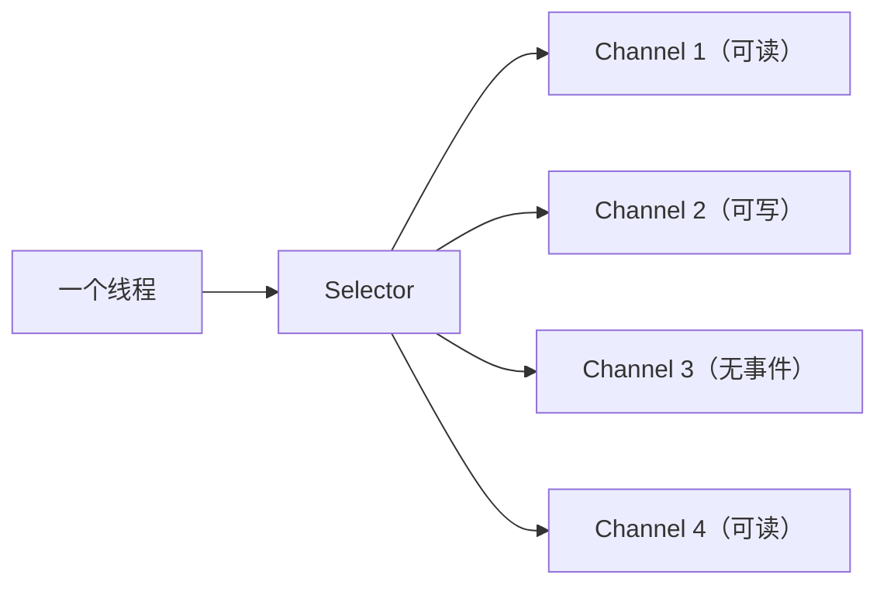

# 第四卷 Java 网络与通信 —— 数据是如何从一个 JVM 到另一个 JVM 的

> 前三卷解决了 Java 如何表达程序、如何运行、多线程如何协作。第四卷回答：Java 程序如何与外部世界建立连接。现代后端本质上不是单机程序，而是 客户端 → 网络 → Java 服务 → 数据库/MQ/Redis/其他服务。本卷从网络本质（字节流的跨机器传输）出发，依次讲解 TCP/IP、Socket、BIO/NIO 模型演进、Netty 框架、HTTP 协议、Servlet/Spring MVC 的通信模型、RPC、长连接与实时通信，最后落地到网络性能分析与故障排查。重点不是框架 API，而是理解数据如何在计算机之间传输，以及 Java 如何构建高性能网络应用。

---

## 1 网络通信基础：程序如何跨越机器边界

本章目标：建立网络世界观。理解程序之间通信的本质——发送字节、接收字节，所有高级协议最终都落到底层字节流。

### 1.1 为什么程序需要网络

从单机到分布式的范式转变：

```
单机时代：Application → Memory
分布式时代：Service A → Network → Service B
```

网络成为**程序之间通信的基础设施**，不再是可选的附加能力。

### 1.2 网络通信的本质

两个程序如何交流？

- **本质**：发送 `bytes`，接收 `bytes`
- HTTP、RPC、WebSocket —— 都是对底层字节流的不同抽象封装
- 网络编程的核心：高效、可靠地在两个端点之间传输字节

### 1.3 网络分层模型

建立分层意识，理解每层的职责边界：

| OSI 七层 | TCP/IP 四层 | 职责 | Java 开发者需要关心的 |
|---------|------------|------|---------------------|
| 应用层/表示层/会话层 | 应用层 | 业务数据格式（HTTP、DNS） | `URL`、`HttpURLConnection`、Spring MVC |
| 传输层 | 传输层 | 端到端可靠传输（TCP、UDP） | `Socket` |
| 网络层 | 网络层 | 路由与寻址（IP） | IP 地址、子网 |
| 数据链路层/物理层 | 网络接口层 | 帧传输与物理信号 | 不需要关心 |

核心收获：Java 开发者需要理解**哪些问题属于哪一层**，才能快速定位网络问题。

### 1.4 数据如何从一台机器到另一台机器

完整的数据封装旅程：

```
Application Data
      ↓ (TCP 分段)
TCP Segment（端口号 + 序列号）
      ↓ (IP 封装)
IP Packet（源/目标 IP 地址）
      ↓ (链路层封装)
Ethernet Frame（MAC 地址）
      ↓
物理网络传输
```

---

## 2 TCP/IP：可靠通信的基础

本章目标：深入理解 TCP——不只是背"三次握手四次挥手"，而是理解 TCP 为什么这样设计，以及这些设计对上层应用开发的直接影响（粘包拆包、性能参数等）。

### 2.1 TCP 为什么存在

UDP 的不足 vs TCP 的承诺：

| | UDP | TCP |
|---|---|---|
| 连接 | 无连接，直接发送 | 面向连接，需建立连接 |
| 可靠性 | 不保证送达 | 确认重传，保证送达 |
| 顺序 | 不保证顺序 | 序列号保证顺序 |
| 流量控制 | 无 | 滑动窗口 |
| 适用场景 | 视频直播、DNS 查询 | 绝大多数业务场景 |

### 2.2 TCP 三次握手与四次挥手

不要只背流程，要理解**为什么**：

- **三次握手**：为什么不是两次？——防止已失效的连接请求到达服务端，服务端误以为客户端要建立连接
- **四次挥手**：为什么比握手多一次？——TCP 是全双工的，每个方向都需要独立关闭
- **TIME-WAIT 为什么等 2MSL**：确保最后一个 ACK 能被对方收到；让旧连接的延迟报文在网络中消失

### 2.3 TCP 数据传输机制

| 机制 | 作用 | 对上层的影响 |
|------|------|------------|
| 序列号（Sequence Number） | 保证数据有序 | 数据必然按序到达 |
| 确认应答（ACK） | 保证数据到达 | 丢包会触发重传 |
| 超时重传 | 应对丢包 | 网络抖动时延迟增加 |
| 滑动窗口 | 流量控制 | 发送方不能发太快 |

### 2.4 TCP 粘包与拆包

这是 Java 网络开发的高频问题：

**根因**：TCP 是**字节流**，不是**消息协议**。应用层写入的"消息"在 TCP 层面没有边界标记。

```
应用层写："hello" + "world"
TCP 可能：一次收到 "helloworld"（粘包）
         或：先收到 "hel"，再收到 "loworld"（拆包）
```

三种解决方案（为 Netty 编解码铺垫）：
- **固定长度**：每条消息固定字节数
- **分隔符**：用特定字符标记消息结尾
- **Length Field**：消息头包含长度字段

### 2.5 TCP 性能相关参数

| 参数 | 含义 | 何时调整 |
|------|------|---------|
| Nagle 算法 | 小包合并发送 | 低延迟场景关闭（`TCP_NODELAY`） |
| KeepAlive | TCP 保活探测 | 长连接场景，但要配合应用层心跳 |
| TIME-WAIT | 主动关闭方等待 | 短连接频繁时端口耗尽 |
| Socket Buffer | 收发缓冲区大小 | 高吞吐场景适当增大 |

---

## 3 Java Socket 编程：网络抽象的起点

本章目标：理解 Socket 不是框架，而是操作系统提供的网络编程接口。Java 的 `Socket` 和 `ServerSocket` 是对 OS Socket 的面向对象封装。

### 3.1 Socket 是什么

Socket = 网络通信端点 = IP + Port

```
应用进程 ←→ Socket ←→ TCP/UDP ←→ IP ←→ 物理网络
```

它本质是一个"插座"——一端插在应用进程，另一端插在网络协议栈。

### 3.2 BIO 模型

传统阻塞 I/O 模型：

```
Thread → Socket.read() → Blocking
```

服务端为每个连接分配一个线程：

```
Client A → Thread A（阻塞在 read()）
Client B → Thread B（阻塞在 read()）
Client C → Thread C（阻塞在 read()）
```

### 3.3 BIO 为什么无法支撑高并发

```
10000 连接 = 10000 线程
```

问题三位一体：

| 问题 | 影响 |
|------|------|
| **内存** | 每个线程 ~1MB 栈空间，10000 线程 = 10GB |
| **调度开销** | 大量线程频繁上下文切换，CPU 花在调度而非业务 |
| **资源浪费** | 大部分线程阻塞等待数据，白白占用资源 |

引出 NIO 的必然性。

---

## 4 Java NIO：高性能网络模型

本章目标：这是 Java 网络编程的核心章节。理解 NIO 如何用**事件驱动**替代**线程阻塞**，用一个线程管理多个连接。

### 4.1 为什么需要 NIO

核心思想转变：

```
BIO：阻塞等待（线程在等数据）
NIO：事件通知（数据到了通知线程）
```

一个线程不再绑定一个连接，而是监听多个连接的事件。

### 4.2 Channel：双向数据通道

替代 BIO 的 `Stream`：

| | Stream | Channel |
|---|---|---|
| 方向 | 单向（InputStream / OutputStream） | 双向 |
| 阻塞 | 阻塞 | 可非阻塞 |
| 操作对象 | 字节 | Buffer |

### 4.3 Buffer：NIO 的数据容器

为什么 NIO 引入 Buffer——Channel 不直接操作字节数组，而是通过 Buffer 统一管理：

```
capacity ←→ limit ←→ position ←→ mark
```

三个关键操作：`flip()`（写→读）、`clear()`（清空准备写）、`compact()`（压缩未读数据）。

### 4.4 Selector：一个线程管理万千连接

NIO 的核心——多路复用器：



流程：`Channel 注册到 Selector → select() 阻塞等待事件 → 遍历 readyKeys 处理`

### 4.5 NIO Reactor 模型

```
Event Loop（一个线程）
      ↓
Selector（监听 N 个 Channel）
      ↓ 事件到达
Channel → Handler（业务处理）
```

Reactor 模式的本质：将 I/O 事件的**检测**和**处理**分离。

### 4.6 NIO 的真实限制

NIO 强大但存在工程问题：

| 问题 | 说明 |
|------|------|
| 编程复杂 | Buffer 操作、事件处理、连接管理，细节繁多 |
| epoll 空轮询 Bug | JDK 特定版本下 epoll 会 CPU 100% |
| 平台差异 | 不同 OS 的 NIO 实现有细微差异 |

引出 Netty 的必然性。

---

## 5 Netty：Java 高性能网络框架

本章目标：理解 Netty 如何封装 NIO 的复杂性，提供高性能、易扩展的网络编程框架。这章是后端开发面试和实战的重点。

### 5.1 为什么需要 Netty

Netty 解决了原生 NIO 的三大痛点：

- **API 复杂** → 统一抽象，简化编程模型
- **性能问题** → 消除 epoll 空轮询 Bug，内存池化、零拷贝
- **扩展需求** → 丰富的协议支持（HTTP、WebSocket、自定义协议）

### 5.2 Netty 核心架构

```
Bootstrap（启动入口）
      ↓
EventLoopGroup（线程池）
      ↓
Channel（连接抽象）
      ↓
ChannelPipeline（拦截器链）
      ↓
ChannelHandler（业务处理）
```

### 5.3 EventLoop：Netty 的线程模型

连接第三卷并发知识：

- 一个 `EventLoop` = 一个线程 + 一个 `Selector`
- 一个 `EventLoop` 负责多个 `Channel`
- 一个 `Channel` 的所有操作都在同一个 `EventLoop` 中执行 → **线程安全，无需加锁**

### 5.4 ChannelPipeline：责任链模式

Netty 扩展性的核心：

```
Inbound:   [Decoder1] → [Decoder2] → [BusinessHandler]
Outbound:  [BusinessHandler] → [Encoder2] → [Encoder1]
```

数据在 Pipeline 中按顺序经过各个 Handler，每个 Handler 只处理自己关心的事。

### 5.5 ByteBuf：Netty 的内存模型

为什么比 `ByteBuffer` 好用：

| | ByteBuffer | ByteBuf |
|---|---|---|
| 读写模式 | 需要 `flip()` 切换 | 独立读/写指针 |
| 容量 | 固定 | 自动扩容 |
| 内存类型 | Heap | Heap + Direct |
| 引用计数 | 无 | 支持，便于池化和回收 |

### 5.6 编解码机制

解决 TCP 粘包拆包的工程方案：

| 解码器 | 适用场景 |
|--------|---------|
| `FixedLengthFrameDecoder` | 固定长度消息 |
| `DelimiterBasedFrameDecoder` | 以分隔符结尾的消息 |
| `LengthFieldBasedFrameDecoder` | 消息头包含长度字段 |

### 5.7 Netty 线程模型深入

```
Boss Group（EventLoop × 1）  →  只处理 accept 事件
Worker Group（EventLoop × N） →  处理 read/write 事件
Task Queue                     →  异步任务
```

这是**主从 Reactor 模式**的经典实现。

---

## 6 HTTP 协议：应用层通信标准

本章目标：理解 HTTP 不是"调用接口的协议"，而是建立在 TCP 之上的应用层消息规范。理解报文结构、方法语义、状态码体系以及从 HTTP/1.1 到 HTTP/3 的演进逻辑。

### 6.1 HTTP 为什么出现

TCP 只负责**可靠传输**，不关心传输的是什么。

HTTP 定义了**业务通信规则**：如何发请求、如何返回响应、状态如何表达。

### 6.2 HTTP 报文结构

```
Request:
  Method SP URL SP Version CRLF
  Header: Value CRLF
  ...
  CRLF
  Body

Response:
  Version SP Status SP Reason CRLF
  Header: Value CRLF
  ...
  CRLF
  Body
```

### 6.3 HTTP 方法语义

| 方法 | 语义 | 幂等 | 安全 |
|------|------|------|------|
| GET | 获取资源 | ✅ | ✅ |
| POST | 创建资源 | ❌ | ❌ |
| PUT | 全量更新 | ✅ | ❌ |
| DELETE | 删除资源 | ✅ | ❌ |
| PATCH | 部分更新 | ❌ | ❌ |

重点理解**语义**，而不是死记。

### 6.4 HTTP 状态码

| 类别 | 含义 | 典型状态码 |
|------|------|-----------|
| 2xx | 成功 | 200 OK、201 Created、204 No Content |
| 3xx | 重定向 | 301 永久、302 临时、304 未修改 |
| 4xx | 客户端错误 | 400 参数错误、401 未认证、403 禁止、404 未找到 |
| 5xx | 服务端错误 | 500 内部错误、502 网关错误、503 服务不可用 |

### 6.5 HTTP/1.1

- **Keep-Alive**：复用 TCP 连接，减少握手开销
- **Pipeline**：一个连接上排队发送多个请求
- **局限性**：队头阻塞（HOL Blocking）——一个慢响应对后续响应有影响

### 6.6 HTTP/2

从文本到二进制帧的革命：

| 改进 | 效果 |
|------|------|
| 二进制分帧 | 解析更高效 |
| 多路复用 | 同一连接并发处理多个请求/响应 |
| 头部压缩 | 减少重复头部传输 |
| Server Push | 服务端主动推送资源 |

### 6.7 HTTP/3（简介）

基于 QUIC（UDP），解决 TCP 层面的队头阻塞问题，支持 0-RTT 快速建连。

---

## 7 Java Web 通信模型：Servlet 到 Spring MVC

本章目标：连接前端开发体验——理解一个 HTTP 请求如何从网络层进入 Java 应用，经过 Servlet 容器、经过 Spring MVC 的 DispatcherServlet，最终到达 Controller。这是连接网络知识和日常开发的关键桥梁。

### 7.1 Servlet 网络模型

```
HTTP Request
      ↓
Connector（Tomcat 的 HTTP 连接器）
      ↓
Servlet Container
      ↓
Servlet.service()
      ↓
HTTP Response
```

### 7.2 Tomcat 网络架构

| 组件 | 职责 |
|------|------|
| Connector | 接收 HTTP 请求，解析为 Request/Response |
| Protocol Handler | 协议适配（HTTP/1.1、HTTP/2、AJP） |
| Thread Pool | 处理请求的线程池 |
| Engine → Host → Context → Wrapper | 容器层级，最终定位到 Servlet |

### 7.3 Spring MVC 请求流程

```
HTTP Request
      ↓
DispatcherServlet（前端控制器）
      ↓
HandlerMapping（找到对应的 Controller 方法）
      ↓
HandlerAdapter（调用方法，参数解析）
      ↓
Controller（业务处理）
      ↓
ViewResolver / @ResponseBody（返回 JSON）
      ↓
HTTP Response
```

### 7.4 Web 框架如何隐藏网络复杂度

`@GetMapping` 一行注解背后：

- Socket 连接的建立与管理
- HTTP 协议的解析与生成
- 请求体的反序列化（JSON → Java 对象）
- 响应体的序列化（Java 对象 → JSON）
- 连接池、超时控制、异常处理

理解这些底层机制，才能真正掌握框架。

---

## 8 RPC 与微服务通信

本章目标：区分 HTTP（面向用户）和 RPC（面向服务）的不同设计哲学，理解 RPC 的核心组成——代理、协议、序列化、传输层。

### 8.1 为什么需要 RPC

| | HTTP | RPC |
|---|---|---|
| 面向对象 | 面向资源（URL） | 面向方法（函数调用） |
| 设计哲学 | 通用、可读 | 高效、透明 |
| 典型场景 | 浏览器 ↔ 服务 | 服务 ↔ 服务 |
| 代表技术 | REST API | Dubbo、gRPC |

RPC 的目标：让远程调用**像本地调用一样自然**。

### 8.2 RPC 核心组成

```
Client Stub（代理，调用方看起来像本地方法）
      ↓
序列化（Java 对象 → 二进制）
      ↓
协议封装（请求 ID + 方法名 + 参数）
      ↓
网络传输（Socket / Netty）
      ↓
反序列化（二进制 → Java 对象）
      ↓
Server Stub（服务端反射调用）
```

### 8.3 序列化机制

| 序列化方案 | 特点 | 适用场景 |
|-----------|------|---------|
| JSON | 可读性好，兼容性强 | REST API、跨语言 |
| Protobuf | 体积小、速度快 | gRPC、高性能场景 |
| Hessian | Java 友好 | Dubbo 默认 |
| Kryo | 高性能 | 大数据场景 |

### 8.4 服务发现

```
Service Provider → 注册 → Service Registry（Nacos / Zookeeper）
                                 ↓
Service Consumer ← 订阅 ← 获取服务地址列表
                                 ↓
                           负载均衡 → 调用
```

### 8.5 RPC 与 HTTP 的选择

| 场景 | 推荐方案 |
|------|---------|
| 对外开放 API | REST（HTTP + JSON） |
| 内部服务间高效调用 | gRPC（Protobuf） |
| Java 生态微服务 | Dubbo |
| 跨语言 + 高性能 | gRPC |

---

## 9 长连接与实时通信

本章目标：理解为什么短连接不够用，长连接（WebSocket、SSE）如何实现实时双向通信，以及 IM 系统的设计思想。

### 9.1 为什么需要长连接

| | 短连接 | 长连接 |
|---|---|---|
| 连接方式 | 每次请求建立新 TCP | 建立一次，持续使用 |
| 开销 | 每次 TCP 握手 | 一次握手长期复用 |
| 实时性 | 轮询（延迟 + 浪费） | 推送（实时） |
| 适用场景 | 普通 Web 请求 | 即时通讯、实时推送 |

### 9.2 WebSocket

HTTP 协议升级到 WebSocket 的过程：

```
Client → HTTP Upgrade 请求（Connection: Upgrade）
Server → 101 Switching Protocols
双方 → WebSocket 帧通信（全双工）
```

特点：客户端和服务端都可以随时发送消息，真正实现双向实时通信。

### 9.3 SSE（Server-Sent Events）

与 WebSocket 的对比：

| | WebSocket | SSE |
|---|---|---|
| 通信方向 | 全双工 | 单向（服务器 → 客户端） |
| 协议 | 独立协议（ws://） | 基于 HTTP |
| 实现复杂度 | 较高 | 较低 |
| 适用场景 | 聊天、游戏 | 股票推送、通知 |

### 9.4 IM 系统设计思想

一个即时通讯系统需要解决的核心问题：

| 问题 | 解决方案 |
|------|---------|
| 在线状态管理 | 用户上线/下线事件 + 心跳检测 |
| 消息路由 | 如何找到用户所在的服务器 → 一致性哈希 + 路由表 |
| 消息可靠性 | 客户端 ACK + 服务端重推 + 离线消息存储 |
| 消息顺序 | 服务端时间戳 + 序列号 |
| 心跳检测 | 定时 ping/pong，超时判定离线 |

---

## 10 网络性能分析与故障排查

本章目标：将前九章的理论落地为工程实战能力。覆盖常见网络问题的定位方法和排查工具。

### 10.1 常见网络问题速查

| 现象 | 可能原因 | 排查方向 |
|------|---------|---------|
| 连接超时 | 防火墙、服务未监听、网络不通 | `telnet`、`nc` 检查端口可达性 |
| Connection Refused | 服务未启动或端口错误 | 确认服务状态和监听端口 |
| Connection Reset | 对端强制关闭连接 | 检查对端日志、是否超时关闭 |
| TIME-WAIT 过多 | 短连接频繁创建销毁 | `netstat -an | grep TIME_WAIT` |
| CLOSE-WAIT 堆积 | 服务端未正确 `close()` | `netstat -an | grep CLOSE_WAIT` |

### 10.2 网络抓包分析

| 工具 | 用途 |
|------|------|
| `tcpdump` | 命令行抓包，适合服务器端 |
| Wireshark | 图形化分析，适合深度排查 |
| 关键分析点 | TCP 握手是否成功、重传次数、窗口大小变化 |

### 10.3 Java 网络诊断

| 工具/命令 | 用途 |
|----------|------|
| `netstat -an` | 当前连接状态一览 |
| `jstack <pid>` | 线程 dump，发现阻塞在 `Socket.read()` 的线程 |
| Arthas `thread -b` | 快速找到当前阻塞的线程 |
| Arthas `trace` | 追踪网络调用耗时 |

### 10.4 高并发网络优化

| 优化方向 | 具体手段 |
|---------|---------|
| 连接管理 | 连接池复用、合理的超时设置 |
| I/O 模型 | 从 BIO 升级到 NIO + Netty |
| TCP 参数 | `TCP_NODELAY` 关闭 Nagle、调整 Socket Buffer |
| KeepAlive | 应用层心跳 + TCP KeepAlive 兜底 |
| 限流 | 网关层 + 应用层多级限流保护 |

---

> 第四卷到此结束。从"字节流是网络通信的本质"出发，经过 TCP/IP → Socket → BIO 的困境 → NIO 与 Reactor → Netty 的封装 → HTTP 协议 → Servlet/Spring MVC → RPC → 长连接/WebSocket → 网络诊断，读者已经建立起 Java 网络编程的完整认知体系。
>
> **四卷之间的递进关系：**
>
> ```
> Java Language（会写代码）
>       ↓
> JVM Runtime（知道代码怎么运行）
>       ↓
> Concurrency（知道多线程为什么正确）
>       ↓
> Networking（知道服务如何通信）
> ```
>
> **与全书其他卷的纵横联系：**
>
> | 依赖方向 | 依赖内容 |
> |---------|---------|
> | ← 第二卷 | 直接内存（DirectMemory）是 NIO 零拷贝的基础 |
> | ← 第三卷 | Reactor/EventLoop 的线程模型强依赖并发知识；Netty 的单线程绑定避免了同步开销 |
> | → 第五卷 | 数据库连接本质上是网络 Socket 连接；Redis 通信也是网络 I/O |
> | → 第六卷 | Spring MVC 的请求处理链路建立在 Servlet 网络模型之上；Cloud 微服务间 RPC 调用依赖本章理解 |
> | → 第七卷 | 负载均衡、API 网关、服务网格都构建在网络层之上；网络调优是性能优化的一个关键维度 |
