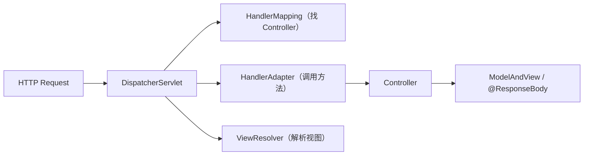

# 第六卷 Java 企业架构 —— 如何把语言、运行时、网络、数据这些能力组合成真实企业级系统

> 前五卷构建了 Java 语言、运行时、并发、网络、数据访问的完整底层认知。第六卷回答：如何利用 Java 生态把这些能力**组合**成一个可设计、可启动、可组织、可扩展、可治理的企业级系统。本卷不是 Spring 框架教程，而是以 Spring 为媒介，讲清楚企业应用的运行模型：从 IoC 的依赖管理思想、AOP 的动态代理机制、MVC 的请求驱动模型、Spring Boot 的自动装配，到 ORM 框架的设计取舍、微服务架构的拆分与治理、安全体系、部署与可观测性。读完这卷，你不仅"会用 Spring"，更"理解为什么这样设计企业系统"。

---

## 1 企业级 Java 应用的发展演进

本章目标：建立企业开发的历史观。理解从单机程序到现代微服务系统的发展驱动力，以及 Spring 生态为什么成为 Java 企业开发的主流选择。

### 1.1 从单体程序到企业系统

```
早期（单机）：User → Application → Database

现代（分布式）：
    User → Gateway → Service A
                      ↓
                    Service B → Database
                      ↓
                    Service C → MQ → Service D
```

变化的核心驱动力：用户量增长 → 数据量增长 → 业务复杂度增长 → 必须拆分与协作。

### 1.2 Java 企业开发为什么复杂

企业系统不同于单机程序的核心区别：

| 维度 | 单机程序 | 企业系统 |
|------|---------|---------|
| 对象管理 | 自己 `new` | 容器统一管理生命周期 |
| 事务 | 不涉及 | ACID、分布式事务 |
| 安全 | 无 | 认证、授权、加密、审计 |
| 配置 | 硬编码 | 多环境、动态刷新 |
| 部署 | 单个 jar | 多实例、容器化、滚动发布 |
| 可观测性 | `System.out.println` | 日志、指标、链路追踪 |

### 1.3 从 Java EE 到 Spring 生态

- **EJB 时代**：重量级，强侵入，难测试，难部署
- **Spring 的胜利**：
  - POJO —— 不依赖特定框架 API
  - DI —— 让对象管理从"硬编码"变成"可配置"
  - 灵活扩展 —— 组件化，按需使用
- **Spring Boot**：约定优于配置，一站式开发体验
- **Spring Cloud**：将微服务治理能力标准化

### 1.4 现代 Java 企业技术栈全景

```
Spring Framework（IoC + AOP + MVC）
        ↓
Spring Boot（自动配置 + Starter + Actuator）
        ↓
Spring Cloud（服务发现 + 配置中心 + 网关 + 熔断）
        ↓
数据层（MySQL + MyBatis/JPA + Redis + MQ）
        ↓
基础设施（Docker + K8s + Prometheus + ELK）
```

---

## 2 Spring 核心思想：IoC 与依赖管理

本章目标：理解 IoC 不是一个 Spring 特有的概念，而是一种将"对象创建权"从使用者转移到容器的设计思想。这是 Spring 一切扩展机制的基础。

### 2.1 为什么需要 IoC

传统代码的问题：

```java
public class OrderService {
    private OrderRepository repo = new OrderRepositoryImpl(); // 硬编码
}
```

- **强耦合**：`OrderService` 必须知道 `OrderRepositoryImpl` 的存在
- **难测试**：无法 Mock 依赖
- **难替换**：换一个实现就要改代码

IoC 的核心反转：

| | 传统 | IoC |
|---|---|---|
| 谁创建 | 我 `new` | 容器创建 |
| 谁管理 | 我持有引用 | 容器管理生命周期 |
| 谁组装 | 我手动设置 | 容器自动注入 |

### 2.2 Spring Bean 的本质

Bean 不是普通 Java 对象，而是**被 Spring 容器管理的对象**。区别在于：

- 普通对象：`new` 创建，GC 回收，开发者全程管理
- Bean：容器创建、容器注入依赖、容器回调生命周期、容器在合适时机销毁

### 2.3 Bean 生命周期

完整流程——这是 Spring 面试和源码理解的核心：

```
BeanDefinition 注册
      ↓
实例化（构造方法 / 工厂方法）
      ↓
属性赋值（依赖注入）
      ↓
Aware 接口回调（BeanNameAware → BeanFactoryAware → ApplicationContextAware）
      ↓
BeanPostProcessor.postProcessBeforeInitialization()
      ↓
@PostConstruct / InitializingBean.afterPropertiesSet()
      ↓
BeanPostProcessor.postProcessAfterInitialization()
      ↓
Bean 就绪，可以被使用
      ↓
@PreDestroy / DisposableBean.destroy()
      ↓
销毁
```

### 2.4 ApplicationContext：Spring 容器本质

| | BeanFactory | ApplicationContext |
|---|---|---|
| 定位 | 底层 IoC 容器 | 高级容器（继承 BeanFactory） |
| 能力 | Bean 的创建与管理 | + AOP、事件、国际化、环境抽象 |
| 加载方式 | 延迟加载 | 预加载（默认） |

### 2.5 依赖注入的三种方式

| 注入方式 | 实现 | 适用场景 | 推荐度 |
|---------|------|---------|--------|
| 构造器注入 | 通过构造方法传入 | 强制依赖、不可变 | ⭐ 首选 |
| Setter 注入 | 通过 setter 方法注入 | 可选依赖、运行时变更 | 次选 |
| 字段注入 | `@Autowired` 直接标注字段 | 简洁但不推荐 | ❌ 不利于测试 |

---

## 3 Spring 容器源码机制

本章目标：深入 Spring 容器内部——理解 Bean 如何被定义、如何被创建、循环依赖如何被解决。这是区分"会用 Spring"和"理解 Spring"的分水岭。

### 3.1 Spring 启动流程

```
ApplicationContext 启动
      ↓
BeanDefinition 扫描与注册
      ↓
BeanFactoryPostProcessor（修改 BeanDefinition，如 ${} 占位符替换）
      ↓
Bean 实例化（反射调用构造方法）
      ↓
依赖注入（@Autowired、@Value 等）
      ↓
初始化（@PostConstruct → afterPropertiesSet → init-method）
```

### 3.2 BeanDefinition：Bean 的"身份证"

Spring 不直接保存对象，而是保存对象的**定义**：

| 属性 | 含义 |
|------|------|
| `beanClassName` | 全限定类名 |
| `scope` | singleton / prototype |
| `lazyInit` | 是否延迟初始化 |
| `dependsOn` | 依赖的 Bean 名称 |
| `initMethodName` / `destroyMethodName` | 生命周期回调 |
| `propertyValues` | 属性值 |

### 3.3 BeanFactory 创建对象的详细流程

```
getBean(name)
      ↓
从缓存 singletonObjects 查找 → 命中则返回
      ↓ 未命中
检查是否正在创建（循环依赖检测）
      ↓
创建 Bean 实例 → populateBean（属性填充）→ initializeBean（初始化）
      ↓
放入 singletonObjects 缓存
```

### 3.4 循环依赖与三级缓存

面试高频问题：A 依赖 B，B 依赖 A，Spring 怎么解决？

```
A 创建中 → 提前暴露 A 的工厂到三级缓存
      ↓
发现依赖 B → 去创建 B
      ↓
B 创建 → 发现依赖 A → 从三级缓存获取 A 的早期引用
      ↓
B 完成 → A 完成
```

三级缓存：

| 缓存 | 名称 | 存储内容 |
|------|------|---------|
| 一级 | `singletonObjects` | 完全初始化好的单例 Bean |
| 二级 | `earlySingletonObjects` | 提前暴露的 Bean（未完全初始化） |
| 三级 | `singletonFactories` | Bean 的工厂 ObjectFactory |

注意：**构造器注入的循环依赖无法解决**，因为构造器执行时连三级缓存都来不及暴露。

---

## 4 Spring AOP：面向切面编程

本章目标：连接第三卷对象模型——理解 AOP 的本质不是"加日志"，而是用代理 + 拦截实现横切关注点的统一管理。讲清楚 JDK 动态代理和 CGLIB 的区别与选择。

### 4.1 为什么需要 AOP

横切关注点的困境：

```
日志、权限、事务、缓存——每个方法都要写，散落各处，重复且难维护。
```

AOP 的思想：把这些关注点"切"出来，统一管理，在合适的时机织入。

### 4.2 AOP 核心概念

| 概念 | 含义 | 示例 |
|------|------|------|
| 切面（Aspect） | 横切关注点的模块化 | `@Aspect` 标注的类 |
| 连接点（Join Point） | 程序执行过程中的点 | 方法调用 |
| 切入点（Pointcut） | 匹配连接点的表达式 | `execution(* com.example..*.*(..))` |
| 通知（Advice） | 在切入点执行的代码 | `@Before`、`@After`、`@Around` |
| 织入（Weaving） | 将切面应用到目标对象 | 编译期、类加载期、运行期 |

### 4.3 动态代理：AOP 的底层实现

| | JDK 动态代理 | CGLIB |
|---|---|---|
| 代理方式 | 基于接口 | 基于继承（子类） |
| 要求 | 目标类必须实现接口 | 不能代理 `final` 类和方法 |
| 性能特点 | 生成快，调用略慢 | 生成慢，调用快 |
| Spring 默认 | 有接口时优先 | 无接口时使用（Spring Boot 2.0 默认 CGLIB） |

### 4.4 Spring AOP 实现机制

```
原始 Bean
      ↓
BeanPostProcessor（AnnotationAwareAspectJAutoProxyCreator）
      ↓
创建 Proxy（JDK Proxy 或 CGLIB）
      ↓
调用时：Proxy → Interceptor Chain → Target Method
      ↓
返回结果
```

### 4.5 AOP 的边界

- **自调用失效**：类内部方法调用不走代理
- **非 public 方法无效**：代理无法拦截
- **不是所有问题都适合 AOP**：过度使用会降低代码可读性

---

## 5 Spring MVC：Web 请求处理模型

本章目标：连接第四卷网络知识——理解一个 HTTP 请求如何从 Tomcat 的 Connector 进入 Spring MVC 的 DispatcherServlet，最终到达 Controller。

### 5.1 Servlet 到 Spring MVC

```
HTTP Request
      ↓
Tomcat Connector（接收 TCP 连接，解析 HTTP 报文）
      ↓
Servlet Container → Filter Chain
      ↓
DispatcherServlet（Spring MVC 的核心前端控制器）
      ↓
Controller
```

Spring MVC 不是替代 Servlet，而是建立在 Servlet 之上的一层抽象。

### 5.2 DispatcherServlet 核心流程



### 5.3 参数解析机制

`@RequestParam`、`@RequestBody` 等注解背后是 `HandlerMethodArgumentResolver`：

| 解析器 | 处理注解 |
|--------|---------|
| `RequestParamMethodArgumentResolver` | `@RequestParam` |
| `RequestResponseBodyMethodProcessor` | `@RequestBody` |
| `PathVariableMethodArgumentResolver` | `@PathVariable` |
| `ModelAttributeMethodProcessor` | `@ModelAttribute` |

### 5.4 返回值处理

`@ResponseBody` 自动将返回对象序列化为 JSON，背后是 `HttpMessageConverter`。

### 5.5 异常处理机制

- `@ExceptionHandler`：Controller 级别的异常处理
- `@ControllerAdvice`：全局异常处理
- 原理：`HandlerExceptionResolver` 在调用链中捕获异常并分发

---

## 6 Spring Boot：约定优于配置

本章目标：理解 Spring Boot 不是"一个新的框架"，而是让 Spring 更好用的启动器。核心在于自动配置和 Starter 机制。

### 6.1 为什么需要 Spring Boot

| 传统 Spring | Spring Boot |
|------------|-------------|
| 大量 XML 配置 | 零 XML（或极少） |
| 手动管理依赖版本 | Starter 一站式引入 |
| 手动配置 Tomcat | 内嵌 Tomcat，`java -jar` 直接运行 |
| 无法感知环境状态 | Actuator 健康检查 + Metrics |

### 6.2 Spring Boot 启动流程

```
main() → SpringApplication.run()
      ↓
创建 ApplicationContext
      ↓
加载 spring.factories → 执行所有 AutoConfiguration
      ↓
条件注解（@ConditionalOnClass 等）筛选生效的配置
      ↓
启动内嵌 Web 服务器（Tomcat / Undertow / Netty）
```

### 6.3 自动配置原理

核心机制：

1. `spring-boot-autoconfigure.jar` 的 `META-INF/spring/org.springframework.boot.autoconfigure.AutoConfiguration.imports`（或旧版的 `spring.factories`）注册所有 AutoConfiguration
2. `@ConditionalOnClass`：classpath 有对应类才生效（如有 `DataSource` → 加载 `DataSourceAutoConfiguration`）
3. `@ConditionalOnMissingBean`：用户自定义了 Bean 则自动配置退让
4. `@EnableConfigurationProperties`：将 `application.yml` 配置映射到 Java 对象

### 6.4 Starter 机制

一个 Starter = 依赖集合 + 自动配置类：

- `spring-boot-starter-web` = Spring MVC + 内嵌 Tomcat + Jackson
- `spring-boot-starter-data-jpa` = Hibernate + Spring Data JPA + 连接池
- `mybatis-spring-boot-starter` = MyBatis + 自动配置

### 6.5 配置体系

- `application.yml` / `application.properties`：环境特定配置
- `@ConfigurationProperties`：类型安全的配置绑定
- Profile（`spring.profiles.active`）：dev / test / prod 环境切换
- `Environment` 抽象：统一的配置来源接口

---

## 7 Spring 整合数据访问框架

本章目标：连接第五卷——第五卷已经讲清了 MyBatis/Hibernate **本身**是什么、怎么工作。第六卷的独特视角是：**Spring 如何把这些独立的框架"装配"进 IoC 容器**——Mapper 接口如何变成 Bean？SqlSession 生命周期如何与 Spring 事务协同？Starter 自动配置做了什么？核心就是四个字：**容器整合**。

### 7.1 回顾：一个独立的 MyBatis 是怎么工作的

（第五卷已详细展开，此处只做最短回顾以建立上下文）

```
Mapper 接口 → JDK 动态代理 → SqlSession → Executor → JDBC
```

独立使用时，开发者需要手动 `sqlSessionFactory.openSession()`，手动 `sqlSession.getMapper()`，手动 `close()`。框架本身不感知事务边界。

### 7.2 Spring 整合的核心问题

要把 MyBatis 装进 Spring，必须解决三个问题：

| 问题 | 独立 MyBatis | Spring 整合后 |
|------|-------------|--------------|
| Mapper 谁来创建？ | 手动 `getMapper()` | IoC 容器自动注入 |
| SqlSession 谁来管理？ | 手动 `open/close` | Spring 管理生命周期 |
| 事务谁来协调？ | 自管 `commit/rollback` | 与 Spring `@Transactional` 联动 |

### 7.3 @MapperScan：把 Mapper 接口注册为 Bean

这不是 MyBatis 的功能，而是 Spring 容器层面的操作：

```
@MapperScan("com.example.mapper")
      ↓
ClassPathMapperScanner（Spring 的 BeanDefinition 扫描器）
      ↓
为每个 Mapper 接口生成一个 MapperFactoryBean 的 BeanDefinition
      ↓
Spring 容器在初始化时，调用 MapperFactoryBean.getObject()
      ↓
返回 JDK 动态代理（MapperProxy）
```

关键理解：`@MapperScan` 利用了 Spring 的 `ImportBeanDefinitionRegistrar` 扩展点，在容器启动阶段就将 Mapper 接口注册为 BeanDefinition。这是连接 6.3 节（Spring 容器源码机制）的典型案例。

### 7.4 SqlSessionTemplate：线程安全 + 事务联动

Spring 不用原始的 `DefaultSqlSession`，而是用 `SqlSessionTemplate` 做了一层封装：

| | DefaultSqlSession | SqlSessionTemplate |
|---|---|---|
| 线程安全 | ❌（每个线程需要独立实例） | ✅（内部用 ThreadLocal + 动态代理） |
| 事务感知 | ❌ | ✅（自动加入当前 Spring 事务） |
| 生命周期 | 手动 open/close | Spring 管理，方法结束自动关闭 |

原理：`SqlSessionTemplate` 内部持有一个动态代理，每次方法调用都会从 `TransactionSynchronizationManager` 获取当前事务绑定的 SqlSession。如果有活跃的 Spring 事务，复用同一个 SqlSession；如果没有，创建新的并在方法结束时关闭。

### 7.5 为什么 Spring 整合后一级缓存"失效"

这恰是第五卷留下的悬案——原因就在 `SqlSessionTemplate` 的行为：

- **有事务时**：同一事务内复用 SqlSession → 一级缓存生效
- **无事务时**：每次查询创建新 SqlSession → 一级缓存"看起来失效"

不是 MyBatis 的 bug，而是 Spring 的设计选择：**以方法为边界管理 SqlSession 生命周期**。这保证了线程安全，代价是缓存的"事务级"语义——想要缓存，就把操作放在一个事务里。

### 7.6 mybatis-spring-boot-starter 自动配置

连接 6.6 节（Spring Boot），这是一个 Starter 如何工作的完整案例：

```
spring-boot-starter 引入 → AutoConfiguration 生效
      ↓
MybatisAutoConfiguration（@ConditionalOnClass{SqlSessionFactory.class}）
      ↓
自动创建：SqlSessionFactory（读取 application.yml 中的 mybatis.* 配置）
          SqlSessionTemplate
          AutoConfiguredMapperScannerRegistrar（自动扫描 @Mapper）
      ↓
开发者只需写 Mapper 接口 + SQL XML，零配置即可注入
```

### 7.7 数据访问层设计：分层中的位置

```
Controller（接收请求、参数校验）
      ↓
Service（业务逻辑编排）
      ↓
Repository / DAO（数据访问接口）
      ↓
MyBatis Mapper / JPA Repository（框架实现）
```

Service 不应感知底层是 MyBatis 还是 JPA——这是 DIP（依赖倒置原则）的体现，也是 IoC 容器让替换成为可能的前提。

---

## 8 微服务架构：从应用到系统

本章目标：理解微服务不是"拆得越细越好"，而是按业务边界将单体拆分为可独立部署的服务，每个服务有自己的数据、团队和发布节奏。

### 8.1 为什么需要微服务

单体的痛点随规模放大：

| 问题 | 表现 |
|------|------|
| 部署耦合 | 改一行代码要重新部署整个应用 |
| 扩展困难 | 只能整体水平扩展，无法只扩展瓶颈模块 |
| 技术栈锁定 | 整个应用使用统一技术栈 |
| 团队协作冲突 | 多个团队改同一代码库 |

### 8.2 微服务核心思想

- **独立部署**：一个服务的变更不要求其他服务重新部署
- **独立扩展**：只扩容压力大的服务
- **数据独立**：每个服务有自己的数据库，不共享
- **团队自治**：一个团队完整负责一个或几个服务

### 8.3 服务注册与发现

```
Service Provider → 注册 → Service Registry（Nacos / Eureka）
Service Consumer ← 订阅 ← 获取服务地址列表
                              ↓
                        负载均衡 → 调用
```

### 8.4 API Gateway

网关是微服务架构的"大门"：

| 功能 | 说明 |
|------|------|
| 路由转发 | 根据路径将请求转发给对应服务 |
| 统一鉴权 | 在网关层验证身份，下游不再重复 |
| 请求限流 | 保护后端服务不被冲垮 |
| 日志收集 | 统一记录请求日志 |
| 跨域处理 | 统一解决 CORS |

### 8.5 服务调用

| 方案 | 协议 | 适用场景 |
|------|------|---------|
| OpenFeign | HTTP + JSON | RESTful 风格，易调试 |
| Dubbo | 自定义 RPC 协议 | Java 生态微服务，高性能 |
| gRPC | HTTP/2 + Protobuf | 跨语言、高性能 |

---

## 9 分布式系统治理

本章目标：微服务拆开了，必须能"管得住"。本章覆盖配置中心、容错机制、限流降级和链路追踪四大治理能力。

### 9.1 配置中心

- **静态配置的困境**：改配置 → 改配置文件 → 重新打包 → 重新部署
- **配置中心的目标**：配置集中管理 + 动态刷新
- **Nacos Config**：配置变更后自动通知应用，`@RefreshScope` 热更新
- **环境隔离**：通过 namespace 隔离 dev / test / prod

### 9.2 服务容错

| 策略 | 含义 | 行为 |
|------|------|------|
| 超时（Timeout） | 调用超过指定时间即失败 | 避免无限等待 |
| 重试（Retry） | 失败后自动重试 | 应对临时故障，需保证幂等 |
| 熔断（Circuit Breaker） | 错误率达阈值，暂时切断调用 | 快速失败，保护调用方 |

### 9.3 限流与降级

| 策略 | 含义 | 适用场景 |
|------|------|---------|
| 限流 | 控制 QPS，超限拒绝 | 防止突发流量压垮系统 |
| 降级 | 返回兜底数据或静默 | 依赖服务不可用时的保底策略 |

Sentinel 的核心能力：流量控制、熔断降级、热点参数限流、系统自适应保护。

### 9.4 分布式链路追踪

一个请求经过多个服务时，如何追踪完整调用链？

```
Request → Service A (TraceID: abc)
              ↓ Span: A→B
         Service B
              ↓ Span: B→C
         Service C
```

- **TraceID**：全局唯一，贯穿整个请求链路
- **SpanID**：每个服务处理片段
- **SkyWalking**：通过 Java Agent 字节码增强实现无侵入追踪

---

## 10 企业系统安全

本章目标：理解安全不是"加一个登录接口"，而是认证、授权、数据保护、审计的完整体系。

### 10.1 身份认证

| 方案 | 原理 | 适用场景 |
|------|------|---------|
| Session-Cookie | 服务端存 Session，客户端带 Cookie | 传统 Web 应用 |
| JWT | 服务端签发令牌，客户端携带，无状态 | 微服务、移动端 |
| OAuth 2.0 | 第三方授权 | 社交登录、开放平台 |

### 10.2 Spring Security 核心机制

```
Filter Chain
      ↓
AuthenticationFilter（提取凭证 → 认证）
      ↓
AuthenticationManager（核心认证入口）
      ↓
SecurityContextHolder（存储认证信息，ThreadLocal）
      ↓
AuthorizationFilter（授权检查）
```

### 10.3 权限模型

| 模型 | 含义 | 示例 |
|------|------|------|
| RBAC | 基于角色的访问控制 | 用户 → 角色（admin/editor）→ 权限 |
| ABAC | 基于属性的访问控制 | 用户属性 + 资源属性 + 环境属性 → 决策 |

### 10.4 数据安全

- **传输安全**：HTTPS / TLS
- **存储安全**：敏感字段加密（如手机号、密码）
- **脱敏**：日志中隐藏敏感信息
- **审计**：记录谁在什么时间做了什么操作

---

## 11 企业应用部署与运行

本章目标：从本地开发到生产部署。覆盖打包方式、Docker 容器化、Kubernetes 基础以及多环境配置管理。

### 11.1 打包与部署

| 方式 | 特点 |
|------|------|
| Jar（Fat Jar） | Spring Boot 默认，内嵌 Tomcat，`java -jar` 直接运行 |
| War | 部署到外部 Servlet 容器（Tomcat / Jetty） |

### 11.2 Docker 化

```dockerfile
FROM openjdk:17-jdk-slim
COPY target/app.jar app.jar
ENTRYPOINT ["java", "-jar", "/app.jar"]
```

Docker 带来的价值：环境一致、快速部署、资源隔离。

### 11.3 Kubernetes 基础

| 概念 | 含义 | 对应关系 |
|------|------|---------|
| Pod | 最小部署单元 | 一个或多个容器 |
| Service | 服务抽象，提供稳定访问入口 | 负载均衡 |
| Deployment | 声明式部署管理 | 副本数、滚动更新、回滚 |
| ConfigMap / Secret | 配置管理 | 环境变量、配置文件 |

### 11.4 配置与环境管理

```
dev（开发环境）→ test（测试环境）→ staging（预发布）→ prod（生产环境）
```

每个环境独立的配置：数据库连接、Redis 地址、日志级别。通过 `spring.profiles.active` 切换。

---

## 12 企业系统可观测性

本章目标：连接第七卷性能与架构——建立"出了问题能快速定位"的系统能力。理解日志、指标、链路追踪三者构成了可观测性的完整拼图。

### 12.1 日志体系

| 组件 | 角色 |
|------|------|
| Logback / Log4j2 | 日志输出框架 |
| Filebeat | 日志采集 |
| Elasticsearch | 日志存储与检索 |
| Kibana | 日志可视化 |

关键实践：每个请求带 TraceID，日志中打印，实现**日志与链路的关联**。

### 12.2 指标监控

| 工具 | 角色 |
|------|------|
| Micrometer | 指标采集门面（类似 SLF4J 之于日志） |
| Prometheus | 指标存储与时序查询 |
| Grafana | 可视化仪表盘 |

### 12.3 链路追踪

```
OpenTelemetry → Collector → Jaeger / SkyWalking / Zipkin
```

- OpenTelemetry：统一的观测数据采集标准
- 自动埋点 + 手动埋点，覆盖关键业务逻辑

### 12.4 线上问题定位

综合运用三大支柱：

| 场景 | 路径 |
|------|------|
| 接口变慢 | Metrics 发现 RT 增长 → Tracing 定位慢在哪个服务 → Logging 看具体错误 |
| 偶发 500 | Tracing 按状态码过滤 → 找到错误 Span → Logging 关联 TraceID 查看异常栈 |
| 内存泄漏 | Metrics 监控 JVM Heap → 超出阈值触发 Dump → 连接第二卷 MAT 分析 |

---

> 第六卷到此结束。从企业开发演进 → IoC/DI → 容器源码 → AOP → MVC → Spring Boot → ORM → 微服务 → 治理 → 安全 → 部署 → 可观测性，读者已经建立起将 Java 底层能力组合为企业级系统的完整认知。
>
> **全书六卷的递进路线：**
>
> ```
> Java Language（会写 Java）
>       ↓
> JVM Runtime（懂 Java 怎么运行）
>       ↓
> Concurrency（懂并发为什么正确）
>       ↓
> Networking（懂服务怎么通信）
>       ↓
> Data & Persistence（懂数据怎么管理）
>       ↓
> Enterprise Architecture（懂企业系统怎么构建）
>       ↓
> 第七卷 性能与架构（系统如何在高并发、大规模场景下持续演进）
> ```
>
> 这对应一个 Java 开发者从初级到中高级真正的认知升级路径。