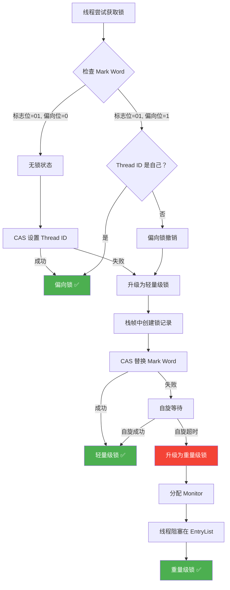

# 第5章 synchronized：Java 内置锁机制

> 什么是锁？为什么每个 Java 对象都能当锁？`synchronized` 背后的 Monitor 是什么？从偏向锁到重量级锁的升级过程是怎样发生的？为什么 JDK 15 要默认关闭偏向锁？本章将从字节码层面开始，逐层深入到对象头、锁升级机制和性能演进，完整揭示 synchronized 的工作原理。

---

## 5.1 synchronized 的使用方式

### 5.1.1 三种形式

`synchronized` 是 Java 中最基本的内置锁机制。它有三种使用形式：

**形式一：实例方法锁**

```java
public class Counter {
    private int count = 0;

    // 锁对象是 this（当前实例）
    public synchronized void increment() {
        count++;
    }

    public synchronized int getCount() {
        return count;
    }
}
```

**形式二：静态方法锁**

```java
public class GlobalCounter {
    private static int count = 0;

    // 锁对象是 GlobalCounter.class（Class 对象）
    public static synchronized void increment() {
        count++;
    }
}
```

**形式三：同步代码块**

```java
public class FineGrainedLock {
    private final Object lock = new Object();
    private int count = 0;

    public void increment() {
        // 锁对象是 lock（显式指定）
        synchronized (lock) {
            count++;
        }
    }

    public void doSomething() {
        // 这段代码不需要锁，可以并发执行
        prepareData();

        // 只有临界区需要同步
        synchronized (lock) {
            updateSharedState();
        }

        // 这段代码也不需要锁
        notifyObservers();
    }
}
```

### 5.1.2 三种形式对比

| 形式 | 锁对象 | 适用场景 | 粒度 |
|------|--------|---------|------|
| 实例方法 | `this` | 整个方法都需要同步 | 粗 |
| 静态方法 | `Class<?>` 对象 | 静态变量的同步访问 | 粗 |
| 同步代码块 | 任意对象 | 只需同步部分代码 | 细 |

**选择建议**：优先使用同步代码块。它的粒度最细，可以最小化临界区，减少锁竞争。实例方法锁虽然简洁，但如果方法中有不需要同步的操作（如日志、参数校验），会导致不必要的阻塞。

### 5.1.3 一个常见的错误

```java
public class BrokenSync {
    // 错误！每个线程都会创建新的 lock 对象
    public void doSync() {
        Object lock = new Object();  // 局部变量，每个线程一个
        synchronized (lock) {
            // 没有互斥效果！
            criticalSection();
        }
    }
}
```

锁对象必须是**所有需要互斥的线程共享的同一个对象**。局部变量在栈上分配，每个线程有自己的栈，所以它们看到的是不同的锁对象——等于没有锁。

---

## 5.2 synchronized 的本质

### 5.2.1 字节码层面

`synchronized` 在编译后会生成 `monitorenter` 和 `monitorexit` 两条字节码指令。

用 `javap -c` 反编译以下代码：

```java
public void syncBlock() {
    synchronized (obj) {
        doSomething();
    }
}
```

反编译结果（简化）：

```
public void syncBlock();
  Code:
     0: aload_0
     1: getfield    #2    // 获取 obj 引用
     4: dup
     5: astore_1           // 将 obj 存入局部变量（用于 monitorexit）
     6: monitorenter       // ← 进入同步块，获取 obj 的监视器
     7: aload_0
     8: invokevirtual #3   // 调用 doSomething()
    11: aload_1
    12: monitorexit        // ← 正常退出，释放监视器
    13: goto          21
    16: astore_2           // 异常处理
    17: aload_1
    18: monitorexit        // ← 异常退出，也要释放监视器
    19: aload_2
    20: athrow
    21: return
```

注意编译器生成了**两个** `monitorexit` 指令：一个在正常路径上，一个在异常处理路径上。这保证了即使同步块中抛出异常，锁也一定会被释放——这是 `synchronized` 相比手动 `lock/unlock` 的一个重要优势。

### 5.2.2 Monitor（监视器）

`monitorenter` 和 `monitorexit` 操作的核心是 **Monitor**——一种互斥同步的底层数据结构。

每个 Java 对象都可以关联一个 Monitor。当线程执行 `monitorenter` 时，它尝试获取该对象的 Monitor 的所有权：

```
                ┌─────────────────────────────┐
                │         Object Monitor       │
                │                             │
                │  _owner: Thread-A (持有者)    │
                │  _count: 1 (重入次数)        │
                │  _EntryList: [Thread-B, ...] │  ← 等待获取锁的线程
                │  _WaitSet:  [Thread-C, ...]  │  ← 调用 wait() 的线程
                │                             │
                └─────────────────────────────┘
```

Monitor 的工作流程：

1. **获取锁**（monitorenter）：如果 `_owner` 为空，当前线程成为 owner，`_count` 设为 1。如果 `_owner` 是当前线程（重入），`_count` 加 1。否则，当前线程进入 `_EntryList` 阻塞等待。
2. **释放锁**（monitorexit）：`_count` 减 1。如果 `_count` 为 0，释放 Monitor 所有权，`_EntryList` 中的一个线程被唤醒。
3. **等待/通知**（wait/notify）：线程调用 `wait()` 后进入 `_WaitSet`，释放 Monitor。`notify()` 从 `_WaitSet` 中唤醒一个线程，该线程需要重新竞争 Monitor。

### 5.2.3 Monitor 与对象的关系

在 HotSpot 虚拟机中，Monitor 并不是在对象创建时就分配的，而是**懒加载**的。只有当一个线程第一次尝试获取该对象的锁时，才会分配（或关联）一个 Monitor。这是因为 Monitor 是一个重量级的数据结构（依赖操作系统的 Mutex），大多数对象永远不会被用作锁。

### 5.2.4 synchronized 的内存语义

`synchronized` 不只负责互斥，还负责可见性和有序性。

线程 A 在同步块里写入共享变量后退出，线程 B 随后进入同一把锁保护的同步块时，必须能看到线程 A 留下的结果。JMM 对 `synchronized` 的要求，就是通过加锁和解锁建立这层语义。

`synchronized` 的内存语义由两个动作建立：

- **`monitorenter`**：获取锁，建立 acquire 语义
- **`monitorexit`**：释放锁，建立 release 语义

可以先看结论：

| 操作 | 语义 | 结果 |
| :-- | :-- | :-- |
| `monitorexit` | release | 退出同步块前的写入，对后续获取同一把锁的线程可见 |
| `monitorenter` | acquire | 获取锁之后的读写，不能重排到加锁之前 |

这就是 JMM 中"**对同一把锁的解锁 happens-before 后续加锁**"的具体落实方式。

```text
线程 A                              线程 B
────────────                        ────────────
synchronized(lock) {                synchronized(lock) {
    x = 42;                             读取 x;
    ready = true;                   }
}

关键关系：
A 在 monitorexit 之前的写入
        happens-before
B 在 monitorenter 之后的读取
```

只要线程 B 获取到了线程 A 刚刚释放的那把锁，B 后续的读取就必须看到 A 在临界区内完成的写入结果。

从实现角度看，HotSpot 会在加锁和解锁路径上加入相应的顺序约束，保证两件事：

- 同步块里的写入在解锁前完成，并按同步语义对外可见
- 获取锁之后的读写不能穿越到加锁之前

在弱内存模型架构上，JVM 会用更明确的屏障把这层语义补齐；在较强内存模型架构上，需要的额外约束可能更少，但语义要求不变。

这也是 `synchronized` 与 `volatile` 的根本区别之一：

- `volatile` 负责单个共享变量读写周围的顺序与可见性
- `synchronized` 负责一整段临界区的互斥、可见性和有序性

因此，`synchronized` 可以保证临界区内复合操作的正确性，而 `volatile` 不能。

HotSpot 会根据竞争情况把实现分成偏向锁、轻量级锁、重量级锁等不同路径；但无论走哪条路径，release / acquire 语义都必须成立。这是 `synchronized` 在不同实现形态下仍然保持同一并发语义的基础。

---

§5.2 介绍了 Monitor 的三个组成部分：`_owner`、`_EntryList` 和 `_WaitSet`。前两个负责互斥和阻塞等待，`_WaitSet` 则是 wait/notify 机制的基础。`synchronized` 解决了互斥问题——同一时刻只有一个线程能进入临界区。但很多时候，线程需要的不只是"独占"，而是"等待某个条件成立后再继续"。这就是 `wait/notify` 的用途。


## 5.3 wait/notify：线程间的通知机制

`synchronized` 解决了互斥问题——同一时刻只有一个线程能进入临界区。但很多时候，线程需要的不只是"独占"，而是"等待某个条件成立后再继续"。这就是 `wait/notify` 的用途。

### 5.3.1 基本用法

```java
synchronized (lock) {
    while (!condition) {   // 用 while，不用 if
        lock.wait();       // 释放锁，进入等待
    }
    // 条件满足，继续执行
}
```

```java
synchronized (lock) {
    condition = true;
    lock.notify();         // 唤醒一个等待的线程
    // 或 lock.notifyAll() 唤醒所有等待的线程
}
```

### 5.3.2 三个关键细节

**1. 必须在 synchronized 块内调用**

`wait()` 和 `notify()` 必须持有调用对象的 Monitor，否则抛 `IllegalMonitorStateException`。这不是语法限制，而是逻辑必须——`wait()` 的本质是"释放当前持有的锁并等待"，没有锁何谈释放？

**2. 用 while 而不用 if**

```java
// ❌ 错误：用 if
synchronized (queue) {
    if (queue.isEmpty()) {
        queue.wait();
    }
    // 唤醒后直接取，但 queue 可能又被其他线程清空了
    Object item = queue.poll();
}

// ✅ 正确：用 while
synchronized (queue) {
    while (queue.isEmpty()) {   // 唤醒后重新检查条件
        queue.wait();
    }
    Object item = queue.poll();
}
```

原因有两个：**虚假唤醒**（spurious wakeup，操作系统可能在没有 `notify` 的情况下唤醒线程）和**竞争唤醒**（`notifyAll` 唤醒所有线程，但只有一个能拿到锁，其他线程醒来发现条件不满足，需要重新等待）。

**3. notify() vs notifyAll()**

`notify()` 只唤醒一个等待线程，`notifyAll()` 唤醒所有。选择取决于场景：

| 场景 | 选择 | 原因 |
|------|------|------|
| 所有等待线程做同样的事 | `notify()` | 唤醒一个就够了，减少无效竞争 |
| 等待不同条件的线程 | `notifyAll()` | 只唤醒一个可能唤醒了错误的线程 |
| 不确定 | `notifyAll()` | 安全，多唤醒几个不会有正确性问题 |

### 5.3.3 wait/notify 的线程状态转换

```
Thread-C 调用 wait():
  RUNNABLE → WAITING
  从 _owner 变为 _WaitSet 成员
  释放 Monitor（_owner = null, _count = 0）

Thread-B 调用 notify():
  从 _WaitSet 取出 Thread-C
  Thread-C 移到 _EntryList
  Thread-C: WAITING → BLOCKED（等待重新获取锁）

Thread-B 释放 Monitor:
  _EntryList 中的线程竞争锁
  Thread-C 重新成为 _owner
  Thread-C: BLOCKED → RUNNABLE，从 wait() 返回
```

很多人以为 `notify()` 后被唤醒的线程会立即执行——不会。它只是从 `_WaitSet` 移到了 `_EntryList`，还需要重新竞争锁。这就是为什么 `wait()` 必须在 `synchronized` 块中——醒来后要重新获取锁才能继续。

### 5.3.4 wait/notify 的局限

`wait/notify` 是 Monitor 机制的基础能力，但它的功能比较原始：

- 只有一个等待队列（`_WaitSet`），无法区分"等待非空"和"等待非满"
- 不支持超时等待（`wait(timeout)` 有，但没有"等到某个条件成立或超时"的组合）
- 不支持公平唤醒（`notify()` 随机唤醒一个，无法保证等待最久的线程先被唤醒）

这些局限正是 `ReentrantLock` + `Condition` 要解决的问题——下一章会讲。`Condition` 可以创建多个等待队列，每个队列等待不同的条件，互不干扰。

---

## 5.4 synchronized 与对象头

### 5.4.1 回顾：对象的内存布局

在第二卷（JVM 对象模型）中，我们讨论过 Java 对象在内存中的布局：

```
┌──────────────────────────────────┐
│         对象头 (Header)           │
│  ┌────────────────────────────┐  │
│  │ Mark Word (标记字段)        │  │  ← 存储锁状态、GC 年龄、hashCode
│  ├────────────────────────────┤  │
│  │ Klass Pointer (类型指针)    │  │  ← 指向类的元数据
│  ├────────────────────────────┤  │
│  │ Array Length (数组长度)     │  │  ← 仅数组对象有
│  └────────────────────────────┘  │
├──────────────────────────────────┤
│         实例数据 (Instance Data)  │
├──────────────────────────────────┤
│         对齐填充 (Padding)        │
└──────────────────────────────────┘
```

synchronized 的锁信息就存储在 **Mark Word** 中。Mark Word 是 64 位（64 位 JVM）的空间，不同的锁状态下存储不同的内容。

### 5.4.2 Mark Word 的四种状态

在 64 位 JVM 中，Mark Word 的内容随锁状态变化：

| 锁状态 | 标志位 | Mark Word 内容（64 位） | 说明 |
|--------|--------|------------------------|------|
| 无锁 | `01` | `hashCode(31) \| age(4) \| biased(1) \| 01` | 存储对象的 hashCode 和分代年龄 |
| 偏向锁 | `01` | `ThreadID(54) \| Epoch(2) \| age(4) \| 1 \| 01` | 存储偏向线程的 ID 和 Epoch |
| 轻量级锁 | `00` | `ptr to lock record(62) \| 00` | 指向栈帧中锁记录的指针 |
| 重量级锁 | `10` | `ptr to Monitor(62) \| 10` | 指向堆中 Monitor 对象的指针 |
| GC 标记 | `11` | 空 | GC 标记，与锁无关 |

注意标志位的设计非常巧妙：

```
标志位为 01:
  ├── biased = 0 → 无锁状态
  └── biased = 1 → 偏向锁状态

标志位为 00 → 轻量级锁
标志位为 10 → 重量级锁
标志位为 11 → GC 标记
```

这意味着一个对象在任意时刻，其 Mark Word 的最低两位就能告诉 JVM 当前的锁状态。

## 5.5 锁升级机制

### 5.5.1 升级路径

synchronized 的锁状态会根据竞争情况**逐步升级**，但**不会降级**（严格来说，只有在 GC 时才会清除锁状态）：

```
无锁 → 偏向锁 → 轻量级锁 → 重量级锁
```

这个设计的哲学是：**从最乐观的假设开始，逐步升级到更安全（但也更重）的同步机制**。

### 5.5.2 无锁 → 偏向锁

**触发条件**：当一个线程第一次获取锁时。

**升级过程**：

```
  线程 A 第一次获取锁
  ─────────────────────

  1. 检查 Mark Word 的标志位 = 01（无锁或偏向锁）
  2. 检查偏向位 = 0（无锁状态）
  3. 使用 CAS 将 Mark Word 中的 Thread ID 替换为线程 A 的 ID
     ├── CAS 成功 → 偏向锁获取成功
     └── CAS 失败 → 说明有竞争，升级到轻量级锁
  4. 之后线程 A 再次进入同步块时，只需检查 Thread ID 是否是自己
     ├── 是 → 直接进入（无任何同步开销）
     └── 否 → 发生竞争，触发锁升级
```

偏向锁的核心思想：**大多数锁在整个生命周期中只有一个线程反复获取**（"偏向"于第一个获取它的线程）。对于这种情况，只需要第一次获取时做一次 CAS，之后的获取/释放几乎零开销。

```
  线程 A 反复获取偏向锁：
  ─────────────────────────

  进入同步块：检查 Thread ID == 我？ → ✅ → 直接执行（几乎零开销）
  退出同步块：什么都不做（不修改 Mark Word）
  再次进入：  检查 Thread ID == 我？ → ✅ → 直接执行
```

#### Epoch 机制

回顾 Mark Word 表格，偏向锁状态下有一个 2 位的 `Epoch` 字段。它的作用是**批量撤销偏向**。

具体机制：

- 每个类（Class）的元数据中维护一个 `epoch` 计数器（不是对象头里，是类级别）
- 每个偏向锁对象的 Mark Word 中存储了获取偏向时的类 `epoch` 值
- 当 JVM 需要撤销某个类所有对象的偏向时（比如发现这个类的锁竞争变激烈了），只需将类的 `epoch` 加 1
- 之后任何线程访问该类的偏向锁对象时，发现对象里的 `epoch` 和类的 `epoch` 对不上，就知道偏向已失效，自动回退到无锁状态

这比逐个遍历所有对象、逐个清除 Thread ID 高效得多——一次 `epoch++` 就完成了整个类的批量撤销。

### 5.5.3 偏向锁 → 轻量级锁

**触发条件**：另一个线程尝试获取已被偏向的锁。

**升级过程**：

```
  线程 B 尝试获取已被线程 A 偏向的锁
  ──────────────────────────────────────

  1. 检查 Mark Word 的标志位 = 01，偏向位 = 1
  2. 检查 Thread ID ≠ 线程 B
  3. 暂停线程 A（到达安全点）
  4. 检查线程 A 是否仍在同步块中
     ├── 是 → 偏向锁升级为轻量级锁
     └── 否 → 撤销偏向，恢复为无锁状态
  5. 线程 A 恢复执行，继续以轻量级锁的方式操作
  6. 线程 B 尝试以轻量级锁的方式获取锁
```

**轻量级锁的获取**：

```
  线程 B 获取轻量级锁
  ─────────────────────

  1. 在线程 B 的栈帧中创建一个锁记录（Lock Record）
  2. 将 Mark Word 复制到锁记录中（称为 Displaced Mark Word）
  3. 使用 CAS 尝试将对象的 Mark Word 替换为指向锁记录的指针
     ├── CAS 成功 → 轻量级锁获取成功
     └── CAS 失败 → 说明有竞争，自旋等待或升级到重量级锁
```

轻量级锁的核心思想：**在没有实际竞争的情况下，通过 CAS 操作在用户态完成加锁，避免操作系统内核态的开销**。

### 5.5.4 轻量级锁 → 重量级锁

**触发条件**：CAS 自旋失败，或竞争激烈。

**升级过程**：

```
  轻量级锁竞争升级为重量级锁
  ─────────────────────────────

  1. 线程 B 自旋 N 次后仍无法获取锁（自适应自旋次数由 JVM 动态调整）
  2. JVM 分配一个 Monitor 对象
  3. 将 Mark Word 设置为指向 Monitor 的指针，标志位改为 10
  4. 线程 B 进入 Monitor 的 _EntryList，阻塞等待
  5. 线程 A 执行完同步块后，发现 Mark Word 指向 Monitor
  6. 线程 A 释放锁，唤醒 _EntryList 中的线程
```

重量级锁依赖操作系统的 **Mutex Lock**（互斥锁），涉及内核态的线程挂起和唤醒，开销最大。

### 5.5.5 完整的锁升级流程图



### 5.5.6 锁升级的不可逆性

锁只能升级，不能降级。一旦升级为重量级锁，即使竞争消失，也不会自动降级为轻量级锁或偏向锁。

这是出于**安全和性能**的考虑：
- 降级需要额外的判断逻辑，增加复杂度
- 降级后如果竞争再次出现，又要重新升级，浪费资源
- 保持重量级锁的 Monitor 对象，后续的加锁/解锁仍然可以使用

不过，**偏向锁可以在 safepoint 时被批量撤销**（通过递增 epoch），但这不是"降级"，而是"撤销"。

---

## 5.6 synchronized 的性能演进

### 5.6.1 JDK 1.2 之前的 synchronized

在 JDK 1.2 之前，`synchronized` 是一个"笨重"的机制：

- **每次加锁**都是重量级的系统调用（pthread_mutex_lock）
- 即使没有任何竞争，加锁/解锁的开销也很大
- 因此当年的 Java 社区流传着一个说法："不要用 synchronized，太慢了"

这也是为什么 `java.util` 包中的早期集合类（如 `Vector`、`Hashtable`）虽然使用了 synchronized，但性能并不好——它们把 synchronized 加在了每一个方法上，粒度太粗。

### 5.6.2 JDK 1.6 的重大改进

JDK 1.6 引入了一系列锁优化，让 synchronized 的性能得到了质的飞跃：

| 优化技术 | 原理 | 适用场景 |
|---------|------|---------|
| 偏向锁 | 第一次获取后记录 Thread ID，后续获取零开销 | 单线程反复获取同一把锁 |
| 轻量级锁 | 用户态 CAS 替代内核态系统调用 | 低竞争，短时间持有 |
| 自旋锁 | 忙等待代替阻塞，避免上下文切换 | 锁持有时间极短 |
| 自适应自旋 | 根据历史数据动态调整自旋次数 | 通用 |
| 锁粗化 | 合并相邻的同步块，减少加锁次数 | 循环中反复加锁/解锁 |
| 锁消除 | 通过逃逸分析消除不可能竞争的锁 | 锁对象不逃逸当前线程 |


### 5.6.3 JDK 15+：偏向锁默认关闭

从 JDK 15 开始，偏向锁被**默认关闭**（`-XX:-UseBiasedLocking`）。原因是：

1. **现代应用的并发度普遍较高**，偏向锁带来的收益有限
2. **偏向锁的撤销开销大**：需要 STW（Stop-The-World）暂停
3. **代码复杂度高**：偏向锁相关代码占据了 HotSpot 锁实现的大量代码，维护成本高
4. **ZGC 和 Shenandoah 等新 GC 与偏向锁的兼容性差**

JDK 18 中偏向锁被标记为废弃（deprecated），计划在未来版本中完全移除。

### 5.6.4 自旋锁与自适应自旋

**自旋锁**的思路：当线程无法获取锁时，不立即阻塞，而是执行一个忙等待（自旋），期望锁很快就会被释放。

```
  传统方式（阻塞）：
  获取锁失败 → 挂起线程（内核态）→ 等待唤醒 → 恢复线程（内核态）
  开销：两次上下文切换 ≈ 数微秒

  自旋方式（忙等待）：
  获取锁失败 → 循环检查（用户态）→ 锁释放 → 获取成功
  开销：几次 CAS 操作 ≈ 数十纳秒
```

但如果锁持有时间很长，自旋会白白浪费 CPU。**自适应自旋**解决了这个问题：

- JVM 根据上一次在同一个锁上的自旋时间和锁持有者的状态来决定本次自旋的次数
- 如果上次自旋成功获取了锁，这次就多自旋几次
- 如果某个锁自旋很少成功，就跳过自旋，直接阻塞

### 5.6.5 锁粗化（Lock Coarsening）

```java
// 优化前：循环中反复加锁/解锁
for (int i = 0; i < 100; i++) {
    synchronized (lock) {
        buffer.append(data[i]);
    }
}

// 优化后：JIT 将锁粗化到循环外部
synchronized (lock) {
    for (int i = 0; i < 100; i++) {
        buffer.append(data[i]);
    }
}
```

JIT 编译器检测到连续的 `monitorenter`/`monitorexit` 操作作用于同一个锁对象时，会自动将锁的范围扩大（粗化），减少加锁/解锁的次数。

### 5.6.6 锁消除（Lock Elimination）

**锁消除**是 JIT 编译器通过**逃逸分析**（Escape Analysis）实现的优化：如果一个锁对象不可能被其他线程访问，就直接消除这个锁。

```java
public String concat(String a, String b) {
    // StringBuffer 是线程安全的，每次 append 都会加锁
    StringBuffer sb = new StringBuffer();
    sb.append(a);
    sb.append(b);
    return sb.toString();
}
```

在这个例子中，`sb` 是一个局部变量，不会逃逸出 `concat` 方法——没有任何其他线程能访问它。因此，JIT 编译器会**完全消除** StringBuffer 内部的 synchronized 操作。

可以通过以下 JVM 参数来观察锁消除的效果：

```bash
# 开启逃逸分析（默认开启）
-XX:+DoEscapeAnalysis

# 开启锁消除（默认开启）
-XX:+EliminateLocks

# 打印锁消除的日志
-XX:+PrintEliminateLocks
```

验证锁消除的代码：

```java
public class LockEliminationDemo {
    // 这个方法中的锁会被消除
    public int addLocally() {
        Object lock = new Object();  // 局部对象，不逃逸
        int sum = 0;
        synchronized (lock) {  // JIT 会消除这个锁
            for (int i = 0; i < 1000; i++) {
                sum += i;
            }
        }
        return sum;
    }

    // 这个方法中的锁不会被消除
    private Object sharedLock = new Object();  // 实例变量，可能逃逸

    public int addWithSharedLock() {
        int sum = 0;
        synchronized (sharedLock) {  // 不能消除
            for (int i = 0; i < 1000; i++) {
                sum += i;
            }
        }
        return sum;
    }
}
```

### 5.6.7 性能对比数据

以下是一个简单的基准测试结果（JDK 17，4 核 CPU，低竞争场景）：

| 方式 | 单次操作耗时 | 说明 |
|------|------------|------|
| 无同步 | ~2 ns | 基准线 |
| 偏向锁 | ~3 ns | 几乎无额外开销 |
| 轻量级锁（CAS） | ~15 ns | 一次 CAS 操作 |
| 重量级锁（无竞争） | ~30 ns | 系统调用开销 |
| 重量级锁（有竞争） | ~200 ns+ | 包含上下文切换 |

这些数据说明：**在 JDK 1.6+ 中，synchronized 的性能已经非常优秀**。在低竞争场景下，偏向锁和轻量级锁的开销几乎可以忽略不计。只有在高竞争场景下，重量级锁的开销才变得显著。

---

## 5.7 synchronized 的局限性

尽管 synchronized 经过了大幅优化，它仍然有一些局限性：

| 局限性 | 说明 |
|--------|------|
| 不可中断 | 线程一旦阻塞在 synchronized 上，无法被中断（`Thread.interrupt()` 无效） |
| 不支持超时 | 无法设置获取锁的超时时间 |
| 不支持公平性 | 无法保证等待时间最长的线程优先获取锁 |
| 不支持条件队列 | 只有一个等待队列（wait/notify），无法实现复杂的条件等待 |
| 必须是块结构 | 获取和释放必须在同一个方法的 `{}` 内完成 |

这些局限性催生了 `java.util.concurrent.locks` 包中的 `Lock` 接口和 `ReentrantLock`。它们提供了可中断获取、超时获取、公平锁、多个条件队列等能力。完整对比和 AQS 实现原理将在第 6 章展开。

---

## 5.8 volatile vs synchronized：如何选择

学完了 volatile（第 4 章）和 synchronized（本章），现在可以做一个完整的对比：

### 全面对比

| 特性 | volatile | synchronized |
| :-- | :-- | :-- |
| 原子性 | ❌ 不保证 | ✅ 保证代码块的原子性 |
| 可见性 | ✅ 保证 | ✅ 保证（释放锁时刷新，获取锁时重新加载） |
| 有序性 | ✅ 保证（禁止重排序） | ✅ 保证（happens-before） |
| 阻塞 | ❌ 不会阻塞 | ✅ 会阻塞（竞争时） |
| 性能 | 极高（CPU 指令级别） | 较高（涉及锁竞争时开销大） |
| 适用场景 | 一写多读、状态标志 | 多写多读、复合操作 |
| 能否修饰方法 | ❌ 只能修饰变量 | ✅ 可以修饰方法和代码块 |

### 选择指南

```text
需要保证并发安全？
    │
    ├── 只有一个线程写，其他线程只读？
    │   └── ✅ 使用 volatile
    │
    ├── 需要多个线程同时写？
    │   └── ✅ 使用 synchronized 或 Lock
    │
    ├── 涉及复合操作（check-then-act、read-modify-write）？
    │   └── ✅ 使用 synchronized 或原子类（CAS）
    │
    └── 需要跨方法的临界区？
        └── ✅ 使用 synchronized 或 Lock
```

### 常见误区

有些人认为"既然 volatile 轻量，就尽量用 volatile 替代 synchronized"。这是错误的。volatile 和 synchronized 解决的是不同层次的问题：

- volatile 解决的是**单个变量**的可见性和有序性问题
- synchronized 解决的是**一段代码**的原子性问题

它们不是替代关系，而是互补关系。在实际开发中，很多场景需要两者的配合——比如 `AtomicInteger`，就是 volatile（可见性）+ CAS（原子性）的组合。


> **纵向联系**
>
> - 本章的锁升级机制，建立在第二卷（JVM 对象模型）中对象头和 Mark Word 的知识基础上。如果你对对象的内存布局不熟悉，建议先回顾第二卷。
> - volatile 与 synchronized 的对比，在第 4 章（volatile）中已经初步讨论。本章从锁升级的角度给出了更深入的分析。
> - 本章提到的 Monitor（监视器），在第 6 章（等待/通知机制）中会详细展开 `wait()`/`notify()` 的工作原理。
> - ReentrantLock 和 AQS（AbstractQueuedSynchronizer）的实现原理，在第 9 章（显式锁）中会深入分析。
> - 锁消除中的"逃逸分析"，在第二卷（JVM 编译优化）中有更详细的讨论。

---
