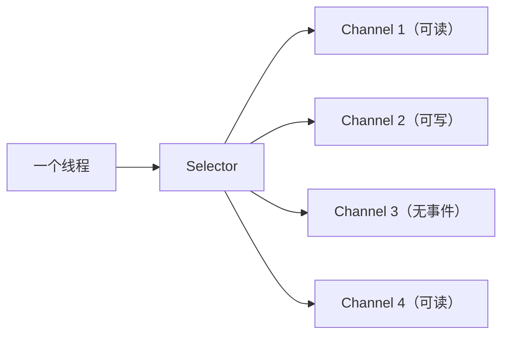

# 第四卷 Java 网络与通信 —— 数据是如何从一个 JVM 到另一个 JVM 的

> 前三卷解决了 Java 如何表达程序、如何运行、多线程如何协作。第四卷回答：Java 程序如何与外部世界建立连接。现代后端本质上不是单机程序，而是 客户端 → 网络 → Java 服务 → 数据库/MQ/Redis/其他服务。本卷从网络本质（字节流的跨机器传输）出发，依次讲解 TCP/IP、Socket、BIO/NIO 模型演进、Netty 框架、HTTP 协议、Servlet/Spring MVC 的通信模型、RPC、长连接与实时通信，最后落地到网络性能分析与故障排查。重点不是框架 API，而是理解数据如何在计算机之间传输，以及 Java 如何构建高性能网络应用。

---

## 1 网络通信基础：程序如何跨越机器边界

本章目标：建立网络世界观。理解程序之间通信的本质——发送字节、接收字节，所有高级协议最终都落到底层字节流。

### 1.1 为什么程序需要网络

从单机到分布式的范式转变：

```
单机时代：Application → Memory
分布式时代：Service A → Network → Service B
```

网络成为**程序之间通信的基础设施**，不再是可选的附加能力。

### 1.2 网络通信的本质

两个程序如何交流？

- **本质**：发送 `bytes`，接收 `bytes`
- HTTP、RPC、WebSocket —— 都是对底层字节流的不同抽象封装
- 网络编程的核心：高效、可靠地在两个端点之间传输字节

### 1.3 网络分层模型

建立分层意识，理解每层的职责边界：

| OSI 七层 | TCP/IP 四层 | 职责 | Java 开发者需要关心的 |
|---------|------------|------|---------------------|
| 应用层/表示层/会话层 | 应用层 | 业务数据格式（HTTP、DNS） | `URL`、`HttpURLConnection`、Spring MVC |
| 传输层 | 传输层 | 端到端可靠传输（TCP、UDP） | `Socket` |
| 网络层 | 网络层 | 路由与寻址（IP） | IP 地址、子网 |
| 数据链路层/物理层 | 网络接口层 | 帧传输与物理信号 | 不需要关心 |

核心收获：Java 开发者需要理解**哪些问题属于哪一层**，才能快速定位网络问题。

### 1.4 数据如何从一台机器到另一台机器

完整的数据封装旅程：

```
Application Data
      ↓ (TCP 分段)
TCP Segment（端口号 + 序列号）
      ↓ (IP 封装)
IP Packet（源/目标 IP 地址）
      ↓ (链路层封装)
Ethernet Frame（MAC 地址）
      ↓
物理网络传输
```

---

## 2 TCP/IP：可靠通信的基础

本章目标：深入理解 TCP——不只是背"三次握手四次挥手"，而是理解 TCP 为什么这样设计，以及这些设计对上层应用开发的直接影响（粘包拆包、性能参数等）。

### 2.1 TCP 为什么存在

UDP 的不足 vs TCP 的承诺：

| | UDP | TCP |
|---|---|---|
| 连接 | 无连接，直接发送 | 面向连接，需建立连接 |
| 可靠性 | 不保证送达 | 确认重传，保证送达 |
| 顺序 | 不保证顺序 | 序列号保证顺序 |
| 流量控制 | 无 | 滑动窗口 |
| 适用场景 | 视频直播、DNS 查询 | 绝大多数业务场景 |

### 2.2 TCP 三次握手与四次挥手

不要只背流程，要理解**为什么**：

- **三次握手**：为什么不是两次？——防止已失效的连接请求到达服务端，服务端误以为客户端要建立连接
- **四次挥手**：为什么比握手多一次？——TCP 是全双工的，每个方向都需要独立关闭
- **TIME-WAIT 为什么等 2MSL**：确保最后一个 ACK 能被对方收到；让旧连接的延迟报文在网络中消失

### 2.3 TCP 数据传输机制

| 机制 | 作用 | 对上层的影响 |
|------|------|------------|
| 序列号（Sequence Number） | 保证数据有序 | 数据必然按序到达 |
| 确认应答（ACK） | 保证数据到达 | 丢包会触发重传 |
| 超时重传 | 应对丢包 | 网络抖动时延迟增加 |
| 滑动窗口 | 流量控制 | 发送方不能发太快 |

### 2.4 TCP 粘包与拆包

这是 Java 网络开发的高频问题：

**根因**：TCP 是**字节流**，不是**消息协议**。应用层写入的"消息"在 TCP 层面没有边界标记。

```
应用层写："hello" + "world"
TCP 可能：一次收到 "helloworld"（粘包）
         或：先收到 "hel"，再收到 "loworld"（拆包）
```

三种解决方案（为 Netty 编解码铺垫）：
- **固定长度**：每条消息固定字节数
- **分隔符**：用特定字符标记消息结尾
- **Length Field**：消息头包含长度字段

### 2.5 TCP 性能相关参数

| 参数 | 含义 | 何时调整 |
|------|------|---------|
| Nagle 算法 | 小包合并发送 | 低延迟场景关闭（`TCP_NODELAY`） |
| KeepAlive | TCP 保活探测 | 长连接场景，但要配合应用层心跳 |
| TIME-WAIT | 主动关闭方等待 | 短连接频繁时端口耗尽 |
| Socket Buffer | 收发缓冲区大小 | 高吞吐场景适当增大 |

---

## 3 Java Socket 编程：网络抽象的起点

本章目标：从 OS 内核视角出发，理解 Socket 的本质（文件描述符 + 协议栈）、系统调用链的 C/Java 映射、内核数据结构（缓冲区/队列/阻塞本质）、生产级 Socket 选项，最后用一个 Echo 示例跑通完整流程并揭示 BIO 的局限。

### 3.1 Socket 的本质：OS 如何抽象网络通信

- **从网卡到进程**：数据如何经过传输层进入 Socket 接收缓冲区，应用 `read()` 读到的就是它
- **Socket = fd + 协议栈**：Unix/Linux 下 Socket 本质是文件描述符，Java 的 `Socket` / `ServerSocket` 内部持有 OS fd
- **五元组与连接标识**：`{源IP, 源端口, 目标IP, 目标端口, 协议}` 唯一标识一条连接；一个监听端口可以 accept 出成千上万条连接
- **Stream Socket vs Datagram Socket**：TCP 与 UDP 的编程模型差异

### 3.2 Socket 系统调用与 Java 映射

七个系统调用的 C 代码与 Java 代码逐条对照：

- `socket()` → `new ServerSocket()` / `new Socket()`
- `bind()` + `listen()` → `serverSocket.bind()` / `new ServerSocket(port)`
- `accept()` → `serverSocket.accept()`（返回新 Socket，与 ServerSocket 独立）
- `connect()` → `new Socket(host, port)`
- `read()` / `write()` → `getInputStream()` / `getOutputStream()`（操作的是内核缓冲区，不是网络）
- `close()` → `socket.close()`（对比 `shutdown()` 的差异）

### 3.3 内核视角：Socket 背后的数据结构

- **发送缓冲区与接收缓冲区**：每 Socket 两块，`write()` 满则阻塞，`read()` 空则阻塞
- **全连接队列与半连接队列**：`listen(backlog)` 控制的队列溢出机制与诊断（`ss -ltn`、`netstat -s`）
- **阻塞的本质**：线程从 `RUNNING` → `TASK_INTERRUPTIBLE` 被挂到 Socket 等待队列，不占 CPU 但占内存
- **一台机器能承载多少 Socket**：从 fd 上限、端口范围、内核内存、线程栈六维瓶颈分析，引出 BIO vs NIO 的内存对比

### 3.4 Socket 选项：生产中真正要调的参数

- `SO_REUSEADDR`：允许绑定 TIME_WAIT 地址，解决服务重启端口被占
- `SO_REUSEPORT`（Linux 3.9+）：多进程/线程绑定同一端口，内核负载均衡
- `TCP_NODELAY`：禁用 Nagle 算法，RPC 框架默认开启
- `SO_KEEPALIVE`：TCP 层保活（默认 2 小时才开始探测，生产需配合应用层心跳）
- `SO_RCVBUF` / `SO_SNDBUF`：缓冲区调优指南
- Java 三层 API 设置方式对照表

### 3.5 动手：用 Java Socket 跑通一个 Echo

- Echo Server（`FixedThreadPool` 版本）+ Echo Client
- 代码剖析：为什么 `flush()` 必要、为什么用 `FixedThreadPool` 而非 `CachedThreadPool`
- **BIO 的局限**：一连接一线程 → 10000 连接 = ~10GB 栈内存 → 不可行 → 引出 NIO

---

## 4 Java NIO：高性能网络模型

本章目标：这是 Java 网络编程的核心章节。理解 NIO 如何用**事件驱动**替代**线程阻塞**，用一个线程管理多个连接。

### 4.1 为什么需要 NIO

核心思想转变：

```
BIO：阻塞等待（线程在等数据）
NIO：事件通知（数据到了通知线程）
```

一个线程不再绑定一个连接，而是监听多个连接的事件。

### 4.2 Channel：双向数据通道

替代 BIO 的 `Stream`：

| | Stream | Channel |
|---|---|---|
| 方向 | 单向（InputStream / OutputStream） | 双向 |
| 阻塞 | 阻塞 | 可非阻塞 |
| 操作对象 | 字节 | Buffer |

### 4.3 Buffer：NIO 的数据容器

为什么 NIO 引入 Buffer——Channel 不直接操作字节数组，而是通过 Buffer 统一管理：

```
capacity ←→ limit ←→ position ←→ mark
```

三个关键操作：`flip()`（写→读）、`clear()`（清空准备写）、`compact()`（压缩未读数据）。

### 4.4 Selector：一个线程管理万千连接

NIO 的核心——多路复用器：



流程：`Channel 注册到 Selector → select() 阻塞等待事件 → 遍历 readyKeys 处理`

### 4.5 NIO Reactor 模型

```
Event Loop（一个线程）
      ↓
Selector（监听 N 个 Channel）
      ↓ 事件到达
Channel → Handler（业务处理）
```

Reactor 模式的本质：将 I/O 事件的**检测**和**处理**分离。

### 4.6 NIO 的真实限制

NIO 强大但存在工程问题：

| 问题 | 说明 |
|------|------|
| 编程复杂 | Buffer 操作、事件处理、连接管理，细节繁多 |
| epoll 空轮询 Bug | JDK 特定版本下 epoll 会 CPU 100% |
| 平台差异 | 不同 OS 的 NIO 实现有细微差异 |

引出 Netty 的必然性。

---

## 5 Netty：Java 高性能网络框架

本章目标：从生产故障（Dubbo 线程池打满）往回拆解 Netty 的线程模型、内存管理和编解码机制。理解 Netty 不是"NIO 的封装库"，而是 Dubbo、gRPC、Elasticsearch 的底层传输基石。

### 5.1 从 NIO 到 Netty：为什么原生 NIO 没人直接用了

- **5.1.1 NIO 的三个致命缺陷**：Buffer flip/clear/compact 手动切、epoll 空轮询 Bug、缺少编解码及线程模型
- **5.1.2 Netty 填了什么**：ByteBuf 读写指针分离、空轮询检测+重建 Selector、内置 HTTP/WebSocket 编解码器和拆包器

### 5.2 EventLoop 线程模型：Dubbo「线程池打满」的根

- **5.2.1 Boss 和 Worker：连接和数据分开管**：bossGroup 只管 accept → Round-Robin 分给 workerGroup 读数据；Channel 的所有 I/O 事件由同一个 EventLoop 线程处理
- **5.2.2 Dubbo 的 dispatcher 和 threadpool：IO 线程和业务线程的分工**：dispatcher 决定 Handler 在哪个线程上跑，threadpool 决定业务线程池大小——两层概念不搞混
- **5.2.3 EventLoop 任务队列：别阻塞 I/O 线程**：耗时操作必须交给独立业务线程池

### 5.3 ByteBuf：你线上见过但没看懂的 `Direct buffer memory` OOM

读写指针分离（readerIndex / writerIndex），不需要 flip。池化堆外内存不受 GC 管理 → `-XX:MaxDirectMemorySize` 默认等于 `-Xmx` → 堆有空间但 OOM 的根因。引用计数（retain/release）+ `SimpleChannelInboundHandler` 自动释放。

### 5.4 编解码：TCP 粘包/拆包的工业化解决方案

三种帧解码器：`FixedLengthFrameDecoder`、`DelimiterBasedFrameDecoder`、`LengthFieldBasedFrameDecoder`（Dubbo 协议帧用的就是这种）。帧解码之后的数据才是完整消息，少了这一步 → 半包/粘包数据直接进业务 Handler → 报错或丢数据。

### 5.5 Reactor 模式全景：从单线程到主从

bossGroup → workerGroup → [可选 businessGroup] → Pipeline → FrameDecoder → Codec → BizHandler。和 Tomcat 的 Acceptor/Poller/Worker 是同一种模式的不同实现。

---

## 6 HTTP 协议：应用层通信标准

本章目标：从生产故障（502/504/超时傻傻分不清、API 偶尔慢找不到瓶颈）往回拆解 HTTP 报文结构、方法语义、状态码排查、版本演进。HTTP 不是你"调用接口的协议"，是你每天在排障时第一个要读的协议。

### 6.1 一次 HTTP 请求到底花了多少时间

- **6.1.1 curl 分阶段计时**：`time_namelookup` / `time_connect` / `time_appconnect` / `time_starttransfer` / `time_total` 六个阶段精确拆解，告诉你瓶颈在 DNS / TCP / TLS / 服务端处理哪一层
- **6.1.2 HTTP 在 TCP 连接上的完整生命周期**：DNS → TCP 三次握手 → TLS → 发送请求 → 服务端处理（TTFB）→ 接收响应 → Keep-Alive 复用或关闭

### 6.2 HTTP 报文：你每天在写的 REST API，底层长什么样

- **6.2.1 请求报文结构**：请求行 → 请求头 → CRLF → 请求体
- **6.2.2 响应报文结构**：状态行 → 响应头 → CRLF → 响应体
- **6.2.3 Header 分类速查**：通用头 / 请求头 / 响应头 / 实体头

### 6.3 HTTP 方法：你的 GET 不是真的只读

- **6.3.1 安全与幂等——这两个属性是你线上数据的防线**：GET 被爬虫扫到 → 写操作凭空触发 → 改用 POST 保数据
- **6.3.2 GET 与 POST 的常见误解**：长度不是协议限制、安全性依赖 HTTPS 而非方法

### 6.4 HTTP 状态码：你线上的每一个 5xx 都在说不同的事

- **6.4.1 502 vs 504 vs Connection Timeout——别再搞混了**：502 = 上游进程挂了连不上 → `connect() failed`；504 = 上游还活着但超时 → `upstream timed out`。排查方向和抢救手段完全不同
- **6.4.2 4xx：问题在你这边**：400/401/403/404/429 的触发场景和排查方向
- **6.4.3 5xx：问题在服务端或中间层**：500/502/503/504 的根因、排查命令和抢救优先级
- **6.4.4 快速判断：从 Nginx error.log 定位问题层**：四个关键 error 关键词一行诊断

### 6.5 HTTP 版本演进：为什么你的 HTTPS 接口比别人慢一拍

- **6.5.1 HTTP/1.0 → HTTP/1.1**：Keep-Alive 省掉每次重连的 TCP 握手
- **6.5.2 HTTP/1.1 → HTTP/2**：多路复用消除应用层队头阻塞
- **6.5.3 HTTP/2 → HTTP/3**：QUIC（UDP）消除 TCP 层队头阻塞，0-RTT 建连

---

## 7 Java Web 通信模型：Servlet 到 Spring MVC

本章目标：连接前端开发体验——理解一个 HTTP 请求如何从网络层进入 Java 应用，经过 Servlet 容器、经过 Spring MVC 的 DispatcherServlet，最终到达 Controller。这是连接网络知识和日常开发的关键桥梁。

### 7.1 Servlet 网络模型

```
HTTP Request
      ↓
Connector（Tomcat 的 HTTP 连接器）
      ↓
Servlet Container
      ↓
Servlet.service()
      ↓
HTTP Response
```

### 7.2 Tomcat 网络架构

| 组件 | 职责 |
|------|------|
| Connector | 接收 HTTP 请求，解析为 Request/Response |
| Protocol Handler | 协议适配（HTTP/1.1、HTTP/2、AJP） |
| Thread Pool | 处理请求的线程池 |
| Engine → Host → Context → Wrapper | 容器层级，最终定位到 Servlet |

### 7.3 Spring MVC 请求流程

```
HTTP Request
      ↓
DispatcherServlet（前端控制器）
      ↓
HandlerMapping（找到对应的 Controller 方法）
      ↓
HandlerAdapter（调用方法，参数解析）
      ↓
Controller（业务处理）
      ↓
ViewResolver / @ResponseBody（返回 JSON）
      ↓
HTTP Response
```

### 7.4 Web 框架如何隐藏网络复杂度

`@GetMapping` 一行注解背后：

- Socket 连接的建立与管理
- HTTP 协议的解析与生成
- 请求体的反序列化（JSON → Java 对象）
- 响应体的序列化（Java 对象 → JSON）
- 连接池、超时控制、异常处理

理解这些底层机制，才能真正掌握框架。

---

## 8 RPC 与微服务通信

本章目标：从生产故障（Dubbo 超时卡在哪一层、GC 导致的静默超时、线程池打满）往回拆解 RPC 的完整调用链路、序列化、服务发现。RPC 不是"看起来像本地调用的远程调用"——它是一组可独立拆解的环节，每环节对应不同排查方向。

### 8.1 一次 Dubbo 调用超时，到底卡在哪一层

- **8.1.1 Dubbo Profiler 拆解——6 个环节的耗时**：Consumer Filter → Cluster/Failover → Invoker → 网络 → Provider Filter → Biz Impl，每环的精确定量
- **8.1.2 GC 导致的「静默超时」——RPC 超时排查最隐蔽的坑**：请求进了 Provider 但 3 秒后才执行，所有监控正常——根因是 G1 mixed GC 的 ref-proc 阶段单线程阻塞，排查方法：GC 日志 ↔ RPC 超时时间点对账

### 8.2 RPC 到底做了什么：一次远程调用的完整旅程

- **8.2.1 一句话总览**：Proxy 拦截 → 序列化 → 协议封装 → Socket 发送 → 反序列化 → 反射调用 → 写回
- **8.2.2 各环节在你线上能表现出什么问题**：每环的正常表现与异常表现对照
- **8.2.3 HTTP vs RPC：你该用哪个**：对外 HTTP REST，对内 RPC

### 8.3 RPC 超时排查三板斧

第一板斧：Consumer 和 Provider 两侧日志对账；第二板斧：GC 日志找 STW > 500ms 的 pause；第三板斧：tcpdump 抓包看重传与丢包

### 8.4 序列化：你的对象为什么传得比想象的慢

- **8.4.1 性能对比**：Kryo > Protobuf > Hessian > JSON（体积和速度差异可达 10 倍）
- **8.4.2 典型踩坑：Protobuf 默认值陷阱**：int32 默认值 0 不序列化 → Java 端反序列化为 null → autoboxing NPE

### 8.5 服务发现：「该调谁」的问题

- **8.5.1 注册中心的本质**：Provider 注册 → Consumer 订阅 → 本地缓存 → 负载均衡选择 → 调用。注册中心挂了不影响已缓存实例的调用
- **8.5.2 负载均衡策略**：Random / RoundRobin / LeastActive / ConsistentHash 的适用场景

---

## 9 长连接与实时通信

本章目标：理解为什么短连接不够用，长连接（WebSocket、SSE）如何实现实时双向通信，以及 IM 系统的设计思想。

### 9.1 为什么需要长连接

| | 短连接 | 长连接 |
|---|---|---|
| 连接方式 | 每次请求建立新 TCP | 建立一次，持续使用 |
| 开销 | 每次 TCP 握手 | 一次握手长期复用 |
| 实时性 | 轮询（延迟 + 浪费） | 推送（实时） |
| 适用场景 | 普通 Web 请求 | 即时通讯、实时推送 |

### 9.2 WebSocket

HTTP 协议升级到 WebSocket 的过程：

```
Client → HTTP Upgrade 请求（Connection: Upgrade）
Server → 101 Switching Protocols
双方 → WebSocket 帧通信（全双工）
```

特点：客户端和服务端都可以随时发送消息，真正实现双向实时通信。

### 9.3 SSE（Server-Sent Events）

与 WebSocket 的对比：

| | WebSocket | SSE |
|---|---|---|
| 通信方向 | 全双工 | 单向（服务器 → 客户端） |
| 协议 | 独立协议（ws://） | 基于 HTTP |
| 实现复杂度 | 较高 | 较低 |
| 适用场景 | 聊天、游戏 | 股票推送、通知 |

### 9.4 IM 系统设计思想

一个即时通讯系统需要解决的核心问题：

| 问题 | 解决方案 |
|------|---------|
| 在线状态管理 | 用户上线/下线事件 + 心跳检测 |
| 消息路由 | 如何找到用户所在的服务器 → 一致性哈希 + 路由表 |
| 消息可靠性 | 客户端 ACK + 服务端重推 + 离线消息存储 |
| 消息顺序 | 服务端时间戳 + 序列号 |
| 心跳检测 | 定时 ping/pong，超时判定离线 |

---

## 10 网络性能分析与故障排查

本章目标：将前九章的理论落地为工程实战能力。覆盖常见网络问题的定位方法和排查工具。

### 10.1 常见网络问题速查

| 现象 | 可能原因 | 排查方向 |
|------|---------|---------|
| 连接超时 | 防火墙、服务未监听、网络不通 | `telnet`、`nc` 检查端口可达性 |
| Connection Refused | 服务未启动或端口错误 | 确认服务状态和监听端口 |
| Connection Reset | 对端强制关闭连接 | 检查对端日志、是否超时关闭 |
| TIME-WAIT 过多 | 短连接频繁创建销毁 | `netstat -an | grep TIME_WAIT` |
| CLOSE-WAIT 堆积 | 服务端未正确 `close()` | `netstat -an | grep CLOSE_WAIT` |

### 10.2 网络抓包分析

| 工具 | 用途 |
|------|------|
| `tcpdump` | 命令行抓包，适合服务器端 |
| Wireshark | 图形化分析，适合深度排查 |
| 关键分析点 | TCP 握手是否成功、重传次数、窗口大小变化 |

### 10.3 Java 网络诊断

| 工具/命令 | 用途 |
|----------|------|
| `netstat -an` | 当前连接状态一览 |
| `jstack <pid>` | 线程 dump，发现阻塞在 `Socket.read()` 的线程 |
| Arthas `thread -b` | 快速找到当前阻塞的线程 |
| Arthas `trace` | 追踪网络调用耗时 |

### 10.4 高并发网络优化

| 优化方向 | 具体手段 |
|---------|---------|
| 连接管理 | 连接池复用、合理的超时设置 |
| I/O 模型 | 从 BIO 升级到 NIO + Netty |
| TCP 参数 | `TCP_NODELAY` 关闭 Nagle、调整 Socket Buffer |
| KeepAlive | 应用层心跳 + TCP KeepAlive 兜底 |
| 限流 | 网关层 + 应用层多级限流保护 |

---

> 第四卷到此结束。从"字节流是网络通信的本质"出发，经过 TCP/IP → Socket → BIO 的困境 → NIO 与 Reactor → Netty 的封装 → HTTP 协议 → Servlet/Spring MVC → RPC → 长连接/WebSocket → 网络诊断，读者已经建立起 Java 网络编程的完整认知体系。
>
> **四卷之间的递进关系：**
>
> ```
> Java Language（会写代码）
>       ↓
> JVM Runtime（知道代码怎么运行）
>       ↓
> Concurrency（知道多线程为什么正确）
>       ↓
> Networking（知道服务如何通信）
> ```
>
> **与全书其他卷的纵横联系：**
>
> | 依赖方向 | 依赖内容 |
> |---------|---------|
> | ← 第二卷 | 直接内存（DirectMemory）是 NIO 零拷贝的基础 |
> | ← 第三卷 | Reactor/EventLoop 的线程模型强依赖并发知识；Netty 的单线程绑定避免了同步开销 |
> | → 第五卷 | 数据库连接本质上是网络 Socket 连接；Redis 通信也是网络 I/O |
> | → 第六卷 | Spring MVC 的请求处理链路建立在 Servlet 网络模型之上；Cloud 微服务间 RPC 调用依赖本章理解 |
> | → 第七卷 | 负载均衡、API 网关、服务网格都构建在网络层之上；网络调优是性能优化的一个关键维度 |
